# Manual do Usuário — Ranmza GT

Guia prático de uso do **Ranmza GT**, o tradutor de jogos, visual novels, vídeos e qualquer
conteúdo em tela. Este manual explica **como usar** cada parte do programa, sem entrar em
detalhes técnicos.

---

## Sumário

1. [O que o programa faz](#1-o-que-o-programa-faz)
2. [Configuração rápida](#2-configuração-rápida)
3. [Uso básico no dia a dia](#3-uso-básico-no-dia-a-dia)
4. [Atalhos de teclado](#4-atalhos-de-teclado)
5. [Configurando a tradução](#5-configurando-a-tradução)
6. [Deixando a tradução com a "cara" do jogo](#6-deixando-a-tradução-com-a-cara-do-jogo)
7. [Modo Vision — quando o OCR erra](#7-modo-vision--quando-o-ocr-erra)
8. [Modo Legenda — tradução automática contínua](#8-modo-legenda--tradução-automática-contínua)
9. [Modo Tempo Real — tradução contínua no lugar (experimental)](#9-modo-tempo-real--tradução-contínua-no-lugar-experimental)
10. [Usando no OBS / transmissões](#10-usando-no-obs--transmissões)
11. [Histórico e desempenho](#11-histórico-e-desempenho)
12. [Problemas comuns e soluções](#12-problemas-comuns-e-soluções)
13. [Referência completa — todas as abas](#13-referência-completa--todas-as-abas)
14. [Atualizando o programa](#14-atualizando-o-programa)

---

## 1. O que o programa faz

O Ranmza GT tira um "print" de uma área da tela, reconhece o texto que está nela, traduz e
mostra a tradução **por cima do jogo**, na mesma posição do texto original — como se fosse uma
legenda flutuante.

Funciona com qualquer jogo, visual novel, vídeo ou programa que mostre texto na
tela.

> **⚠️ Requisito essencial: o jogo precisa estar em modo Janela ou Janela sem borda.** O Ranmza
> GT desenha a tradução **por cima** da janela do jogo — então rode o jogo em **modo Janela**
> (*Windowed*) ou, de preferência, **Janela sem borda** (*Borderless* / *Fullscreen sem borda*),
> que ocupa a tela inteira e ainda deixa a tradução aparecer por cima. Em **Tela cheia exclusiva**
> (*Exclusive Fullscreen*) o Windows entrega a tela só para o jogo e nenhum programa consegue
> desenhar sobre ela — a tradução não vai aparecer. Sintoma típico: você aperta Traduzir, a
> tradução até surge na aba **Histórico**, mas nada aparece sobre o jogo. Solução: troque o jogo
> para **Janela sem borda** nas opções de vídeo dele.

O fluxo básico é sempre:

1. Você escolhe **onde** está o texto (uma área da tela).
2. Aperta um atalho para **traduzir**.
3. A tradução aparece sobreposta ao jogo.
4. Aperta outro atalho para **limpar** quando quiser, ou ela some sozinha depois de um tempo.

---

## 2. Configuração rápida

São **cinco ajustes**. Depois deles você já está traduzindo; todo o resto deste manual é
refinamento, e você lê quando (e se) precisar.

| Passo | O que fazer | Onde |
|---|---|---|
| 1 | Escolher o monitor | aba **Geral › Config** |
| 2 | Escolher os idiomas | aba **Geral › Idioma** |
| 3 | Escolher o tradutor | aba **Traducao › Tradutores** |
| 4 | Marcar a área do texto | atalho `Numpad7`, com o jogo aberto |
| 5 | Traduzir | atalho `Numpad9` (linha) ou `Numpad8` (parágrafo) |

> **Antes de tudo: o jogo em modo Janela.** Em *Tela cheia exclusiva* nenhum programa consegue
> desenhar por cima — a tradução simplesmente não aparece. Troque o jogo para **Janela sem
> borda** nas opções de vídeo dele. Explicação completa na
> [seção 1](/Manual/o-que-o-programa-faz.md).

> **O programa nem abriu, com erro *"VCRUNTIME140.dll não foi encontrado"*?** Falta o
> **Microsoft Visual C++ Redistributable (x64)**, um componente gratuito da Microsoft que a
> maioria dos PCs já tem (vem junto com muitos jogos). Instale por este link oficial e abra o
> programa de novo:
> <https://aka.ms/vs/17/release/vc_redist.x64.exe>

### 2.1 Primeiro olhar: como a janela é organizada

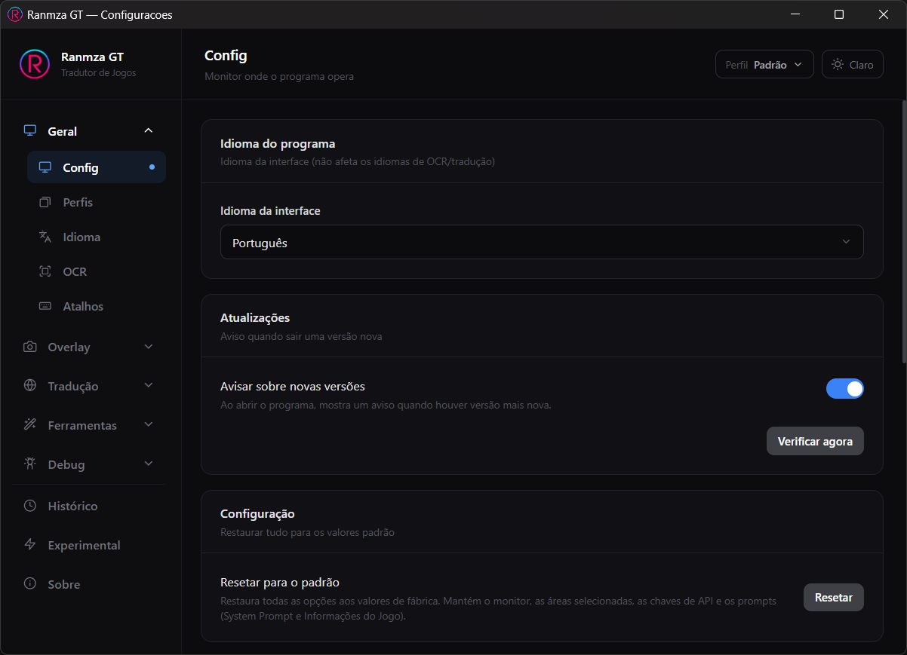

O menu da esquerda agrupa as opções por assunto. Nesta configuração rápida você só encosta em
**Geral** e **Traducao** — o resto existe para quando você quiser afinar alguma coisa.

| Menu | O que tem dentro |
|---|---|
| **Geral** | Config (monitor, tema, barra flutuante), Idioma, OCR e Atalhos |
| **Overlay** | Aparência da tradução na tela: Captura, Legenda e Web |
| **Traducao** | Tradutores (motor e chaves de API) e I.A (prompts e parâmetros) |
| **Ferramentas** | Inpaint (apagar o texto original) e Lab (testar pré-processamento) |
| **Debug** | Monitor de desempenho, imagens de diagnóstico e Logs |
| **Historico** | As traduções da sessão atual |
| **Experimental** | Recursos em desenvolvimento, como o Modo Tempo Real |
| **Sobre** | Versão do programa e links |

> **Idioma da interface** (em *Geral › Config*) muda só o idioma **do programa** — os menus e
> textos que você está vendo. Não tem nada a ver com o idioma que vai ser traduzido; esse é o
> passo 2.3.

### 2.2 Escolha o monitor

Ainda em **Geral › Config**, no card **Monitor**, escolha em **Tela ativa** onde o programa vai
trabalhar. Com um monitor só, deixe em *Automatico* e siga em frente.

Trocar de monitor **exige reiniciar o programa** — aparece um aviso com o botão **Reiniciar
agora** no rodapé da aba. Só depois do reinício a captura, o seletor de área e a tradução na
tela passam a valer para a outra tela. A área que você já tinha selecionado é apagada na troca.

O **Backend de captura** logo acima pode ficar em *Auto (recomendado)*: ele usa o método certo
para a sua versão do Windows sozinho e troca na hora, sem reiniciar.

### 2.3 Escolha os idiomas

Abra **Geral › Idioma**.

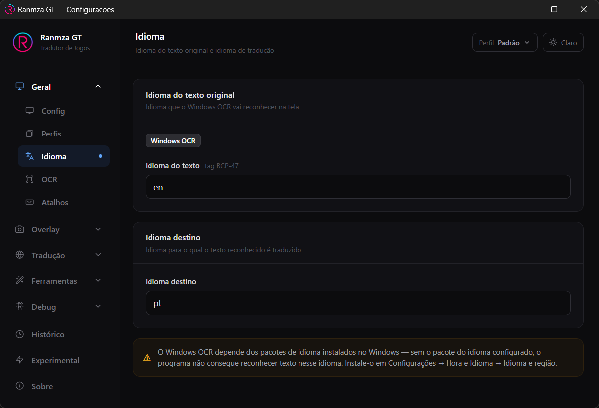

- **Idioma do texto** — o idioma que está escrito no jogo. Digite a sigla do idioma
  (`en` para inglês, `ja` para japonês, `ko` para coreano, `zh` para chinês…).
- **Idioma destino** — o idioma no qual você quer ler. `pt` para português.

> **Aviso amarelo sobre pacote de idioma?** O Windows OCR só reconhece idiomas cujo pacote está
> instalado no Windows. Instale em *Configurações → Hora e Idioma → Idioma e região*. Sem o
> pacote, o programa não consegue ler o texto naquele idioma.

> **Usando OneOCR?** Aí não existe idioma de origem para escolher: ele é um modelo único
> multilíngue (latim, CJK, cirílico…) que detecta o idioma sozinho, e o campo **Idioma do
> texto** nem aparece enquanto ele estiver selecionado — nem o aviso de pacote do Windows, que
> não se aplica. O **Idioma destino** continua valendo normalmente. O motor de OCR se troca em
> *Geral › OCR*, mas para começar deixe no padrão.

### 2.4 Escolha o tradutor

Abra **Traducao › Tradutores**.

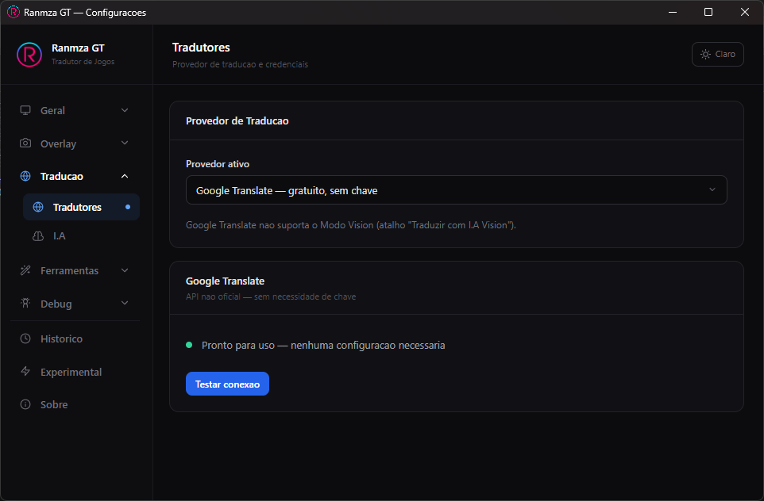

O padrão é o **Google Translate — gratuito, sem chave**: não precisa configurar nada, já está
pronto para uso. É com ele que você deve fazer o primeiro teste.

Quando quiser mais qualidade, troque em **Provedor ativo**:

- **DeepL** — tradutor dedicado, muito natural, com opção de formalidade. Precisa de chave de
  API, mas tem **plano gratuito** (as chaves terminam em `:fx`, e o programa reconhece sozinho
  qual servidor usar).
- **OpenAI**, **Anthropic (Claude)** ou **Gemini** — motores de IA. Precisam de chave de API
  com créditos, e em troca entregam traduções bem mais naturais e consistentes, principalmente
  em diálogos longos. Escolha o modelo em *Autenticação* e cole a chave em *Chaves de API*.

Cada motor guarda as suas próprias credenciais, então trocar de um para outro e voltar não
apaga nada. Use o botão **Testar conexao** para confirmar que a chave está válida antes de
entrar no jogo.

> **Várias chaves com rotação automática.** Todo motor com chave aceita **mais de uma**: clique
> em *+ Adicionar chave*. Se a chave em uso ficar sem crédito ou bater no limite de requisições,
> o programa passa sozinho para a próxima da lista; esgotadas todas, ele cai no Google
> Translate. Ajuda bastante em sessões longas de Modo Legenda.

> Só os motores de IA (OpenAI, Claude, Gemini) suportam o **Modo Vision** — o Google Translate e
> o DeepL não. Veja a [seção 7](/Manual/modo-vision-quando-o-ocr-erra.md).

### 2.5 Marque a área do texto

Com o jogo aberto e em foco, aperte **`Numpad7`**. A tela escurece e você arrasta o mouse para
desenhar um retângulo sobre a região onde o texto aparece — normalmente a caixa de diálogo.
Solte o botão para confirmar, ou aperte `ESC` para cancelar.

A área fica salva. Você só precisa marcar de novo se o jogo mudar a posição da caixa de texto
ou se você trocar a resolução.

> Não marcou nenhuma área? O programa captura a **tela inteira** — funciona, mas fica mais lento
> e erra mais. Vale marcar.

  <iframe src="https://player.vimeo.com/video/1218016540"
          style="position:absolute;top:0;left:0;width:100%;height:100%;border:0"
          allow="fullscreen; picture-in-picture" allowfullscreen
          title="Marcando a área do texto"></iframe>

<i>Marcando a área do texto com o `Numpad7`.</i>

### 2.6 Traduza

Com o texto na tela, aperte um dos dois atalhos de tradução — a diferença é só **como as linhas
são agrupadas** antes de traduzir:

| Atalho | Modo | Use quando |
|---|---|---|
| **`Numpad9`** | **Linha** | Menus, listas, itens, botões — cada linha é uma coisa separada |
| **`Numpad8`** | **Parágrafo** | Diálogos e textos corridos — junta as linhas próximas num bloco só |

Na dúvida, comece pelo `Numpad8` em jogos de história e pelo `Numpad9` em menus.

A tradução aparece por cima do jogo, na posição do texto original, e some sozinha depois de um
tempo. Para tirá-la na hora, aperte **`NumpadDecimal`** (a vírgula do teclado numérico).

  <iframe src="https://player.vimeo.com/video/1217778050"
          style="position:absolute;top:0;left:0;width:100%;height:100%;border:0"
          allow="fullscreen; picture-in-picture" allowfullscreen
          title="Selecionando a área e traduzindo"></iframe>

<i>Selecionando a área e traduzindo — nos modos linha e parágrafo.</i>

> **Os atalhos só funcionam com o jogo em foco.** Com a janela de configuração do Ranmza GT em
> primeiro plano eles ficam desativados de propósito — assim você digita nos campos sem
> disparar comandos sem querer. Clique de volta no jogo antes de testar.

### 2.7 Plano B: a barra flutuante

Alguns jogos "engolem" as teclas do Numpad, e às vezes o NumLock atrapalha. Para esses casos,
ative **Mostrar barra flutuante** em *Geral › Config*: uma janelinha com os mesmos comandos em
botões, disparados por clique do mouse.

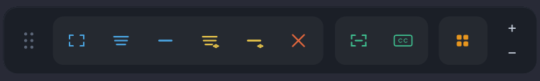

Ela fica **sempre por cima de tudo** — inclusive de jogo em janela sem borda — e você a arrasta
pelo canhoto de pontinhos da esquerda para qualquer canto de qualquer monitor. O atalho
`NumpadSubtract` (o menos do teclado numérico) mostra e esconde a barra.

Os botões, da esquerda para a direita (passe o mouse sobre um para ver o nome):

| Ícone | O que faz |
|---|---|
| Colchetes (ciano) | Selecionar área de captura |
| Três linhas (roxo) | Traduzir (Parágrafo) |
| Traço (roxo) | Traduzir (Linha) |
| Três linhas (rosa) | Traduzir com I.A Vision (Parágrafo) |
| Traço (rosa) | Traduzir com I.A Vision (Linha) |
| X (vermelho) | Limpar overlay |
| Balão (verde) | Modo Legenda — ligar/desligar |
| Retângulo (verde) | Selecionar área da legenda |
| Quatro pontos (laranja) | Mostrar/ocultar áreas |

### 2.8 Trocando os atalhos

Se as teclas padrão não te servem — teclado sem numérico, conflito com os controles do jogo —
troque em **Geral › Atalhos**.

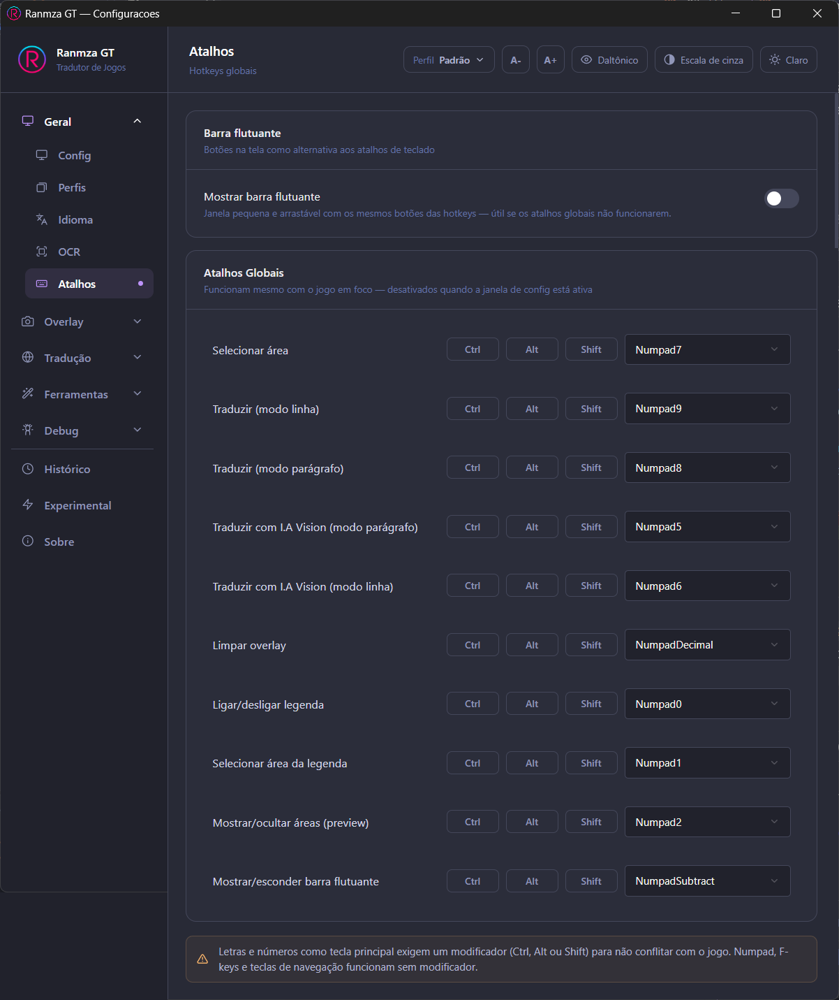

Cada ação tem uma tecla principal, escolhida na lista à direita, e três botões de modificador
(Ctrl, Alt e Shift) que você liga se quiser combinar.

> **Letra ou número como tecla principal exige um modificador** (Ctrl, Alt ou Shift), senão você
> dispararia o programa toda vez que digitasse no jogo. Teclas do Numpad, F1–F12 e as de
> navegação funcionam sozinhas.

As teclas do **Modo Tempo Real** não ficam aqui: por ser experimental, elas moram na aba
**Experimental**, e vêm sem tecla definida. Veja a
[seção 9](/Manual/modo-tempo-real-traducao-continua-no-lugar-experimental.md).

### Deu certo? E se não deu

Se a tradução apareceu sobre o jogo, está tudo pronto — siga para a
[seção 3](/Manual/uso-basico-no-dia-a-dia.md).

- **Nada aconteceu ao apertar o atalho** → a janela de configuração estava em foco, ou o jogo
  está "engolindo" as teclas do Numpad. Use a **barra flutuante** (passo 2.7) ou troque a tecla
  (passo 2.8).
- **A tradução aparece na aba Historico, mas não sobre o jogo** → o jogo está em *Tela cheia
  exclusiva*. Troque para *Janela sem borda*.
- **Saiu tradução errada ou embaralhada** → o OCR leu mal. Comece trocando o modo de
  agrupamento (`Numpad9` ↔ `Numpad8`) e veja a
  [seção 5](/Manual/configurando-a-traducao.md).

Outros problemas estão na [seção 12](/Manual/problemas-comuns-e-solucoes.md).

---

## 3. Uso básico no dia a dia

> **Importante**: os atalhos de teclado só funcionam com a **janela do jogo em foco**. Se a
> janela de configuração do Ranmza GT estiver aberta e selecionada (em primeiro plano), os
> atalhos ficam desativados — clique de volta no jogo (ou minimize a configuração) antes de
> usar `Numpad9`, `Numpad7`, etc.

1. Jogue normalmente.
2. Quando aparecer um texto que você quer traduzir, aperte **Traduzir**: `Numpad8` para
   diálogos (modo parágrafo) ou `Numpad9` para menus (modo linha).
3. A tradução aparece na tela, na posição do texto original.
4. Ela some sozinha depois de um tempo (configurável), ou aperte **Limpar overlay** (padrão
   `NumpadDecimal`) para tirá-la na hora.
5. Se o texto do jogo mudar antes da tradução sumir, é só apertar **Traduzir** de novo — a
   tradução antiga é limpa automaticamente antes da nova captura.

### Parágrafo ou linha: pegue o jeito

A escolha entre `Numpad8` e `Numpad9` é o ajuste que mais muda o resultado no dia a dia, e você
faz na hora, sem abrir configuração nenhuma:

- **`Numpad8` (parágrafo)** junta as linhas próximas num bloco só. É o que você quer numa caixa
  de diálogo, onde a fala continua de uma linha para a outra.
- **`Numpad9` (linha)** traduz cada linha por conta própria. É o que você quer num inventário ou
  menu, onde "Poção" e "Espada longa" não têm nada a ver uma com a outra.

Errou o modo? Aperte o outro atalho na sequência — a tradução anterior é limpa sozinha.

### Não confia nos atalhos do teclado?

Ative a **barra flutuante** em **Geral › Config** e dispare tudo por clique do mouse. Ela fica
sempre acima de qualquer janela, move-se livremente entre monitores e é o plano B para quando o
jogo "engole" as teclas do Numpad. Os nove botões estão explicados no
[passo 2.7](/Manual/configuracao-rapida.md).

### Conferindo se as áreas estão certas

Aperte **Mostrar/ocultar áreas** (padrão `Numpad2`) para desenhar retângulos coloridos
mostrando onde o programa vai capturar (e, se o Modo Legenda estiver configurado, onde a
legenda aparece). Aperte de novo para esconder. Não traduz nada, é só um guia visual.

---

## 4. Atalhos de teclado

| Atalho | Padrão | O que faz |
|---|---|---|
| Selecionar área | `Numpad7` | Abre o seletor para escolher onde está o texto |
| Traduzir (modo parágrafo) | `Numpad8` | Captura e traduz juntando as linhas próximas num bloco — diálogos |
| Traduzir (modo linha) | `Numpad9` | Captura e traduz cada linha por conta própria — menus e listas |
| Traduzir com I.A Vision (modo parágrafo) | `Numpad5` | Igual ao `Numpad8`, mas mandando a imagem para a IA (veja seção 7) |
| Traduzir com I.A Vision (modo linha) | `Numpad6` | Igual ao `Numpad9`, mas mandando a imagem para a IA (veja seção 7) |
| Limpar overlay | `NumpadDecimal` (vírgula do Numpad) | Esconde a tradução exibida |
| Ligar/desligar legenda | `Numpad0` | Ativa a tradução automática contínua (veja seção 8) |
| Selecionar área da legenda | `Numpad1` | Escolhe onde está a legenda do jogo |
| Mostrar/ocultar áreas (preview) | `Numpad2` | Mostra os retângulos das áreas configuradas |
| Mostrar/esconder barra flutuante | `NumpadSubtract` (menos do Numpad) | Abre ou fecha a barra flutuante de botões (veja seção 3) |

> **E o Modo Tempo Real?** Os atalhos dele — ligar/desligar e selecionar área — não estão nesta
> lista nem em Geral › Atalhos: por ser experimental, ficam na aba **Experimental**, e vêm **sem
> tecla definida**. Você escolhe as suas lá. Veja a
> [seção 9](/Manual/modo-tempo-real-traducao-continua-no-lugar-experimental.md).

Todos podem ser trocados em **Geral › Atalhos** — escolha outra tecla e, se quiser, combine com
Ctrl/Alt/Shift. Se escolher uma **letra ou um número** da fileira de cima, é **obrigatório** usar
pelo menos um modificador (Ctrl, Alt ou Shift), para não atrapalhar os controles normais do jogo
(que usam WASD e os slots 0–9 o tempo todo). Numpad, F1–F12 e as teclas de navegação funcionam
sozinhas — os grupos **Números** e **Navegação** salvam quem está em notebook sem teclado
numérico.

> Os atalhos só funcionam quando a janela do jogo está em foco (ou seja, quando a janela de
> configuração do Ranmza GT não está em primeiro plano). Assim você pode digitar normalmente
> nos campos da configuração sem disparar comandos sem querer.

---

## 5. Configurando a tradução

### Tipo de texto: diálogo ou menu?

O modo de agrupamento **não se escolhe numa aba** — é decidido na hora da captura, pelo atalho
que você aperta:

- **`Numpad8` — Modo Parágrafo** — junta linhas próximas em um único bloco de tradução. Use para
  **diálogos, falas de personagens, textos corridos** (visual novels, JRPGs).
- **`Numpad9` — Modo Linha** — cada linha vira uma tradução separada. Use para **menus,
  inventário, status, HUD** — onde cada linha é uma informação independente e não deve ser
  misturada com a de cima ou de baixo.

O mesmo vale para o Vision: `Numpad5` é parágrafo e `Numpad6` é linha.

Se o modo Parágrafo estiver juntando falas que deveriam ser separadas (ou separando uma fala que
deveria ficar junta), ajuste a **Sensibilidade do agrupamento**, em **Geral › OCR**:

- Texto sendo **separado demais**? Aumente o valor (até 3,0).
- Texto sendo **juntado demais**? Diminua o valor (até 0).

Esse ajuste só afeta o modo Parágrafo — no modo Linha ele é ignorado.

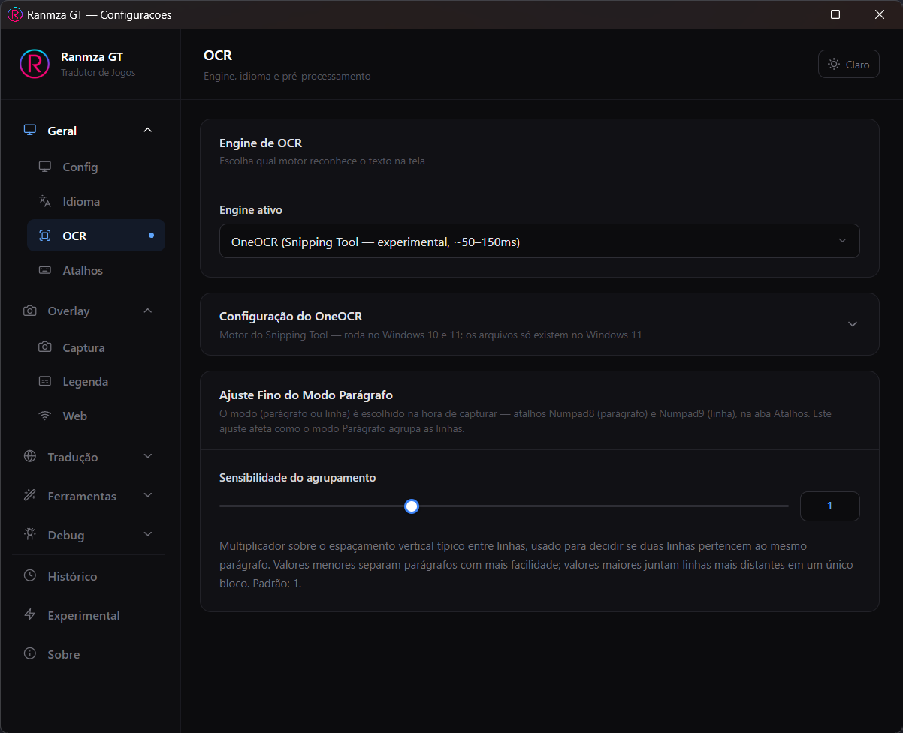

<i>O ajuste fica no fim da aba <b>Geral › OCR</b>, no card <b>Ajuste Fino do Modo Parágrafo</b>.</i>

### Melhorando o reconhecimento de texto difícil

Se o programa não está detectando o texto direito (fontes pequenas, estilizadas, com efeitos),
vá em **Overlay › Captura** e ative o **Pré-processamento**. Algumas dicas rápidas:

- **Texto pequeno**: aumente o **Upscale** (2x ou 3x costuma resolver).
- **Fonte com contorno grosso**: aumente um pouco o **Sharpen**.
- **Texto com pouco contraste contra o fundo**: aumente o **Contraste**.
- **Texto claro sobre fundo escuro** (ou vice-versa, se estiver dando errado): tente
  **Inverter cores**.

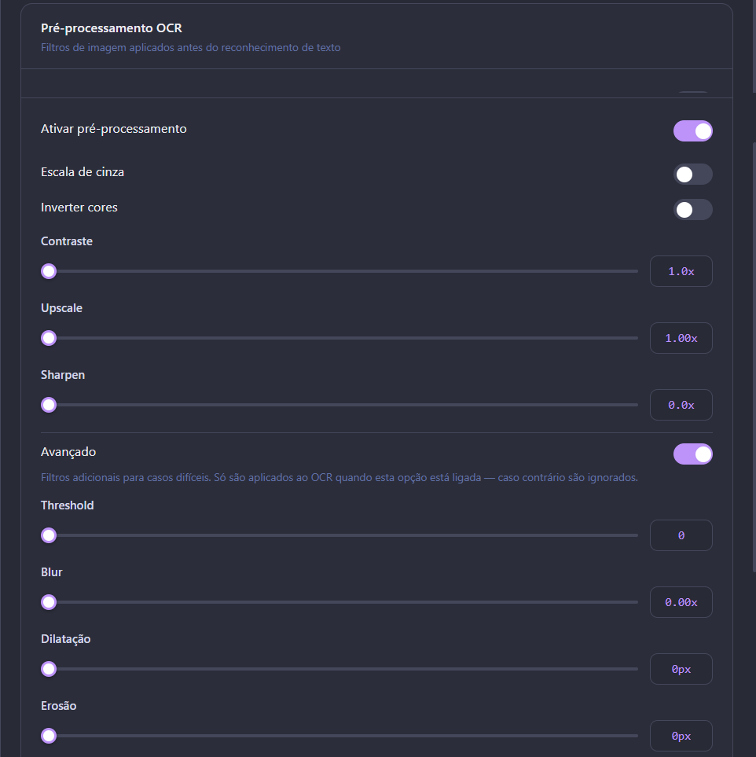

<i>O card <b>Pré-processamento OCR</b>, em <b>Overlay › Captura</b>. Os filtros extras
(Threshold, Blur, Dilatação, Erosão) só entram com o <b>Avançado</b> ligado.</i>

Não sabe por onde começar? Use **Ferramentas › Lab** — lá dá para testar todas essas opções em
imagens de exemplo, ver o resultado em tempo real, e depois aplicar a configuração que funcionou
melhor direto na Captura ou na Legenda.

### Trocando o motor de OCR (avançado)

Se mesmo com pré-processamento o reconhecimento continuar ruim, **Geral › OCR** permite trocar
o "motor" de reconhecimento de texto:

- **WinOCR** (padrão) — rápido (~30 ms), já vem pronto, mas pode errar em fontes muito
  estilizadas.
- **OneOCR** (experimental) — o motor de OCR da Ferramenta de Captura (Snipping Tool), muito
  melhor que o WinOCR em fontes estilizadas e multilíngue automático (não precisa configurar
  idioma de origem). **Roda no Windows 10 e no 11**; o que é exclusivo do Windows 11 são os
  3 arquivos que ele usa — eles só vêm com o Snipping Tool do Win11, então você os copia de uma
  máquina com Windows 11 e aponta a pasta. O card em Geral › OCR mostra o passo a passo. Por
  usar uma API não oficial da Microsoft, uma atualização do Snipping Tool pode parar de
  funcionar; nesse caso, basta reextrair os arquivos.

---

## 6. Deixando a tradução com a "cara" do jogo

Em **Overlay › Captura**, no card **Texto**:

- **Fonte**: escolha entre as fontes incluídas na pasta `fonts/` ou use a padrão do sistema
  (Arial). A prévia logo abaixo mostra como fica.
- **Cor do texto**: branco por padrão; troque para combinar com a paleta do jogo.
- **Tamanho da fonte** e **Altura da linha**: ajuste para o texto ficar legível e bem
  espaçado.
- **Auto-fit**: deixe ativado para o programa **diminuir a fonte automaticamente** até a
  tradução inteira caber no espaço do texto original — assim o texto nunca é cortado. Dica: com
  o Auto-fit ligado, deixe o **Tamanho da fonte** no máximo — o programa encontra sozinho o
  maior tamanho que exibe a tradução completa preenchendo bem a área, e subir mais o controle
  não muda mais nada.
- **Fundo**: desenha uma caixa escura atrás do texto (com opacidade ajustável), para garantir
  legibilidade sobre qualquer cenário.
- **Contorno**: alternativa ao fundo — desenha uma borda preta nas letras, sem caixa visível,
  para um visual mais discreto/integrado.

> Fundo e contorno são opções alternativas — ativar uma desativa a outra automaticamente.

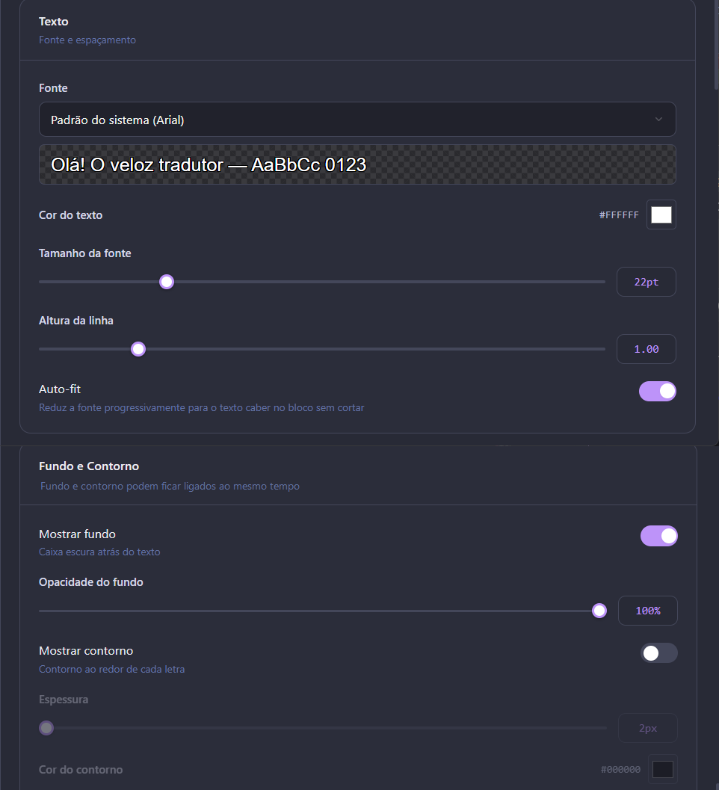

<i>Os cards <b>Texto</b> e <b>Fundo e Contorno</b>, em <b>Overlay › Captura</b>.
A prévia embaixo da fonte mostra o resultado antes de você testar no jogo.</i>

### Quanto tempo a tradução fica na tela

Em "Exibição", escolha por quanto tempo a tradução permanece visível depois de aparecer: 15s,
30s, 1 minuto (padrão), 2, 5 ou 10 minutos — ou "Nunca" (a tradução só some quando você apertar
o atalho de limpar ou traduzir de novo).

No mesmo card fica **"Esconder a tradução de gravações e transmissões"**: ligada, a tradução
continua na sua tela normalmente, mas não aparece para programas de captura. Útil para gravar o
jogo sem a tradução por cima. Vale só para a tradução manual; o Modo Legenda tem a opção
equivalente na aba dele.

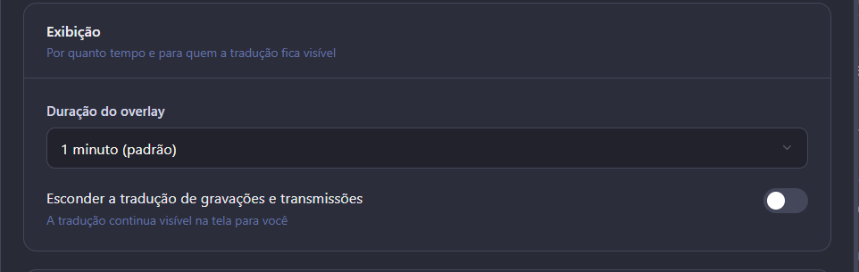

<i>O card <b>Exibição</b>, em <b>Overlay › Captura</b>.</i>

> Funciona só com programas rodando **NESTE PC** (OBS, Game Bar, NVIDIA ShadowPlay, etc).
> Gravando por placa de captura, a tradução aparece assim mesmo — quem esconde a janela é o
> Windows, e o que sai pelo cabo de vídeo é a tela inteira.

---

## 7. Modo Vision — quando o OCR erra

Às vezes o reconhecimento de texto comum (OCR) erra letras, perde pedaços do texto ou se perde
totalmente em fontes muito estilizadas/artísticas, com símbolos ou ícones no meio do texto.

Para esses casos, use o **Traduzir com I.A Vision**. Em vez de confiar só no texto reconhecido, o
programa **envia a imagem da tela para a Inteligência Artificial**, que "olha" a imagem e entende
melhor o que está escrito, mesmo que o reconhecimento de texto tenha errado.

Assim como no Traduzir normal, o Vision tem os dois modos, e você escolhe pelo atalho:

- **`Numpad5`** — Vision no **modo parágrafo** (diálogos).
- **`Numpad6`** — Vision no **modo linha** (menus e listas).

**Importante:**
- Só funciona com **OpenAI, Claude ou Gemini** (Google Translate e DeepL não suportam esse modo).
- É um pouco mais lento e **sempre faz uma chamada nova** à IA (não usa o histórico de
  traduções já feitas).
- A posição da tradução na tela ainda depende de onde o reconhecimento de texto encontrou algo
  — então, em casos raros, a tradução pode ficar maior que a área detectada.

**Quando usar**: fontes desenhadas à mão, créditos estilizados, textos com ícones/símbolos
misturados (ex: "pressione [ícone de botão] para continuar"), ou sempre que o atalho normal
("Traduzir") devolver um texto sem sentido.

---

## 8. Modo Legenda — tradução automática contínua

Para cenas com diálogo contínuo (cutscenes, modo automático de visual novels, vídeos com
legenda), o Modo Legenda traduz **sozinho, repetidamente**, sem você precisar apertar nada.

### Como configurar

1. Em **Overlay › Legenda**, ajuste as opções de captura (intervalo, quantas linhas mostrar,
   etc.) — os padrões já funcionam bem para a maioria dos casos.
2. Aperte **Selecionar área da legenda** (padrão `Numpad1`) e desenhe um retângulo sobre onde a
   legenda/diálogo aparece no jogo.
3. Aperte **Ligar/desligar legenda** (padrão `Numpad0`) para ativar.

A partir daí, o programa fica de olho naquela área, traduzindo automaticamente sempre que um
texto novo aparecer e ficar "parado" por um instante (isso evita traduzir letras aparecendo uma
por uma em efeitos de "máquina de escrever").

Por padrão, as traduções aparecem **acima** da área selecionada, em ordem (mais recente
embaixo), e somem sozinhas se nenhum texto novo aparecer por alguns segundos. Dá para trocar
isso pela sobreposição no lugar da legenda original — é o tópico a seguir.

  <iframe src="https://player.vimeo.com/video/1217784520"
          style="position:absolute;top:0;left:0;width:100%;height:100%;border:0"
          allow="fullscreen; picture-in-picture" allowfullscreen
          title="Modo Legenda traduzindo sozinho"></iframe>

<i>Modo Legenda traduzindo sozinho, com as traduções acima da área selecionada.</i>

### Substituindo a legenda original no lugar

Em **Overlay › Legenda**, o primeiro card (*Posição da tradução*) tem a opção **"Substituir a
legenda original no lugar"**. Ligada, a tradução deixa de aparecer acima da área e passa a ser
desenhada **em cima** dela, cobrindo a legenda original do jogo — como se o jogo estivesse
legendado no seu idioma.

Nesse modo o programa mostra **uma fala por vez**, e o controle *Linhas visíveis* fica travado
em 1. O motivo é simples: a área que você selecionou tem o tamanho de **uma** legenda do jogo,
então empilhar duas ou três falas traduzidas ali dentro não caberia — o texto sairia cortado na
borda. Sua escolha de linhas fica guardada e volta a valer assim que você desligar a opção.

> Se mesmo com uma fala a tradução não couber (o português costuma ser mais longo que o inglês
> ou o japonês), diminua o *Tamanho da fonte* no card **Texto**, ou refaça a seleção da área um
> pouco mais alta que a legenda do jogo.

> Nesse modo a legenda fica **escondida das capturas de tela**. Não é um defeito: é justamente
> isso que impede o OCR de reler a própria tradução no ciclo seguinte e se retroalimentar.
> Funciona só com programas rodando **NESTE PC** (OBS, Game Bar, NVIDIA ShadowPlay, etc).
> Gravando por placa de captura, a tradução aparece assim mesmo.

A opção vale só para o Modo Legenda — a tradução manual (`Numpad8`/`Numpad9`) e o Modo Tempo
Real não são afetados.

  <iframe src="https://player.vimeo.com/video/1218086653"
          style="position:absolute;top:0;left:0;width:100%;height:100%;border:0"
          allow="fullscreen; picture-in-picture" allowfullscreen
          title="Tradução cobrindo a legenda original"></iframe>

<i>A tradução desenhada por cima da legenda original. O vídeo foi filmado com
celular justamente porque, nesse modo, a legenda não aparece em gravações de tela.</i>

### Deixando a IA "lembrar" das falas anteriores

Se você está usando OpenAI, Claude ou Gemini, **Traducao › I.A** tem um controle **"Falas
anteriores"** (0 a 20, padrão 5). Com ele ligado, a IA recebe as últimas falas já traduzidas
como referência antes de traduzir a próxima — isso ajuda a manter os mesmos nomes, termos e
tom ao longo de uma conversa. Se notar que a IA está mudando o nome de um personagem ou o tom
da tradução de uma fala para outra, aumente esse valor; se preferir que cada fala seja
traduzida sem depender das anteriores, deixe em 0.

> O **DeepL** também aproveita as falas anteriores como contexto, **sem custo extra** — ele
> recebe as últimas falas como referência (seguindo o mesmo controle **"Falas anteriores"**)
> para manter a consistência de nomes e termos. Mesmo não sendo uma IA conversacional, isso
> deixa a tradução contínua mais coesa. **Google Translate** não usa esse contexto.

### Aparência separada

Overlay › Legenda tem suas próprias opções de fonte, cor, fundo e contorno — independentes da
tradução manual — então você pode deixar a legenda contínua menor/mais discreta e a tradução
manual (`Numpad8`/`Numpad9`) maior, por exemplo. O pré-processamento de imagem também é
independente.

### Desligando

Aperte **`Numpad0`** novamente, ou o botão verde de balão na barra flutuante. A legenda na tela
é limpa imediatamente.

O modo também **se desliga sozinho** depois de um tempo sem detectar texto na região, para não
ficar rodando à toa quando você sai da cutscene e esquece de desligar. O tempo é escolhido em
*Overlay › Legenda → Desligar Modo Legenda após inatividade*: Nunca, 1, 2, 3, 5 ou 10 minutos
(padrão 1 minuto). Repare que isso **desliga o modo**, não só esconde a legenda — para religar,
aperte `Numpad0`.

---

## 9. Modo Tempo Real — tradução contínua no lugar (experimental)

> Recurso **experimental** — ligado e configurado pela aba **Experimental**. O comportamento
> ainda pode mudar e bugs são esperados.

O Modo Tempo Real junta o melhor dos outros dois modos: é **contínuo e automático** como o
Modo Legenda (não precisa apertar nada a cada fala), mas desenha a tradução **no lugar do texto
original**, sobre cada linha detectada, como o modo Traduzir — em vez de empilhar tudo numa
caixa fora da área. Ele trabalha sobre uma **área própria**, normalmente maior que a da legenda
(cobre a caixa de diálogo inteira, o nome do personagem, várias linhas de uma vez).

É indicado para conversas com NPCs em que aparecem **nome + várias linhas de fala** ao mesmo
tempo, e você quer tudo traduzido ao vivo, na posição original, sem clicar.

### Como usar

Tudo do Tempo Real fica na aba **Experimental**, dentro do card *Modo Tempo Real (sobreposição
ao vivo)* — inclusive os atalhos, que **não vêm com tecla definida**. É de propósito: enquanto
o recurso é experimental, ele não ocupa uma tecla do seu teclado sem você pedir.

1. Abra a aba **Experimental** e expanda o card **Modo Tempo Real**.
2. Ligue **Permitir Modo Tempo Real**. Essa chave só **destrava** a hotkey — não começa a
   traduzir nada por si só. Com ela desligada, o atalho não faz absolutamente nada.
3. Defina as duas teclas ali mesmo: **Ligar/desligar Tempo Real** e **Selecionar área do Tempo
   Real**. Escolha teclas livres do Numpad (`Numpad3` e `Numpad4` estão sobrando nos padrões de
   fábrica) ou qualquer outra combinação.
4. Ajuste as opções, se quiser (intervalo, fonte, fundo, contorno, limpeza automática) — os
   padrões já funcionam.
5. Aperte a tecla de **selecionar área** e desenhe o retângulo sobre a região onde o texto
   aparece.
6. Aperte a tecla de **ligar/desligar**. A tradução passa a aparecer sobreposta, atualizando
   sozinha conforme o texto muda. Aperte de novo para desligar.

> O overlay do Tempo Real é **sempre** escondido das capturas de tela — não há nada para
> ligar. Sem isso, a tradução que o programa desenha por cima seria recapturada pelo próprio
> OCR no ciclo seguinte, se retroalimentando até virar uma bagunça. Funciona só com programas
> rodando **NESTE PC** (OBS, Game Bar, NVIDIA ShadowPlay, etc). Gravando por placa de captura,
> a tradução aparece assim mesmo.

> Por ser contínuo e desenhar várias áreas ao vivo, o Tempo Real é mais pesado que os outros
> modos. Se notar travadas, aumente o **intervalo** no card.

### Estabilidade com fundo animado

Em cenas com fundo em movimento (animações de jogos de RPG, vídeos), o reconhecimento de texto
pode oscilar de um quadro para outro, fazendo a tradução **tremer** ou **piscar**. Dois ajustes
no card do Tempo Real controlam isso:

- **Estabilidade da posição** — quantos pixels o texto precisa andar para a tradução ser
  reposicionada. Maior = tradução mais "parada" (ignora o tremor); menor = acompanha o texto
  mais de perto. (Padrão: 12px.)
- **Segurar em falha de OCR** — por quantos ciclos uma tradução continua na tela quando o
  reconhecimento falha por um instante, evitando a piscada. Maior = segura mais tempo; menor =
  some mais rápido. (Padrão: 6.)

Regra prática: se ainda **tremer**, aumente a *Estabilidade da posição*; se ainda **piscar**,
aumente o *Segurar em falha de OCR*.

### Efeito máquina de escrever (typewriter)

Muitos jogos revelam o texto **letra por letra**. Para não traduzir frases pela metade, ligue
**Esperar o texto assentar**, no card *Esperar texto completo (efeito máquina de escrever)* da
aba Experimental: o programa aguarda a fala parar de mudar antes de traduzir. Vale tanto para o
Modo Tempo Real quanto para o Modo Legenda.

Três controles afinam o comportamento: quantas leituras seguidas precisam bater (*Capturas
estáveis exigidas*), o quanto elas precisam se parecer para contarem como iguais (*Limiar de
"mesmo texto"*) e quanto tempo no máximo esperar antes de traduzir do jeito que está (*Teto de
espera*).

---

## 10. Usando no OBS / transmissões

Se você transmite ou grava o jogo e quer que **a tradução apareça também no vídeo/stream**
(ou só no vídeo, sem aparecer no jogo em si), use **Overlay › Web**:

1. Ative o **Servidor ativo**.
2. Copie o endereço **Captura — OBS** (`/captura/obs`) mostrado na aba, no botão *Copiar*.
3. No OBS, adicione uma fonte do tipo **"Navegador" (Browser Source)** e cole esse endereço.
   Essa versão da página tem fundo transparente, pronta para sobrepor à captura do jogo.
4. (Opcional) **Desative** a chave **"Mostrar tradução na tela"** para tirar o overlay do jogo e
   deixar a tradução aparecer **só** na página do navegador/OBS — útil se a captura do OBS já
   inclui a janela do overlay e você não quer ver a tradução duplicada. Deixe **ligada** se
   quiser a tradução nos dois lugares.

Você também pode personalizar tema (claro/escuro/dracula), cores, tamanho da fonte, e se quer
mostrar o texto original junto com a tradução, horário e qual serviço foi usado.

A página também pode ser aberta em qualquer navegador da rede local (celular, segundo monitor,
etc.) usando o endereço **Captura** (`/captura`) mostrado na aba — essa versão vem com histórico
e botão de limpar.

> Se a tradução some das suas gravações e transmissões, há três causas possíveis. Duas são
> automáticas, nos modos que desenham **por cima** do texto original: o Modo Tempo Real (sempre)
> e o Modo Legenda com *"Substituir a legenda original no lugar"* ligado — nos dois o overlay
> precisa ficar invisível para capturas, senão o OCR releria a própria tradução. A terceira é
> uma escolha sua: *"Esconder a tradução de gravações e transmissões"*, no card **Exibição** de
> Overlay › Captura. É justamente nesses casos que o servidor Web resolve.

---

## 11. Histórico e desempenho

- **Aba Historico**: mostra as traduções feitas durante a sessão atual (texto original,
  tradução, horário e serviço usado), da mais recente para a mais antiga. Clique numa entrada
  para copiar a tradução; há também um botão para limpar tudo.
- **Debug › Monitor**: liga um registro das últimas 10 traduções com o tempo que cada etapa
  levou (captura, pré-processamento, reconhecimento, tradução, total) — útil para perceber se
  alguma configuração está deixando o programa lento (por exemplo, pré-processamento muito
  pesado). A coluna **Cache** mostra quantos blocos foram resolvidos sem chamar a API, e a
  **API**, quantas chamadas foram feitas de fato.
- **Uso do DeepL** (**Traducao › Tradutores**, com o DeepL selecionado): mostra quantos
  **caracteres** o DeepL traduziu nesta sessão e a **cota da conta** (caracteres usados/limite do
  período de cobrança) — clique em "Atualizar" para consultar. É exclusivo do DeepL; os motores
  de IA não expõem o gasto pela chave.

---

## 12. Problemas comuns e soluções

**"Erro ao abrir o programa: VCRUNTIME140.dll não foi encontrado" (ou MSVCP140.dll)**
→ Falta o **Microsoft Visual C++ Redistributable** no seu Windows — um componente gratuito da
Microsoft que alguns PCs recém-formatados ainda não têm. Baixe e instale o pacote **x64** por este
link oficial: <https://aka.ms/vs/17/release/vc_redist.x64.exe> — depois reabra o Ranmza GT, que ele
abre normalmente.

**"O reconhecimento não detecta nada" / aviso vermelho sobre idioma**
→ Vá em **Geral › Idioma** e clique no aviso para instalar o pacote de idioma do Windows necessário.

**"Apertei o atalho e nada acontece"**
→ Confira se a janela de configuração não está em primeiro plano (os atalhos só funcionam com
o jogo em foco). Se mesmo assim não funcionar, ative a **barra flutuante** (**Geral › Config**) e use
os botões dela.

**"Os atalhos não funcionam em alguns jogos (mesmo com o jogo em foco)"**
→ Alguns jogos rodam com privilégios elevados (Administrador) e, por isso, **bloqueiam o registro
dos atalhos globais** do Ranmza GT. Nesse caso, **execute o Ranmza GT como Administrador** (clique
com o botão direito no `.exe` → *Executar como administrador*) — assim ele consegue ativar os
atalhos por cima do jogo. Para não precisar repetir toda vez, marque *Executar este programa como
administrador* em **Propriedades → Compatibilidade** do executável. (Alternativa: use a **barra
flutuante**, que dispara as ações por clique do mouse e não depende dos atalhos do teclado.)

**"A tradução não aparece, ou demora muito"**
→ Confira as abas **Historico** e **Debug › Monitor** para ver se a tradução está sendo feita. Falhas passageiras
(limite de requisições, servidor fora do ar por um instante, queda de conexão) são **tentadas de
novo automaticamente** uma vez antes de recorrer ao Google Translate. Se você tiver **mais de uma
chave** cadastrada para o motor, ele ainda tenta as demais chaves da lista antes do fallback. Se
aparecer um aviso amarelo de "fallback para Google Translate" — e no Histórico a tradução vier
marcada como "Google Translate (fallback)" —, quer dizer que o serviço configurado (OpenAI, Claude,
Gemini) falhou em **todas** as chaves; confira suas chaves de API e créditos em Traducao › Tradutores.

**"Apareceu um aviso vermelho de erro"**
→ Geralmente indica chave de API inválida, créditos esgotados, ou o serviço fora do ar
temporariamente. Confira **Traducao › Tradutores**. Se o aviso disser que a resposta foi **cortada no
limite de tokens**, aumente o **Max tokens** em **Traducao › I.A** (acontece só em blocos de texto muito
grandes).

**"O texto reconhecido está errado/incompleto"**
→ Tente ativar o pré-processamento (**Overlay › Captura**) com upscale e ajuste de contraste,
ou use o **Traduzir com I.A Vision** (`Numpad5` parágrafo, `Numpad6` linha) para deixar a IA
"ver" a imagem e corrigir.

**"A tradução fica cortada ou não cabe na caixa"**
→ Na tradução manual (`Numpad8`/`Numpad9`), ative **Auto-fit** em **Overlay › Captura** — o programa
vai diminuir a fonte automaticamente até caber.
→ No **Modo Legenda** com *Substituir a legenda original no lugar* ligado não há auto-fit: a
tradução tem que caber na área que você marcou. Diminua o *Tamanho da fonte* em **Overlay ›
Legenda**, ou refaça a seleção da área um pouco mais alta que a legenda do jogo.

**"As traduções de falas diferentes estão se misturando num bloco só" (ou o contrário)**
→ Primeiro confira se você apertou o atalho certo: `Numpad8` junta as linhas (parágrafo) e
`Numpad9` separa (linha). Se o modo está certo e ainda erra, ajuste a **Sensibilidade do
agrupamento** em **Geral › OCR** — ela só afeta o modo Parágrafo.

**"Troquei de monitor e a captura não funciona mais direito"**
→ Reinicie o programa pelo botão em **Geral › Config** — é necessário após trocar de monitor.

**"Quero compartilhar meus logs para suporte, mas não quero mostrar o conteúdo do jogo"**
→ Confira em **Debug › Logs** se a opção "Logar textos capturados e traduções" está
**desativada** (é o padrão) — assim os logs não mostram o conteúdo dos textos/traduções.

---

## 13. Referência completa — todas as abas

Esta seção descreve **cada aba e cada opção** da janela de configuração, na ordem em que
aparecem no menu da esquerda. É material de consulta — para o dia a dia, as seções anteriores
já bastam.

O menu tem cinco grupos com sub-itens (**Geral**, **Overlay**, **Traducao**, **Ferramentas**,
**Debug**) e três itens soltos embaixo (**Historico**, **Experimental**, **Sobre**).

### Geral › Config

Onde o programa opera.

- **Idioma do programa → Idioma da interface** — troca o idioma da própria janela de
  configuração (Português / Inglês). Não afeta os idiomas de OCR e tradução. Na primeira
  execução ele detecta o idioma do Windows (cai para Inglês se não for Português).
- **Atualizações → Avisar sobre novas versões** — liga o aviso que aparece ao abrir o programa
  quando existe versão mais nova publicada (veja a seção 14). Desligue aqui, ou pelo próprio
  aviso, e religue por este toggle.
- **Atualizações → Verificar agora** — consulta na hora se existe versão nova, mesmo com o
  aviso desligado. A resposta aparece ao lado do botão: *"Você está na versão mais recente"*,
  a versão encontrada (com um botão **Baixar** que abre a página no navegador) ou um aviso de
  que não foi possível verificar.
- **Configuração → Resetar para o padrão** — restaura todas as opções aos valores de fábrica.
  **Mantém** o monitor, as áreas selecionadas, as chaves de API, os prompts (System Prompt e
  Informações do Jogo) e a preferência de aviso de atualização.
- **Backend de captura → Backend** — como o programa lê os pixels da tela:
  - *Auto (recomendado)* — escolhe sozinho: WGC no Windows 11, DXGI no Windows 10, sem a borda
    amarela. A troca vale na hora, sem reiniciar.
  - *WGC (Windows 11)* — Windows Graphics Capture.
  - *DXGI (Windows 10)* — Desktop Duplication; existe para o Windows 10 não desenhar a borda
    amarela ao redor do monitor capturado.
- **Monitor → Tela ativa** — em qual monitor o programa captura, traduz e exibe. *Automático*
  usa o monitor principal do Windows. Trocar de monitor **limpa a área de captura** salva e
  **exige reiniciar** (botão "Reiniciar agora" aparece no rodapé da aba).
- **Barra flutuante → Mostrar barra flutuante** — liga a janelinha de botões sempre visível
  (veja o passo 2.7). Também abre e fecha pelo atalho `NumpadSubtract`, e ela **lembra a última
  posição** em que você a deixou.

### Geral › Idioma

O campo do idioma de origem **se adapta ao motor de OCR** escolhido em Geral › OCR.

- **Idioma do texto original**
  - Com *WinOCR* — o campo **Idioma do texto** recebe uma tag BCP-47 (`en`, `ja`, `ko`,
    `zh-Hans`, `pt`…). Se o pacote do idioma não estiver instalado no Windows, aparece um aviso
    com o botão **Instalar pacote de idioma**, que abre direto a tela de idiomas do Windows.
  - Com *OneOCR* — **detecção automática**; não há idioma de origem para configurar e o campo
    não aparece.
- **Idioma destino** — para qual idioma traduzir (`pt`, `es`, `fr`, `de`, `it`, `zh`…).

### Geral › OCR

Qual motor reconhece o texto e como ele agrupa as linhas.

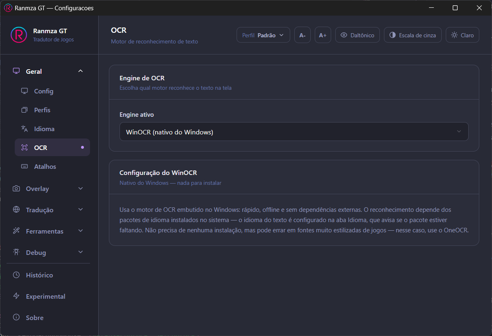

- **Engine de OCR → Engine ativo**
  - *WinOCR (padrão — nativo, ~30 ms)* — motor embutido no Windows: rápido, offline e sem
    dependência externa. O reconhecimento depende dos pacotes de idioma instalados no sistema.
    É o mais rápido, mas pode errar em fontes muito estilizadas de jogos.
  - *OneOCR (Snipping Tool — experimental, ~50–150 ms)* — modelo multilíngue com detecção
    automática de idioma. **Roda no Windows 10 e no 11**; o que é exclusivo do Windows 11 são os
    arquivos: `oneocr.dll`, `oneocr.onemodel` e `onnxruntime.dll` só vêm com o Snipping Tool do
    Windows 11. Você os copia de uma máquina com Win11 e aponta a pasta (o card traz o passo a
    passo, inclusive o comando do PowerShell para achar a pasta do Snipping Tool). Usa uma API
    não oficial da Microsoft — uma atualização do Snipping Tool pode quebrar a integração, e aí
    é só reextrair os arquivos.
  - O card de configuração do motor é **recolhível**: fica aberto enquanto a pasta não estiver
    configurada, e depois você pode fechá-lo.
- **Ajuste Fino do Modo Parágrafo → Sensibilidade do agrupamento** (0–3,0; padrão 1) —
  multiplicador sobre o espaçamento vertical típico entre linhas, usado para decidir se duas
  linhas pertencem ao mesmo parágrafo. Valores menores separam parágrafos com mais facilidade;
  maiores juntam linhas mais distantes num bloco só.

> **O modo não se escolhe aqui.** Parágrafo ou linha é decidido **na hora de capturar**, pelo
> atalho que você aperta: `Numpad8` (parágrafo) ou `Numpad9` (linha). Esta aba só afina como o
> modo Parágrafo agrupa.

### Geral › Atalhos

Dez atalhos globais — funcionam com o jogo em foco e ficam desativados enquanto a janela de
configuração está em primeiro plano. Cada um tem os modificadores **Ctrl / Alt / Shift** e uma
tecla principal, escolhida entre os grupos **Numpad**, **Função** (F1–F12), **Navegação**
(setas, Insert, Delete, Home, End, PageUp, PageDown), **Números** e **Letras**.

| Ação | Padrão |
|---|---|
| Selecionar área | `Numpad7` |
| Traduzir (modo linha) | `Numpad9` |
| Traduzir (modo parágrafo) | `Numpad8` |
| Traduzir com I.A Vision (modo parágrafo) | `Numpad5` |
| Traduzir com I.A Vision (modo linha) | `Numpad6` |
| Limpar overlay | `NumpadDecimal` |
| Ligar/desligar legenda | `Numpad0` |
| Selecionar área da legenda | `Numpad1` |
| Mostrar/ocultar áreas (preview) | `Numpad2` |
| Mostrar/esconder barra flutuante | `NumpadSubtract` |

> **Letras e números** como tecla principal **exigem** um modificador (Ctrl, Alt ou Shift) para
> não conflitar com o jogo, que usa WASD e os slots 0–9 o tempo todo. Numpad, F-keys e teclas de
> navegação funcionam sem modificador. Os grupos Números e Navegação salvam quem está em
> notebook sem teclado numérico.

O programa avisa se você repetir a mesma combinação em dois atalhos — um dos dois não seria
registrado.

Os atalhos do **Modo Tempo Real** não estão aqui: por ser experimental, eles ficam na aba
Experimental e vêm **sem tecla definida**.

### Overlay › Captura

Aparência da tradução manual e pré-processamento da imagem.

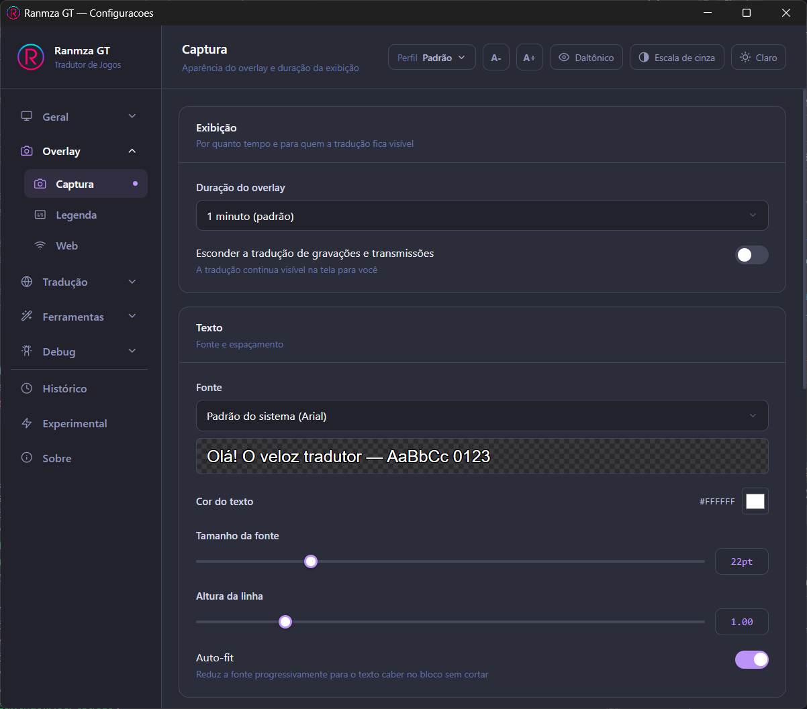

- **Texto**
  - *Fonte* — "Padrão do sistema (Arial)" ou qualquer fonte da pasta `fonts/`, com prévia ao
    lado.
  - *Cor do texto* — seletor de cor (padrão branco).
  - *Tamanho da fonte* — 8 a 72 pt.
  - *Altura da linha* — 0,80 a 2,00.
  - *Auto-fit* — reduz a fonte progressivamente para o texto caber no bloco sem cortar.
- **Fundo e Contorno** — são alternativos, ligar um desliga o outro.
  - *Mostrar fundo* + *Opacidade do fundo* (10–100%) — caixa escura atrás do texto.
  - *Mostrar contorno* + *Espessura* (2–5 px) — contorno preto ao redor de cada letra.

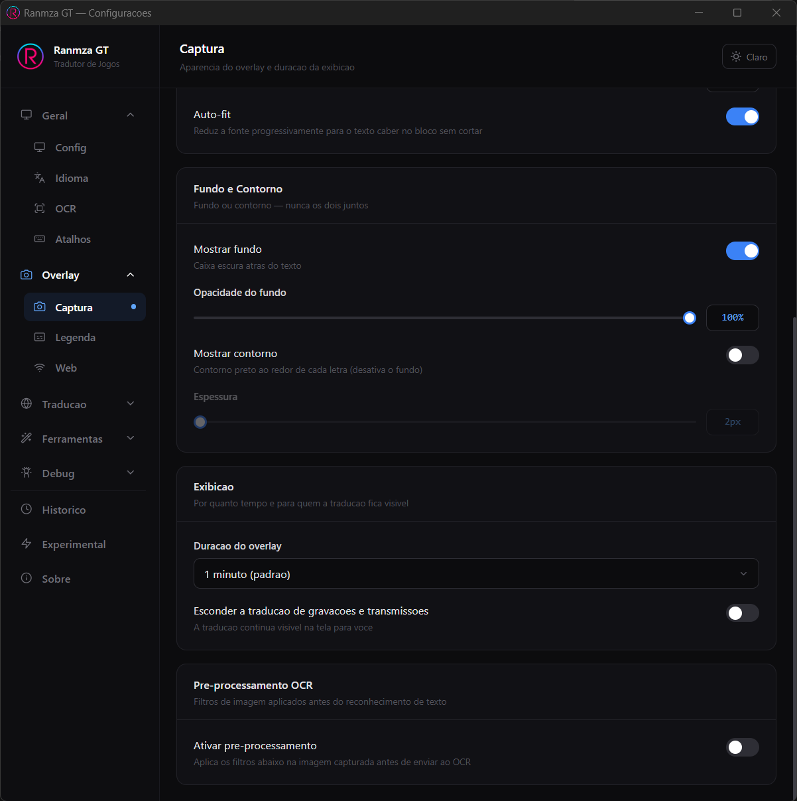

- **Exibição**
  - *Duração do overlay* — Nunca limpar automaticamente / 15 s / 30 s /
    **1 minuto (padrão)** / 2 / 5 / 10 minutos.
  - *Esconder a tradução de gravações e transmissões* — a tradução continua visível na sua tela,
    mas some das capturas. Funciona só com programas rodando neste PC (OBS, Game Bar, NVIDIA
    ShadowPlay, etc); gravando por placa de captura, ela aparece assim mesmo. Afeta só a
    tradução manual.
- **Pré-processamento OCR** — filtros aplicados à imagem antes do reconhecimento:
  - *Ativar pré-processamento* liga o bloco.
  - *Escala de cinza* · *Inverter cores*
  - *Contraste* (1,0–3,0×) · *Upscale* (1,0–4,0×) · *Sharpen* (0–2,0×)
  - *Avançado* — só é aplicado quando ligado: *Threshold* (0–255), *Blur* (0–5,0×),
    *Dilatação* (0–10 px), *Erosão* (0–10 px).

### Overlay › Legenda

O Modo Legenda tem aparência e pré-processamento **próprios**, independentes de Overlay › Captura.

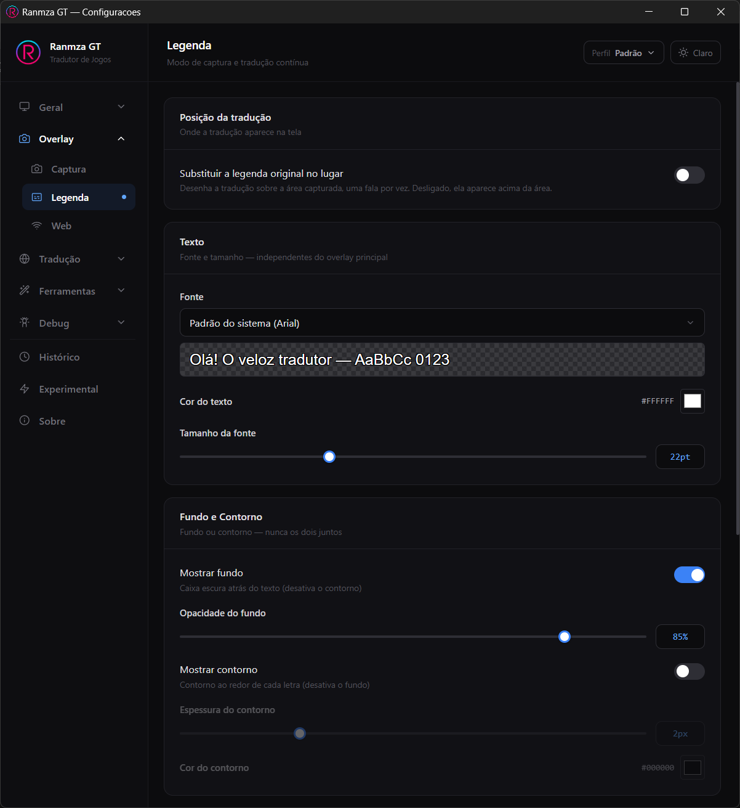

- **Posição da tradução** — *Substituir a legenda original no lugar*: desenha a tradução em cima
  da área capturada, cobrindo a legenda original, em vez de mostrá-la acima da área. Mostra uma
  fala por vez (ver *Linhas visíveis* abaixo). Nesse modo a legenda some das capturas feitas
  neste PC — é o que impede o OCR de reler a própria tradução. Ver a seção 8.
- **Texto** — *Fonte*, *Cor do texto* e *Tamanho da fonte* (10–48 pt). Não tem altura de linha
  nem auto-fit.
- **Fundo e Contorno** — *Mostrar fundo* + *Opacidade* (10–100%) ou *Mostrar contorno* +
  *Espessura do contorno* (1–5 px).

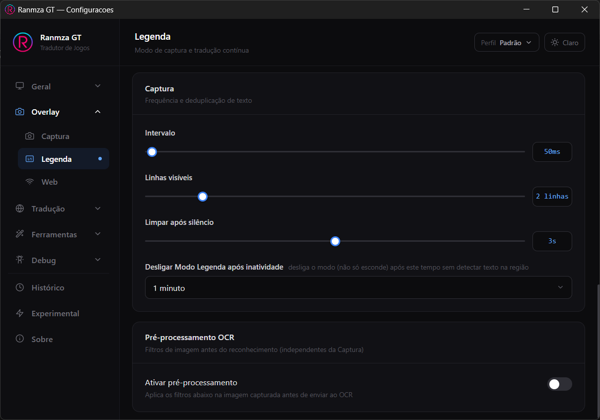

- **Captura**
  - *Intervalo* — de quanto em quanto tempo a área é relida (25 ms a 5 s).
  - *Linhas visíveis* — quantas linhas de legenda manter na tela (1 a 8). Fica **travado em 1**
    quando *Substituir a legenda original no lugar* está ligado; o valor escolhido é preservado
    para quando a opção for desligada.
  - *Limpar após silêncio* — apaga a legenda se nenhum texto novo aparecer por X segundos
    (1 a 5 s).
  - *Desligar Modo Legenda após inatividade* — **desliga o modo**, não só esconde, depois desse
    tempo sem detectar texto na região: Nunca / 1 / 2 / 3 / 5 / 10 minutos.
- **Pré-processamento OCR** — os mesmos controles de Overlay › Captura, porém independentes
  dela.

### Overlay › Web

Transmite as traduções para navegadores na rede local — e para o OBS.

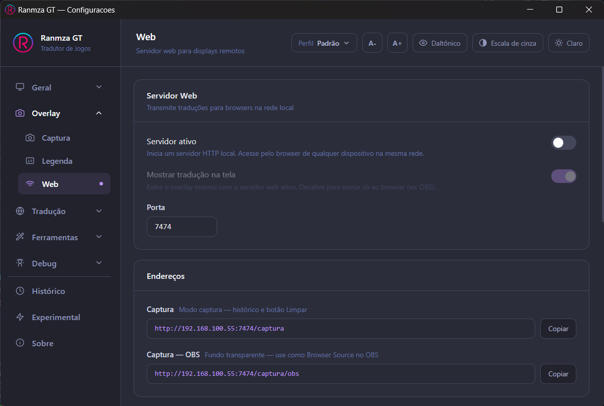

- **Servidor Web**
  - *Servidor ativo* — sobe um servidor HTTP local, acessível por qualquer aparelho na mesma
    rede.
  - *Mostrar tradução na tela* — mantém o overlay mesmo com o servidor ligado; desligue para
    mandar **só** para o navegador/OBS.
  - *Porta* (1024–65535) — mostra também quantos clientes estão conectados.
- **Endereços** — `/captura` (com histórico e botão Limpar) e `/captura/obs` (fundo
  transparente, para usar como Browser Source no OBS), cada um com botão **Copiar**.
- **Aparência** — *Tema* · *Tamanho da fonte* (12–48 px) · *Negrito* · *Texto detectado* (mostra
  o original abaixo da tradução) · *Horário e serviço* · *Cores personalizadas*, que libera seis
  seletores: texto traduzido, texto original, horário, serviço (badge), fundo do card e borda do
  card.
- **Histórico → Entradas mantidas no buffer** (10–200).

### Traducao › Tradutores

Qual serviço traduz e com quais credenciais.

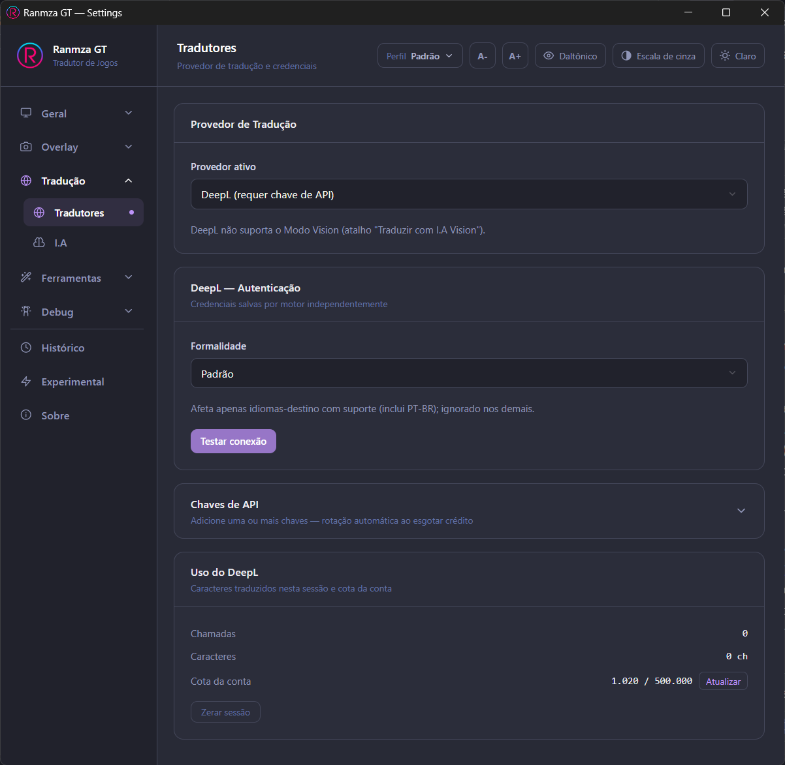

- **Provedor de Tradução → Provedor ativo**
  - *Google Translate — gratuito, sem chave* — API não oficial, nada para configurar.
    **Não suporta o Modo Vision.**
  - *DeepL (requer chave de API)* — tradutor dedicado de alta qualidade; **não suporta o Modo
    Vision**. Não tem seleção de modelo, mas tem **Formalidade** (Padrão / Mais formal / Mais
    informal), que só afeta os idiomas-destino com suporte — PT-BR incluso — e é ignorada nos
    demais. Aproveita o campo **Informações do Jogo** (Traducao › I.A) e, no Modo Legenda, as falas
    anteriores como contexto, sem custo extra.
  - *OpenAI*, *Anthropic (Claude)*, *Gemini* — motores de IA, exigem chave de API.
- **Autenticação** — aparece nos provedores com chave. As credenciais são **salvas por motor**,
  então trocar de serviço e voltar não apaga nada.
  - *Modelo* (motores de IA) — cada motor traz três faixas: rápida/econômica, melhor equilíbrio
    e qualidade superior.
    - OpenAI: GPT-4.1 nano · GPT-4.1 mini · GPT-4.1
    - Claude: Haiku 4.5 · Sonnet 5 · Opus 4.8
    - Gemini: 2.0 Flash · 2.5 Flash · 2.5 Pro
    - *Personalizado…* — última opção da lista: abre um campo livre onde você digita **qualquer
      ID de modelo** aceito pelo provedor, para usar um modelo mais novo sem esperar uma
      atualização do programa.
  - *Testar conexão* — faz uma chamada de teste com a chave e o modelo atuais e mostra na hora
    se está tudo certo ou qual erro voltou, em vez de você descobrir o problema no meio do jogo.
    Também existe no Google, para checar a conectividade.
- **Chaves de API** — card recolhível onde entra a credencial do motor selecionado (`sk-…`,
  `sk-ant-…`, `AIza…`, ou a chave DeepL `:fx` do plano gratuito). Ele **abre sozinho** enquanto
  nenhuma chave estiver preenchida.
  - *+ Adicionar chave* / *✕* — dá para cadastrar **quantas chaves quiser** no mesmo motor.
    Quando a chave em uso fica sem crédito ou bate no limite de requisições, a próxima da lista
    assume automaticamente; esgotadas todas, cai no Google Translate.
- **Uso do DeepL** — só com o DeepL selecionado: chamadas e caracteres traduzidos na sessão, mais
  a **cota da conta** (botão *Atualizar*); *Zerar sessão* reinicia a contagem. É o único motor
  com esse acompanhamento — os de IA não expõem o gasto pela chave.

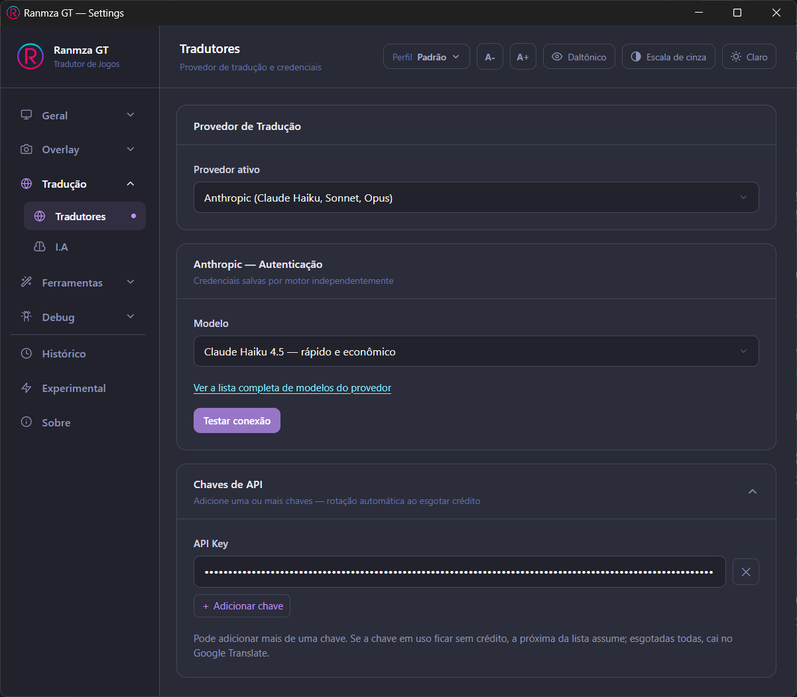

### Traducao › I.A

Parâmetros do modelo e prompts.

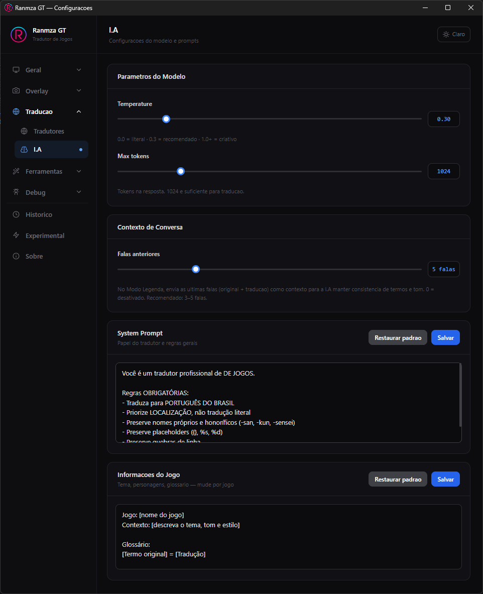

- **Parâmetros do Modelo**
  - *Temperature* (0–2) — 0,0 literal · 0,3 recomendado · 1,0+ criativo.
  - *Max tokens* (256–4096) — tamanho da resposta; 1024 basta para tradução.
- **Contexto de Conversa → Falas anteriores** (0–20) — no Modo Legenda, envia as últimas falas
  (original + tradução) como contexto, para a IA manter consistência de termos e tom.
  0 desativa; recomendado 3–5.
- **System Prompt** — papel do tradutor e regras gerais, com botões **Salvar** e **Restaurar
  padrão** (que recupera o texto de fábrica só deste campo).
- **Informações do Jogo** — tema, personagens e glossário; mude a cada jogo. Mesmos botões.

> Com o Google Translate ativo, os cards que não se aplicam ficam marcados em vermelho
> ("Só vale pros motores de IA…" e "O Google Translate não usa isso."). O **Contexto de
> Conversa** e as **Informações do Jogo** também valem para o DeepL.

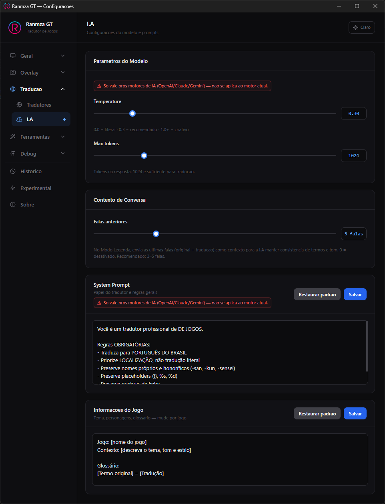

O reset geral (Geral › Config) **não** apaga o System Prompt nem as Informações do Jogo.

### Ferramentas › Inpaint

Reconstrução de fundo por IA (MI-GAN) — em desenvolvimento.

Em vez da caixa preta atrás da tradução, apaga o texto original da captura e reconstrói o fundo
com um modelo de inpainting rodando dentro do programa — a tradução fica parecendo nativa do
jogo. Vale para as **traduções manuais** (Traduzir e Vision); o Modo Legenda não usa. Custa
~50–200 ms por tradução e ~200 MB de RAM enquanto ativo.

  <iframe src="https://player.vimeo.com/video/1217778049"
          style="position:absolute;top:0;left:0;width:100%;height:100%;border:0"
          allow="fullscreen; picture-in-picture" allowfullscreen
          title="Fundo reconstruído por IA"></iframe>

<i>O fundo reconstruído no lugar da caixa preta atrás da tradução.</i>

- **Ativar fundo reconstruído** — só tem efeito com os arquivos configurados abaixo.
- **Ajuste fino da máscara**
  - *Dilatação da máscara* (0–12 px; padrão 3) — se depois de apagar o texto ainda sobra um
    resíduo de borda (o halo da fonte), aumente para o MI-GAN reconstruir um pouco além das
    letras.
  - *Limiar de detecção* (1,05–1,60; padrão 1,30) — limiar menor deixa a máscara mais sensível
    (pega mais halo, mas pode confundir fundo texturizado com texto).
  - Os dois valem **por captura**, sem reiniciar.
- **Instalação** — baixe `migan_pipeline_v2.onnx` (28 MB) e o `onnxruntime.dll` (de dentro do
  `onnxruntime-win-x64-1.26.0.zip`), coloque os dois na mesma pasta e aponte aqui
  (**Procurar** / **Verificar**). Trocar a pasta da `onnxruntime.dll` exige reiniciar o
  programa.

> Dica: ative o **Contorno** na aba Overlay › Captura, porque o fundo reconstruído pode ficar
> claro demais para texto branco.

### Ferramentas › Lab

Laboratório para testar o pré-processamento sem mexer no jogo.

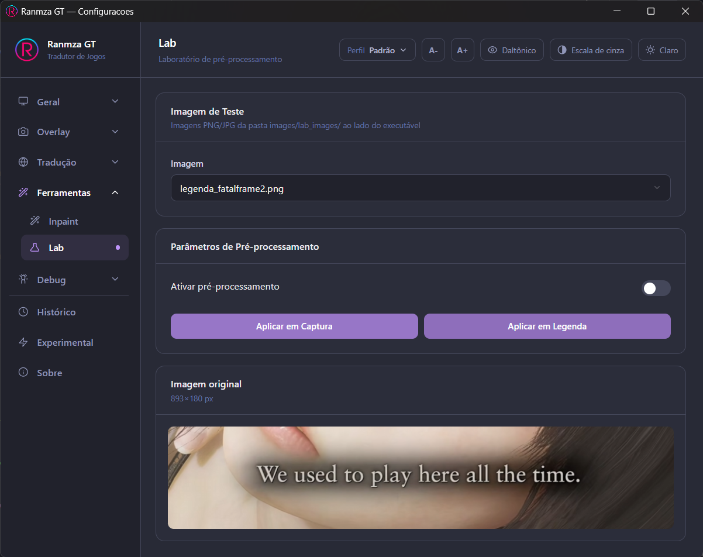

- **Imagem de Teste** — escolhe uma imagem PNG/JPG da pasta `images/lab_images/`, ao lado do
  executável.
- **Parâmetros de Pré-processamento** — os mesmos controles de Overlay › Captura, com **prévia ao
  vivo**: a imagem original e a processada aparecem embaixo, lado a lado.
- **Aplicar em Captura** / **Aplicar em Legenda** — copiam a configuração que você acabou de
  testar para a aba correspondente.

Ligar *Avançado* revela Threshold, Blur, Dilatação e Erosão, para os casos difíceis:

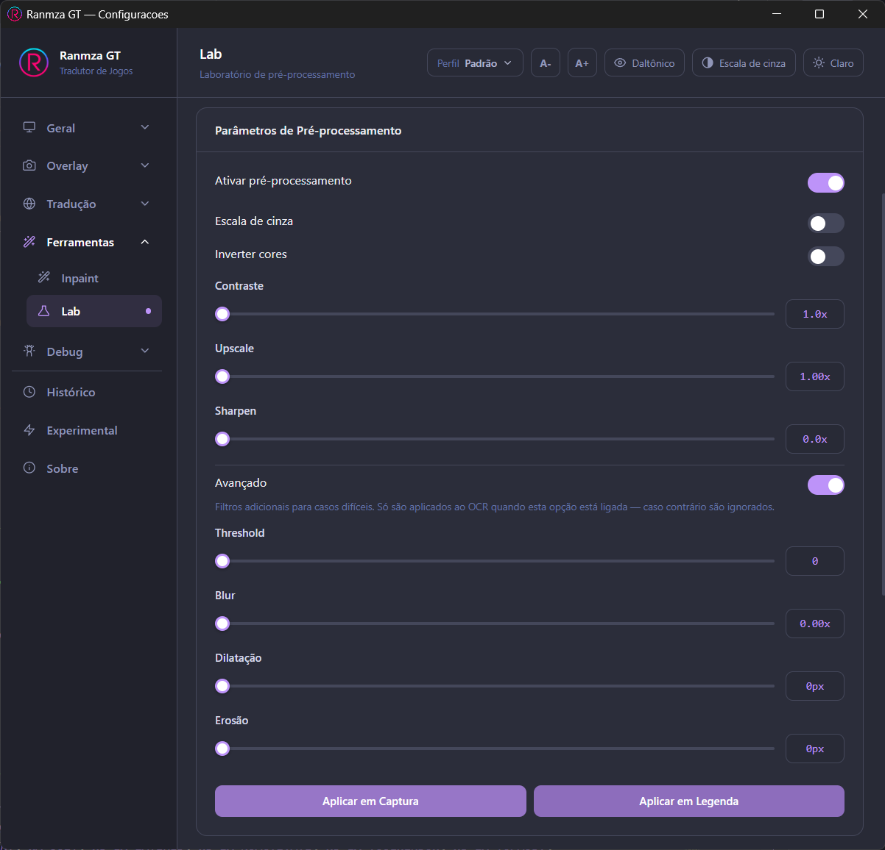

### Debug › Monitor

Latência de cada etapa do pipeline.

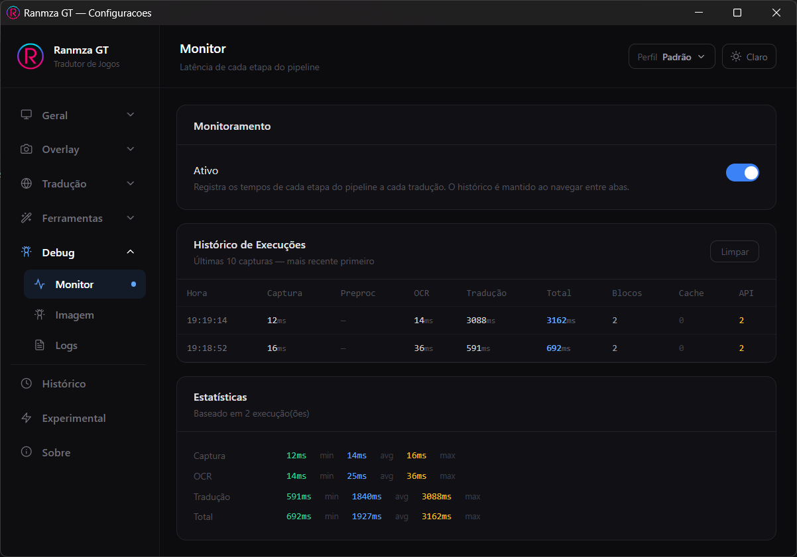

- **Monitoramento → Ativo** — registra os tempos de cada etapa a cada tradução. O histórico é
  mantido ao navegar entre abas.
- **Histórico de Execuções** — tabela das últimas 10 capturas: Hora, Captura, Preproc, OCR,
  Tradução, Total, Blocos, Cache (acertos sem chamar a API) e API (chamadas feitas).
- **Estatísticas** — mínimo, média e máximo de cada etapa.

### Debug › Imagem

Imagens de diagnóstico.

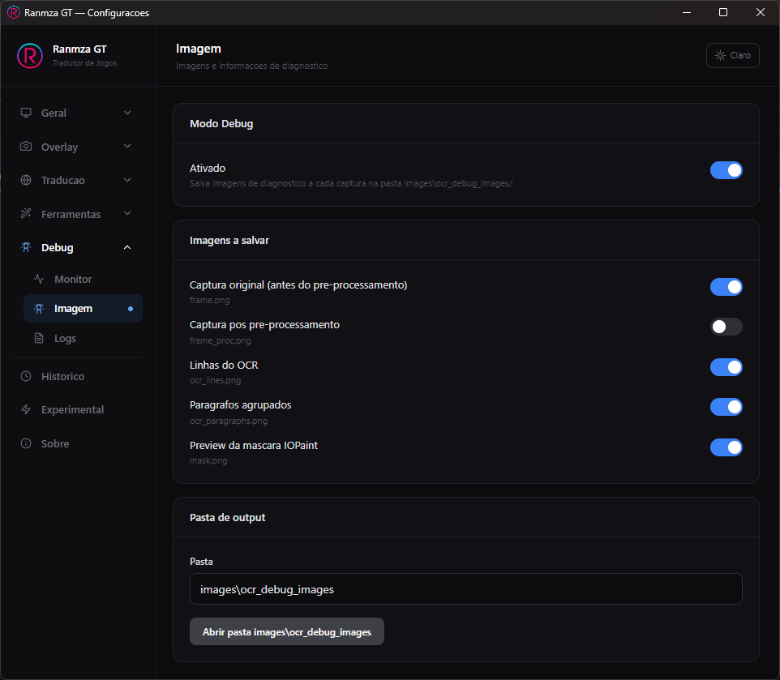

- **Modo Debug → Ativado** — salva imagens de diagnóstico a cada captura.
- **Imagens a salvar** — Captura original antes do pré-processamento (`frame.png`), Captura pós
  pré-processamento (`frame_proc.png`), Linhas do OCR (`ocr_lines.png`), Parágrafos agrupados
  (`ocr_paragraphs.png`) e Preview da máscara de inpainting (`mask.png`).
- **Pasta de output** — o caminho (padrão `images\ocr_debug_images`) e um botão para abrir a
  pasta.

### Debug › Logs

Log da sessão atual, em tempo real.

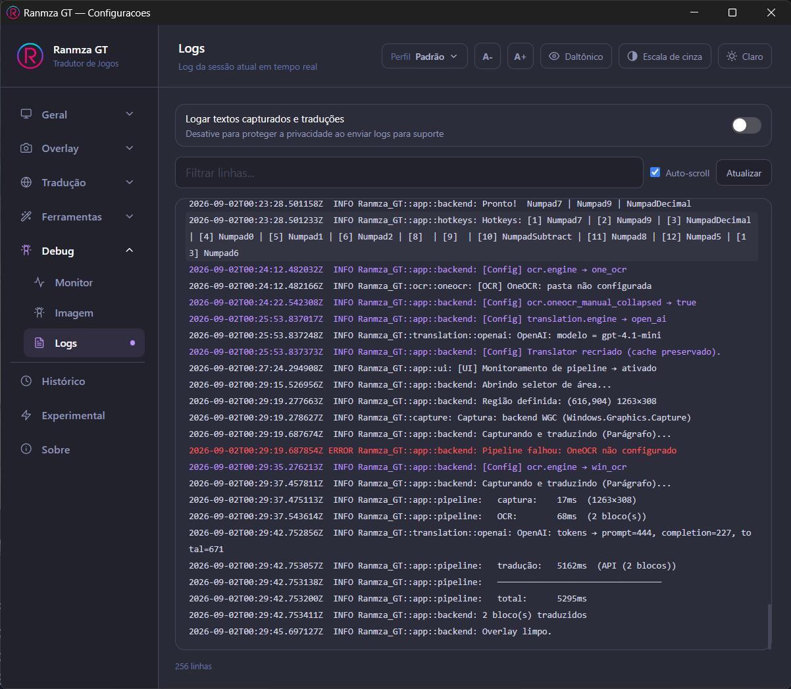

- **Logar textos capturados e traduções** — chave de privacidade, **desligada por padrão**.
  Deixe desligada ao mandar log para suporte, para não expor o conteúdo do jogo.
- **Filtrar linhas** · **Auto-scroll** · **Atualizar** — controles da visualização; erros saem
  em vermelho, avisos em amarelo.

### Historico

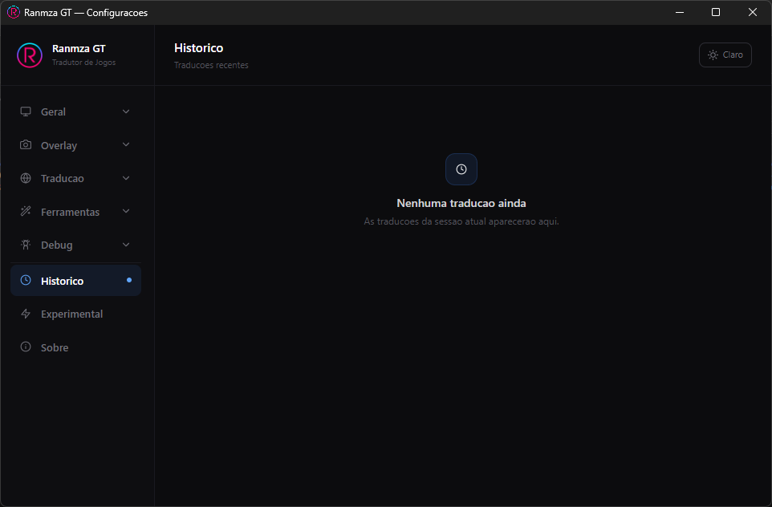

Lista as traduções da **sessão atual** — horário, serviço, tradução e, abaixo, o texto original
— da mais recente para a mais antiga, até o limite definido em Overlay › Web. Clique numa
entrada para copiar a tradução. Botão **Limpar histórico**.

### Experimental

> Tudo nesta aba está **em desenvolvimento**: o comportamento pode mudar, bugs são esperados e
> recursos podem ser removidos.

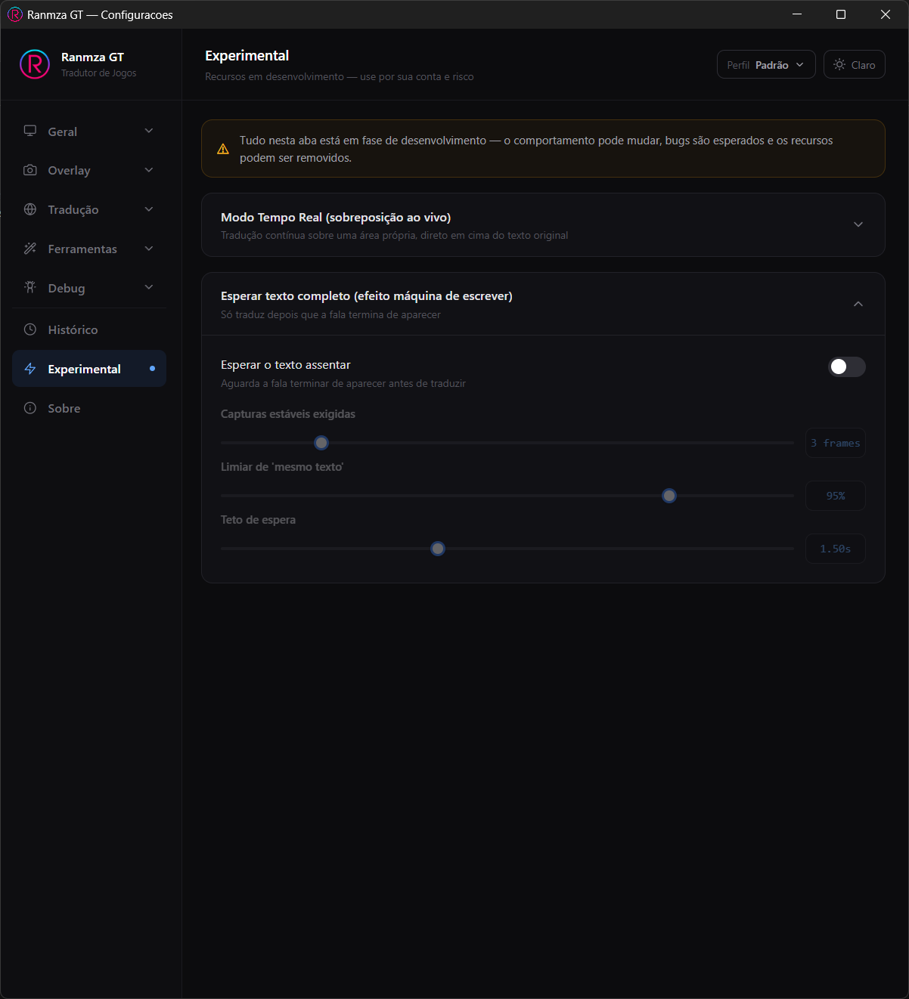

São dois cards recolhíveis.

**Modo Tempo Real (sobreposição ao vivo)** — tradução contínua desenhada no lugar do texto
original, sobre uma área própria.

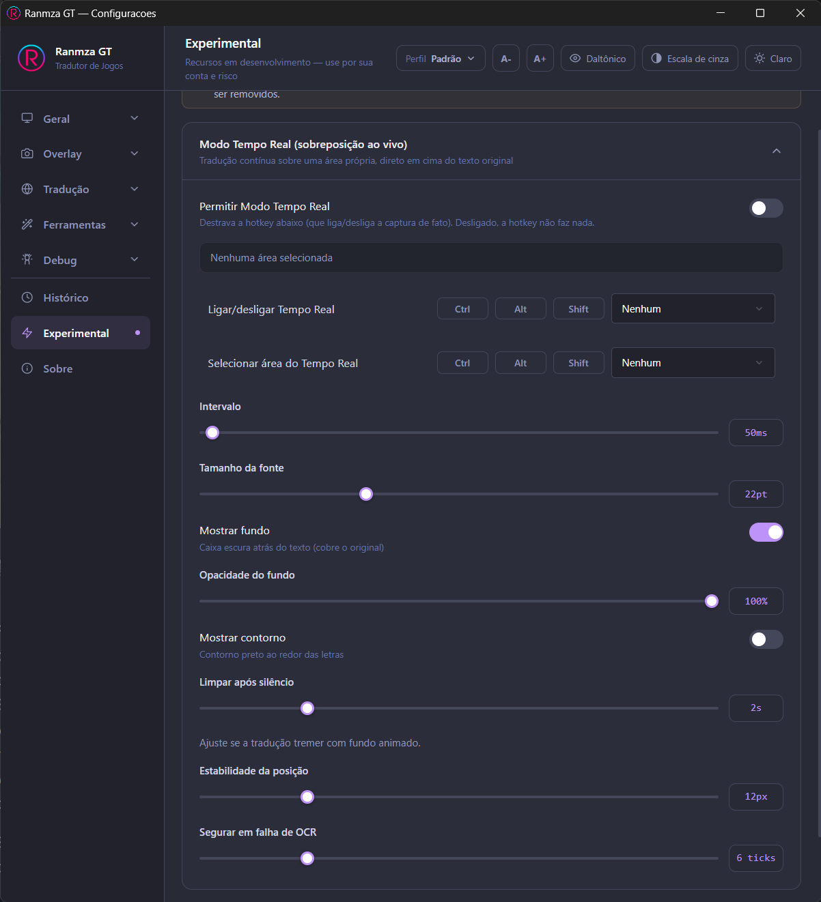

- *Permitir Modo Tempo Real* — destrava a hotkey abaixo, que é quem liga e desliga a captura de
  fato. Com isso desligado, a hotkey não faz nada.
- Os dois atalhos — *Ligar/desligar Tempo Real* e *Selecionar área do Tempo Real* — moram aqui e
  vêm **sem tecla definida**; escolha as suas.
- *Intervalo* (25 ms–2 s) · *Tamanho da fonte* (10–48 pt) · *Mostrar fundo* + *Opacidade*
  (10–100%) · *Mostrar contorno* · *Limpar após silêncio* (0–10 s).
- *Estabilidade da posição* (0–60 px) e *Segurar em falha de OCR* (0–30 ticks) — contra tremor e
  piscada quando o fundo é animado.
- Tem ainda um pré-processamento de imagem exclusivo. Veja a **seção 9**.

> O overlay do Tempo Real é sempre invisível para capturas de tela (inclusive OBS) — ver a
> seção 9.

**Esperar texto completo (efeito máquina de escrever)** — só traduz depois que a fala termina de
aparecer, evitando traduzir frases ainda "sendo digitadas" na tela. Vale para o Modo Legenda e o
Modo Tempo Real.

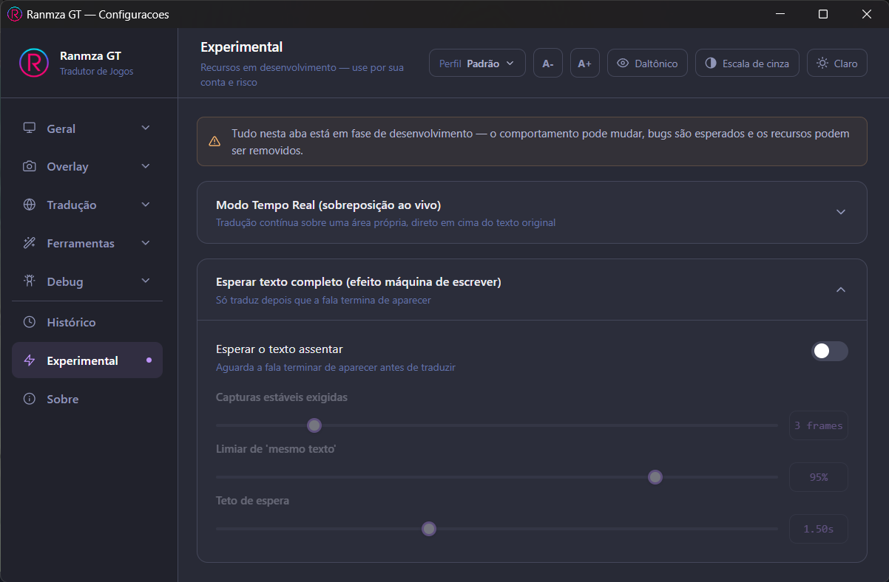

- *Capturas estáveis exigidas* (2–8 frames) — quantas leituras seguidas precisam bater.
- *Limiar de "mesmo texto"* (80–99%) — o quanto duas leituras precisam se parecer para contarem
  como iguais.
- *Teto de espera* (0–4 s) — tempo máximo de espera antes de traduzir do jeito que está.

### Sobre

Informações do programa: ícone, nome e **versão** instalada, a lista de funcionalidades, o autor
e a **Licença de Uso** completa — o que é permitido (uso pessoal gratuito, distribuir cópias não
modificadas, criar conteúdo como vídeos e streams) e o que é proibido (modificar ou fazer
engenharia reversa, vender, redistribuir versões modificadas, uso comercial sem autorização,
remover créditos), além do aviso de garantia.

---

## 14. Atualizando o programa

Ao abrir o programa, se existir uma versão mais nova publicada, aparece um aviso com a versão
que você tem e a que saiu. O botão **Baixar** abre a página da versão nova no seu navegador —
é lá que estão as novidades daquela versão e o arquivo `.zip`.

**O programa não baixa e não instala nada sozinho.** Ele só avisa; o download e a troca dos
arquivos são feitos por você, do mesmo jeito que na primeira instalação. Isso é de propósito:
um programa que substitui o próprio executável é exatamente o comportamento que o Windows
Defender bloqueia, e não vale o risco de o programa inteiro parar de abrir.

**Como atualizar**, depois de baixar o `.zip`: feche o Ranmza-GT, extraia o conteúdo por cima
da pasta atual e confirme a substituição dos arquivos. Suas configurações (`config.json`),
as chaves de API, as fontes que você colocou em `fonts/` e os arquivos de `models/` (OneOCR e
MI-GAN) **não estão no `.zip`** e continuam onde estão.

Para desligar o aviso, marque **Não avisar sobre novas versões** no próprio aviso, ou desligue
em **Geral › Config → Atualizações**. É por esse toggle que ele volta a aparecer.

Mesmo com o aviso desligado, o botão **Verificar agora**, no mesmo card, consulta na hora se
saiu versão nova — é o jeito de olhar de vez em quando sem ficar sendo avisado toda vez.

> O programa consulta a página de versões no máximo uma vez a cada 6 horas, mesmo que você
> abra e feche várias vezes no dia — o aviso continua aparecendo em toda abertura, porque ele
> usa a última resposta guardada. O botão *Verificar agora* ignora esse intervalo. Se você
> estiver sem internet, nada acontece: nenhum erro aparece e o programa abre normalmente.
