# Manual do Usuário — Ranmza GT

Guia prático de uso do **Ranmza GT**, o tradutor de jogos, visual novels, vídeos e qualquer
conteúdo em tela. Este manual explica **como usar** cada parte do programa, sem entrar em
detalhes técnicos.

---

## Sumário

1. [O que o programa faz](#1-o-que-o-programa-faz)
2. [Configuração rápida](#2-configuração-rápida)
3. [Uso básico no dia a dia](#3-uso-básico-no-dia-a-dia)
4. [Perfis — um conjunto de ajustes por jogo](#4-perfis--um-conjunto-de-ajustes-por-jogo)
5. [Atalhos de teclado](#5-atalhos-de-teclado)
6. [Configurando a tradução](#6-configurando-a-tradução)
7. [Deixando a tradução com a "cara" do jogo](#7-deixando-a-tradução-com-a-cara-do-jogo)
8. [Modo Vision — quando o OCR erra](#8-modo-vision--quando-o-ocr-erra)
9. [Modo Legenda — tradução automática contínua](#9-modo-legenda--tradução-automática-contínua)
10. [Usando no OBS / transmissões](#10-usando-no-obs--transmissões)
11. [Histórico e desempenho](#11-histórico-e-desempenho)
12. [Problemas comuns e soluções](#12-problemas-comuns-e-soluções)
13. [Referência completa — todas as abas](#13-referência-completa--todas-as-abas)
14. [Atualizando o programa](#14-atualizando-o-programa)

---

## 1. O que o programa faz

O Ranmza GT tira um "print" de uma área da tela, reconhece o texto que está nela, traduz e
mostra a tradução **por cima do jogo**. Funciona com qualquer jogo, visual novel, vídeo ou
programa que mostre texto na tela: legendas, diálogos, menus, cartas, itens.

São dois jeitos de traduzir:

- **Captura de tela** — você aperta uma tecla e o programa traduz a área marcada uma vez, com a
  tradução desenhada por cima de cada trecho do texto original. Serve para menus, inventário,
  cartas, diálogos parados e telas cheias de texto.
- **Modo Legenda** — você liga uma vez e o programa fica lendo a área da legenda sozinho,
  traduzindo cada fala nova enquanto ela aparece. Serve para cutscenes, vídeos e diálogos que
  passam sozinhos.

> **⚠️ Requisito essencial: o jogo precisa estar em modo Janela ou Janela sem borda.** O Ranmza
> GT desenha a tradução **por cima** da janela do jogo — então rode o jogo em **modo Janela**
> (*Windowed*) ou, de preferência, **Janela sem borda** (*Borderless* / *Fullscreen sem borda*),
> que ocupa a tela inteira e ainda deixa a tradução aparecer por cima. Em **Tela cheia exclusiva**
> (*Exclusive Fullscreen*) o Windows entrega a tela só para o jogo e nenhum programa consegue
> desenhar sobre ela — a tradução não vai aparecer. Sintoma típico: você aperta Traduzir, a
> tradução até surge na aba **Histórico**, mas nada aparece sobre o jogo. Solução: troque o jogo
> para **Janela sem borda** nas opções de vídeo dele.

O fluxo básico da captura de tela é sempre:

1. Você escolhe **onde** está o texto (uma área da tela).
2. Aperta um atalho para **traduzir**.
3. A tradução aparece sobreposta ao jogo.
4. Aperta outro atalho para **limpar** quando quiser, ou ela some sozinha depois de um tempo.

O Modo Legenda tem a própria área e o próprio atalho de ligar e desligar — está na
[seção 9](/Manual/modo-legenda-traducao-automatica-continua.md).

---

## 2. Configuração rápida

Na primeira vez que você abre o programa, o **Guia de configuração** aparece sozinho e passa por
tudo o que precisa ser escolhido. Siga o guia e você já sai traduzindo; o resto desta seção
explica cada passo com mais calma, para quem pulou o guia ou quer entender o que escolheu.

| Passo | O que fazer | Onde |
|---|---|---|
| 1 | Escolher o monitor | guia ou aba **Geral › Config** |
| 2 | Escolher o leitor de texto (OCR) | guia ou aba **Geral › OCR** |
| 3 | Escolher os idiomas | guia ou aba **Geral › Idioma** |
| 4 | Escolher o tradutor | guia ou aba **Tradução › Tradutores** |
| 5 | Marcar a área do texto | atalho `Numpad7`, com o jogo aberto |
| 6 | Traduzir | atalho `Numpad9` (linha) ou `Numpad8` (parágrafo) |

> **Antes de tudo: o jogo em modo Janela.** Em *Tela cheia exclusiva* nenhum programa consegue
> desenhar por cima — a tradução simplesmente não aparece. Troque o jogo para **Janela sem
> borda** nas opções de vídeo dele. Explicação completa na
> [seção 1](/Manual/o-que-o-programa-faz.md).

> **O programa nem abriu, com erro *"VCRUNTIME140.dll não foi encontrado"*?** Falta o
> **Microsoft Visual C++ Redistributable (x64)**, um componente gratuito da Microsoft que a
> maioria dos PCs já tem (vem junto com muitos jogos). Instale por este link oficial e abra o
> programa de novo:
> <https://aka.ms/vs/17/release/vc_redist.x64.exe>

### 2.1 O Guia de configuração

O guia é uma janela por cima da tela de configurações, com oito passos:

| Passo | O que você escolhe |
|---|---|
| **Início** | Nada: explica como o programa funciona e os dois jeitos de traduzir |
| **Monitor** | Em qual monitor o jogo fica, e o que essa escolha muda |
| **OCR** | WinOCR ou OneOCR, com os prós e contras de cada um. Com o OneOCR, o botão para copiar os arquivos dele |
| **Idiomas** | O idioma do texto do jogo e o idioma em que você quer ler |
| **Tradução** | O serviço de tradução e a chave dele, se precisar, com uma lista de qual escolher |
| **Captura** | Quanto tempo a tradução da captura de tela fica na tela, fonte, cor e Auto-fit |
| **Legenda** | Fonte, cor e o filtro de alfabeto do Modo Legenda |
| **Pronto** | Um resumo do que você escolheu e as teclas para começar |

Tudo o que você muda no guia vale na hora, igual nas abas. Os passos no topo são clicáveis, para
voltar ou pular para outro. Com o **WinOCR**, o guia não passa do passo Idiomas sem um idioma
escolhido, porque sem ele o WinOCR não sabe o que ler.

- **Concluir**, no último passo, ou **Pular**, a qualquer momento, fecham o guia. Ele não volta
  sozinho depois disso.
- Fechar o programa no meio do guia faz ele aparecer de novo na próxima vez.
- Para ver o guia de novo, use o botão **Guia** no topo da tela.
- Criar um perfil com **Começar do zero** também abre o guia, para configurar o jogo novo.

### 2.2 Como a janela é organizada

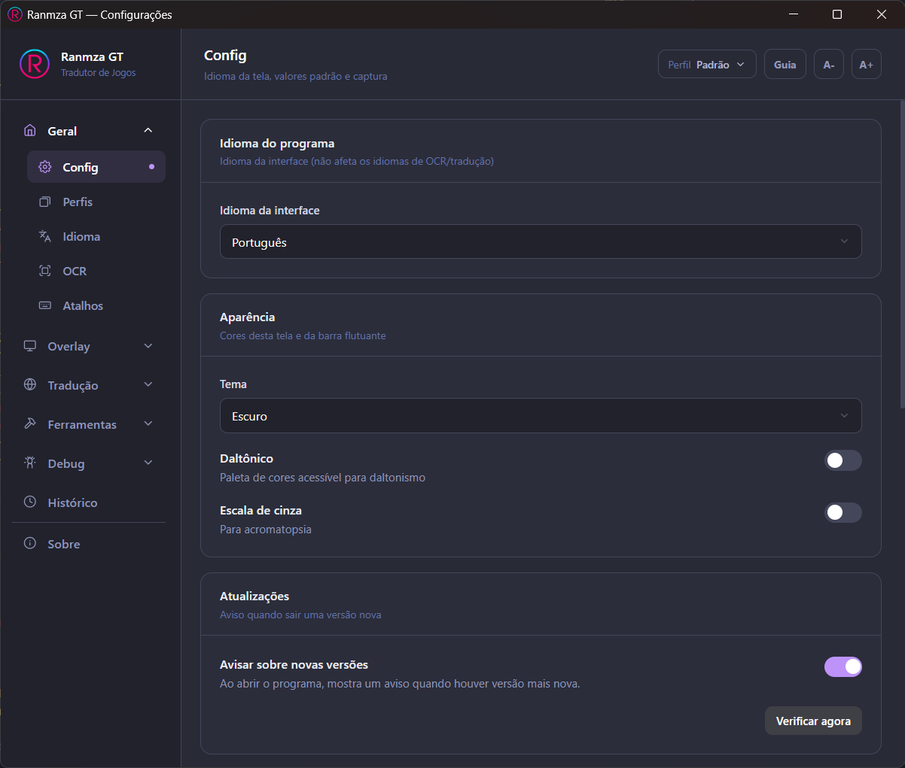

O menu da esquerda agrupa as opções por assunto. Na configuração rápida você só encosta em
**Geral** e **Tradução** — o resto existe para quando você quiser afinar alguma coisa.

| Menu | O que tem dentro |
|---|---|
| **Geral** | Config (idioma da tela, aparência, atualizações, monitor, alertas), Perfis, Idioma, OCR e Atalhos (barra flutuante) |
| **Overlay** | Aparência da tradução na tela: Captura, Legenda e Web |
| **Tradução** | Tradutores (serviço e chaves de API) e I.A (prompts e contexto) |
| **Ferramentas** | Inpaint (apagar o texto original) |
| **Debug** | Monitor de desempenho e Logs |
| **Histórico** | As traduções da captura de tela na sessão atual |
| **Sobre** | Versão do programa, licença e links |

No topo da janela ficam o seletor de **Perfil**, o botão **Guia** e os botões **A−** e **A+**,
que diminuem e aumentam o texto da tela de configurações.

> **Idioma da interface** (em *Geral › Config*) muda só o idioma **do programa** — os menus e
> textos que você está vendo. Não tem nada a ver com o idioma que vai ser traduzido; esse é o
> passo 2.4.

### 2.3 Escolha o monitor

Em **Geral › Config**, no card **Monitor**, escolha em **Tela ativa** onde o jogo fica. Com um
monitor só, deixe em *Automático* e siga em frente.

O monitor escolhido é onde abrem a seleção das áreas, os alertas, a prévia das áreas e a barra
flutuante, até você arrastá-la. A tradução aparece no monitor onde a área foi marcada.

- **A troca vale na hora**, sem reiniciar.
- **Cada monitor guarda as próprias áreas.** Ao trocar de monitor, as áreas do monitor anterior
  ficam guardadas; ao voltar para ele, elas voltam. No primeiro uso de um monitor, marque as
  áreas nele.
- **Cada perfil guarda o próprio monitor.** Com um perfil por jogo, cada jogo volta no monitor
  dele.
- Se o monitor escolhido for desconectado, o programa usa o principal do Windows.

O **Backend de captura** logo acima pode ficar em *Auto (recomendado)*: ele usa o método certo
para a sua versão do Windows sozinho e troca na hora, sem reiniciar.

### 2.4 Escolha os idiomas

Abra **Geral › Idioma**.

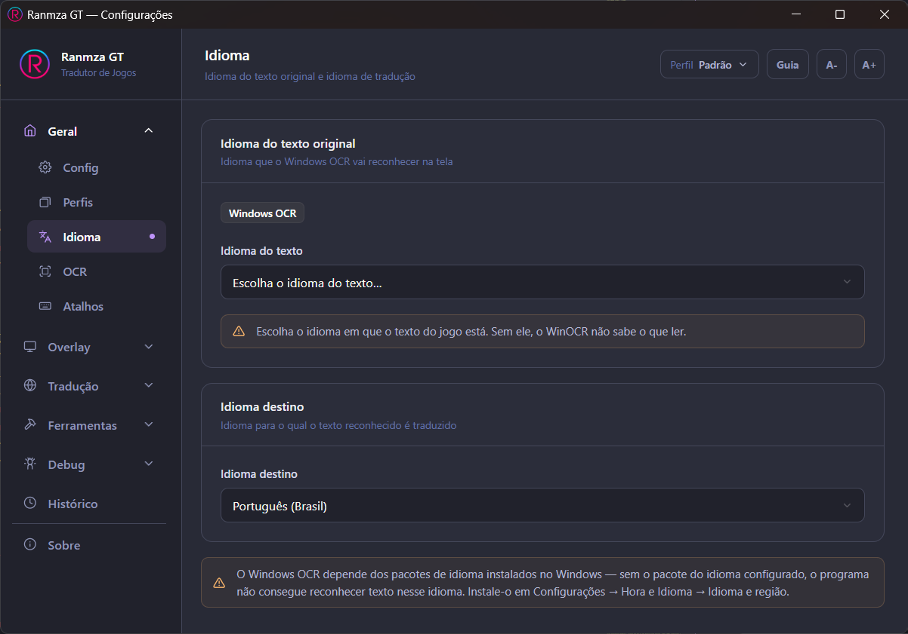

- **Idioma do texto** — o idioma em que o jogo está. Com o WinOCR, a lista mostra só os idiomas
  que já têm o pacote de leitura de texto instalado no Windows. Numa instalação nova o campo vem
  vazio, com um aviso: escolha um da lista.
- **Idioma destino** — o idioma em que você quer ler. Português (Brasil) é o padrão.

> **O idioma do jogo não está na lista?** O WinOCR só lê idiomas cujo pacote está instalado no
> Windows. Instale em *Configurações → Hora e Idioma → Idioma e região* e abra o programa de novo.
> Se o Windows não tiver nenhum pacote com leitura de texto, o aviso traz o botão **Instalar
> pacote de idioma**, que abre essa tela.

> **Usando OneOCR?** Aí não existe idioma de origem para escolher: ele é um modelo único
> multilíngue (latim, japonês, chinês, coreano, cirílico…) que detecta o idioma sozinho, e o
> campo **Idioma do texto** nem aparece enquanto ele estiver selecionado. O **Idioma destino**
> continua valendo normalmente. O OneOCR é o motor **recomendado** e se escolhe em
> *Geral › OCR* — veja *Trocando o motor de OCR* na [seção 6](/Manual/configurando-a-traducao.md).

### 2.5 Escolha o tradutor

Abra **Tradução › Tradutores**.

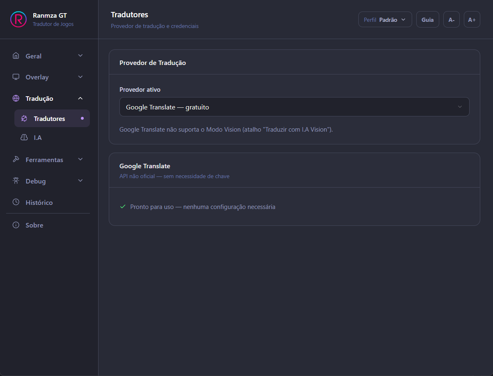

O padrão é o **Google Translate — gratuito**: não precisa de chave nem de configuração, já está
pronto para uso. É com ele que você deve fazer o primeiro teste.

> **Gratuito, mas com limite.** O Google Translate sem chave aceita só um punhado de traduções
> num intervalo curto. Passou disso, aparece o alerta *"Google: limite de uso (429)"* e aquela
> captura fica sem tradução. Para traduzir uma fala aqui e ali ele dá conta; em sessão longa e no
> Modo Legenda o limite chega rápido. E o limite é contado **por endereço de IP** — quem usa
> internet móvel ou provedor com **CGNAT** divide esse limite com outros clientes e bate nele bem
> mais cedo. A explicação e o que fazer estão na [seção 12](/Manual/problemas-comuns-e-solucoes.md).

?> **Atenção: a API do Google usada aqui não é oficial.** É o mesmo endereço que a página do
Google Tradutor usa por baixo dos panos, sem chave e sem conta. Ela não é publicada nem
documentada, então o Google pode mudá-la ou tirá-la do ar quando quiser, sem aviso — e nesse dia
só voltam a traduzir os serviços com chave. Se você depende do programa para jogar, vale ter uma
chave de outro serviço já configurada.

Quando quiser mais qualidade, troque em **Provedor ativo**:

- **Google Cloud Translation**, **DeepL** e **Azure Translator** — tradutores dedicados. Precisam
  de chave de API e têm plano gratuito com limite por mês. No DeepL, as chaves do plano gratuito
  terminam em `:fx`, e o programa reconhece sozinho qual servidor usar. O DeepL também recebe as
  Informações do Jogo e as falas anteriores como contexto, sem custo extra. O Azure, além da chave,
  exige a **região** do recurso (as duas coisas ficam na mesma página do portal do Azure).
- **OpenAI**, **Anthropic (Claude)**, **Gemini** e **Groq** — IAs. Precisam de chave de API, e
  em troca entregam traduções mais naturais e consistentes, porque traduzem levando em conta as
  falas anteriores e as Informações do Jogo. OpenAI e Anthropic cobram por uso; Gemini e Groq têm
  plano gratuito. Escolha o modelo no card de autenticação e cole a chave em *Chaves de API*.
- **Compatível com OpenAI** — para usar uma IA que roda no seu PC (LM Studio, Ollama) ou outro
  serviço que não está na lista. Você informa o endereço e o nome do modelo. Veja
  [IA no seu PC ou outro serviço](/Manual/configurando-a-traducao.md) na seção 6.

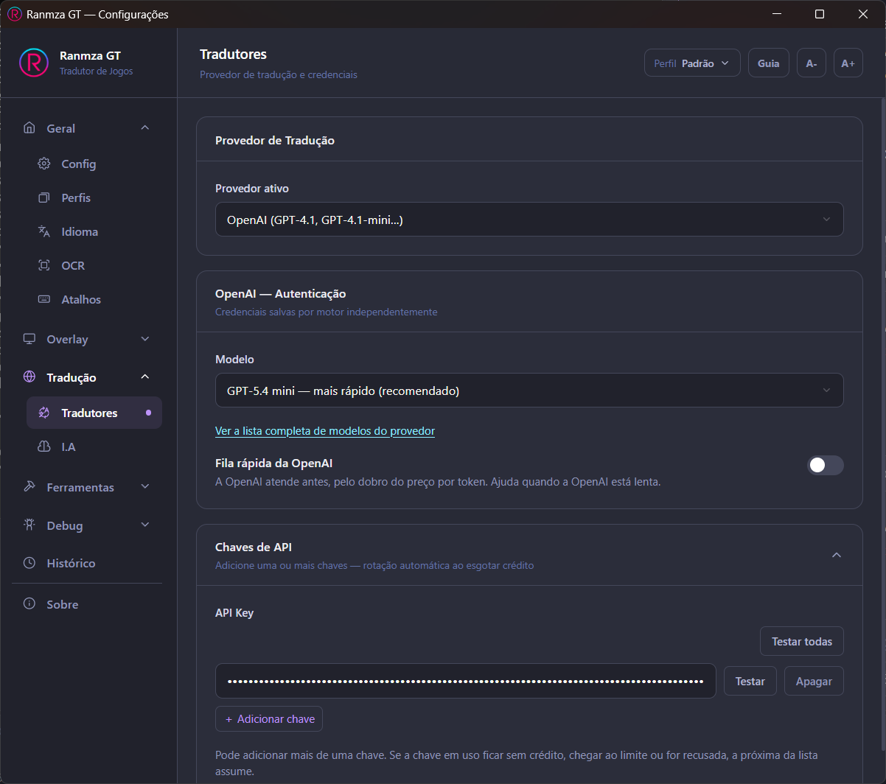

Cada serviço guarda as suas próprias chaves, então trocar de um para outro e voltar não apaga
nada. As chaves ficam guardadas **criptografadas** e só abrem neste PC, na sua conta do Windows.

> **Várias chaves com rotação automática.** Todo serviço com chave aceita **mais de uma**:
> clique em *+ Adicionar chave*. Se a chave em uso for recusada, ficar sem crédito ou bater no
> limite de requisições, o programa passa na hora para a próxima da lista; esgotadas todas, ele
> cai no Google Translate e mostra o alerta *"<serviço> falhou, usando Google"*. Ajuda bastante em sessões longas de Modo Legenda.

> Só a OpenAI, a Anthropic, o Gemini e o Compatível com OpenAI (quando o modelo aceita imagem)
> suportam o **Modo Vision** — o Google Translate, o Google Cloud, o DeepL, o Azure e a Groq não.
> Veja a [seção 8](/Manual/modo-vision-quando-o-ocr-erra.md).

### 2.6 Marque a área do texto

Com o jogo aberto e em foco, aperte **`Numpad7`**. A tela escurece e você arrasta o mouse para
desenhar um retângulo sobre a região onde o texto aparece — normalmente a caixa de diálogo.
Solte o botão para confirmar, ou aperte `ESC` para cancelar.

A área fica salva. Você só precisa marcar de novo se o jogo mudar a posição da caixa de texto
ou se você trocar a resolução.

> Sem área marcada, os atalhos de tradução não traduzem nada: aparece o alerta *"Captura sem
> área"*. Marque a área primeiro.

  <iframe src="https://player.vimeo.com/video/1218016540"
          style="position:absolute;top:0;left:0;width:100%;height:100%;border:0"
          allow="fullscreen; picture-in-picture" allowfullscreen
          title="Marcando a área do texto"></iframe>

<i>Marcando a área do texto com o `Numpad7`.</i>

### 2.7 Traduza

Com o texto na tela, aperte um dos dois atalhos de tradução — a diferença é só **como as linhas
são agrupadas** antes de traduzir:

| Atalho | Modo | Use quando |
|---|---|---|
| **`Numpad9`** | **Linha** | Menus, listas, itens, botões — cada linha é uma coisa separada |
| **`Numpad8`** | **Parágrafo** | Diálogos e textos corridos — junta as linhas próximas num bloco só |

Na dúvida, comece pelo `Numpad8` em jogos de história e pelo `Numpad9` em menus.

A tradução aparece por cima do jogo, na posição do texto original, e some sozinha depois de um
tempo. Para tirá-la na hora, aperte **`NumpadDecimal`** (a vírgula do teclado numérico).

  <iframe src="https://player.vimeo.com/video/1217778050"
          style="position:absolute;top:0;left:0;width:100%;height:100%;border:0"
          allow="fullscreen; picture-in-picture" allowfullscreen
          title="Selecionando a área e traduzindo"></iframe>

<i>Selecionando a área e traduzindo — nos modos linha e parágrafo.</i>

> **Os atalhos só funcionam com o jogo em foco.** Com a janela de configuração do Ranmza GT em
> primeiro plano eles ficam desativados de propósito — assim você digita nos campos sem
> disparar comandos sem querer. Se você apertar um atalho com a configuração em foco, um alerta
> avisa. Clique de volta no jogo antes de testar.

### 2.8 Plano B: a barra flutuante

Alguns jogos "engolem" as teclas do Numpad, e às vezes o NumLock atrapalha. Para esses casos,
ative **Mostrar barra flutuante** em *Geral › Atalhos*: uma janelinha com os mesmos comandos em
botões, disparados por clique do mouse.

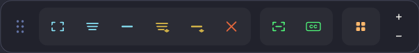

Ela fica **sempre por cima de tudo** — inclusive de jogo em janela sem borda — e você a arrasta
pela alça de pontinhos da esquerda para qualquer canto de qualquer monitor. O atalho
`NumpadSubtract` (o menos do teclado numérico) mostra e esconde a barra.

Os botões, da esquerda para a direita (passe o mouse sobre um para ver o nome), em três grupos:

| Grupo | Botões |
|---|---|
| Captura de tela | Selecionar área · Traduzir (parágrafo) · Traduzir (linha) · Vision (parágrafo) · Vision (linha) · Limpar |
| Modo Legenda | Selecionar área da legenda · Ligar/desligar legenda |
| Prévia | Mostrar/ocultar áreas |

No canto direito, dois botões **+ / −** ajustam o tamanho da barra inteira na tela — útil em
monitores 4K ou muito pequenos. As cores dos botões seguem o tema da tela de configurações.

### 2.9 Trocando os atalhos

Se as teclas padrão não te servem — teclado sem numérico, conflito com os controles do jogo —
troque em **Geral › Atalhos**.

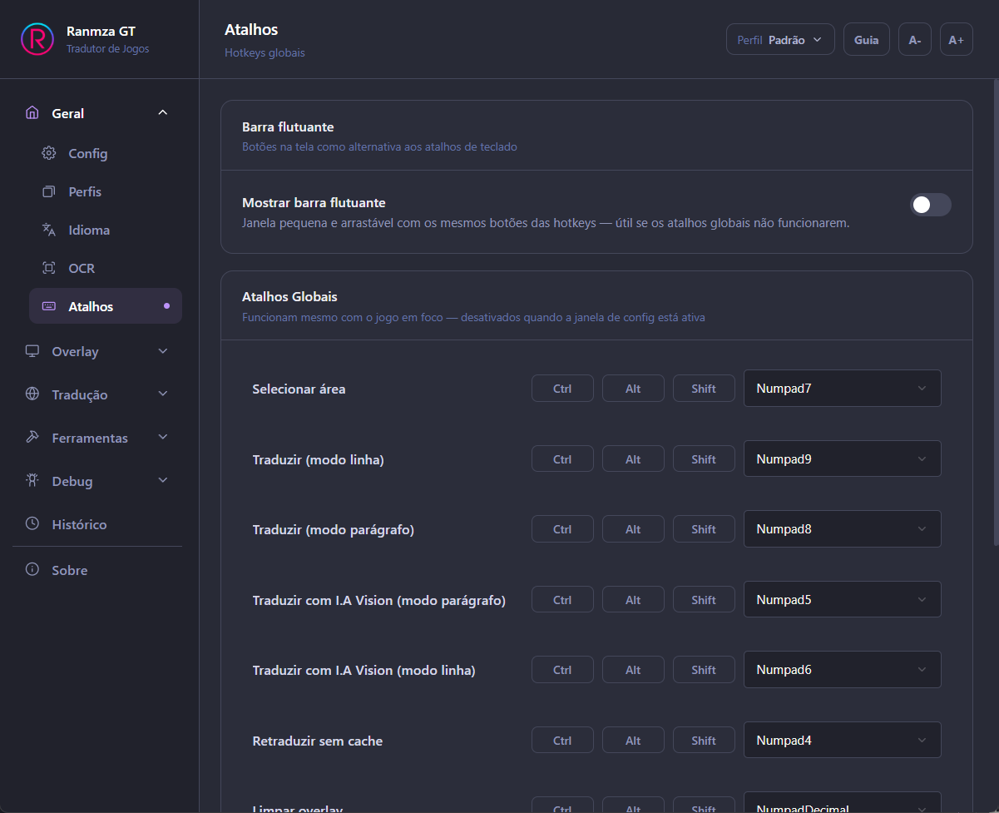

Cada ação tem uma tecla principal, escolhida na lista à direita, e três botões de modificador
(Ctrl, Alt e Shift) que você liga se quiser combinar. A troca vale na hora, sem reiniciar.

> **Letra ou número como tecla principal exige um modificador** (Ctrl, Alt ou Shift), senão você
> dispararia o programa toda vez que digitasse no jogo. Teclas do Numpad, F1–F12 e as de
> navegação funcionam sozinhas.

### Deu certo? E se não deu

Se a tradução apareceu sobre o jogo, está tudo pronto — siga para a
[seção 3](/Manual/uso-basico-no-dia-a-dia.md).

- **Nada aconteceu ao apertar o atalho** → a janela de configuração estava em foco, ou o jogo
  está "engolindo" as teclas do Numpad. Use a **barra flutuante** (passo 2.8) ou troque a tecla
  (passo 2.9).
- **A tradução aparece na aba Histórico, mas não sobre o jogo** → o jogo está em *Tela cheia
  exclusiva*. Troque para *Janela sem borda*.
- **Saiu tradução errada ou embaralhada** → o OCR leu mal. Comece trocando o modo de
  agrupamento (`Numpad9` ↔ `Numpad8`) e veja a [seção 6](/Manual/configurando-a-traducao.md).

Outros problemas estão na [seção 12](/Manual/problemas-comuns-e-solucoes.md).

---

## 3. Uso básico no dia a dia

> **Importante**: os atalhos de teclado só funcionam com a **janela do jogo em foco**. Se a
> janela de configuração do Ranmza GT estiver aberta e selecionada (em primeiro plano), os
> atalhos ficam desativados — clique de volta no jogo (ou minimize a configuração) antes de
> usar `Numpad9`, `Numpad7`, etc.

1. Jogue normalmente.
2. Quando aparecer um texto que você quer traduzir, aperte **Traduzir**: `Numpad8` para
   diálogos (modo parágrafo) ou `Numpad9` para menus (modo linha).
3. A tradução aparece na tela, na posição do texto original.
4. Ela some sozinha depois de um tempo (configurável), ou aperte **Limpar overlay** (padrão
   `NumpadDecimal`) para tirá-la na hora.
5. Se o texto do jogo mudar antes da tradução sumir, é só apertar **Traduzir** de novo — a
   tradução antiga é limpa automaticamente antes da nova captura.

Para diálogos que passam sozinhos, como cutscenes, use o **Modo Legenda**
([seção 9](/Manual/modo-legenda-traducao-automatica-continua.md)): você liga uma vez e ele
traduz cada fala sem você apertar nada.

### Parágrafo ou linha: pegue o jeito

A escolha entre `Numpad8` e `Numpad9` é o ajuste que mais muda o resultado no dia a dia, e você
faz na hora, sem abrir configuração nenhuma:

- **`Numpad8` (parágrafo)** junta as linhas próximas num bloco só. É o que você quer numa caixa
  de diálogo, onde a fala continua de uma linha para a outra.
- **`Numpad9` (linha)** traduz cada linha por conta própria. É o que você quer num inventário ou
  menu, onde "Poção" e "Espada longa" não têm nada a ver uma com a outra.

Errou o modo? Aperte o outro atalho na sequência — a tradução anterior é limpa sozinha.

### Não confia nos atalhos do teclado?

Ative a **barra flutuante** em **Geral › Atalhos** e dispare tudo por clique do mouse. Ela fica
sempre acima de qualquer janela, move-se livremente entre monitores e é o plano B para quando o
jogo "engole" as teclas do Numpad. Os nove botões estão explicados no
[passo 2.8](/Manual/configuracao-rapida.md).

### Conferindo se as áreas estão certas

Aperte **Mostrar/ocultar áreas** (padrão `Numpad2`) para desenhar no monitor escolhido o
contorno e o nome de cada área: a da captura de tela, a da legenda e a faixa onde a tradução da
legenda aparece. Aperte de novo para esconder. Não traduz nada, é só um guia visual, e acompanha
na hora uma área nova ou uma mudança na configuração.

---

## 4. Perfis — um conjunto de ajustes por jogo

Cada jogo pede um ajuste diferente: a caixa de diálogo fica num canto da tela, o idioma é
outro, a fonte que lê bem num não lê no outro, e o glossário de nomes não serve para mais
nada fora dali. Um **perfil** guarda tudo isso junto, e você troca de jogo em um clique.

O seletor fica no **topo da janela**, ao lado do botão **Guia**, e aparece em todas as abas —
porque o perfil ativo é o contexto de tudo que elas mostram.

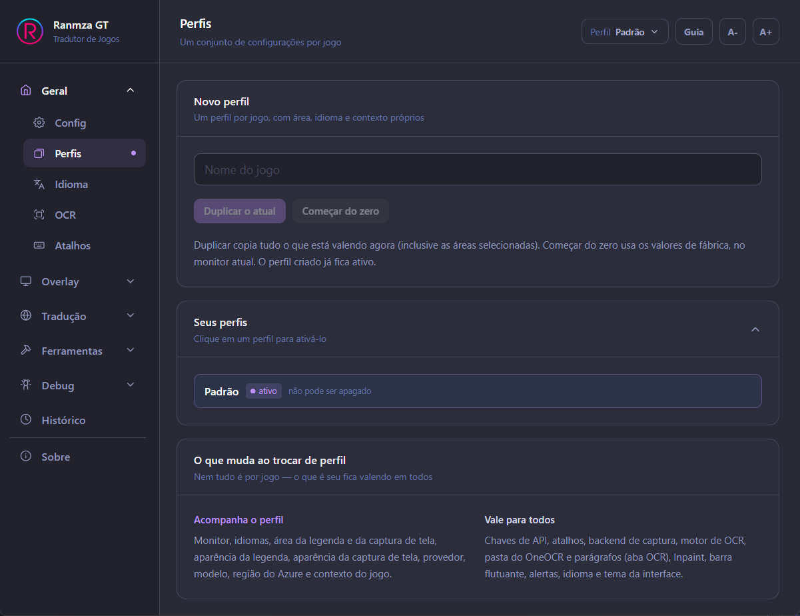

### O perfil Padrão

Existe sempre, já vem ativo e **não pode ser apagado nem renomeado**. Se você nunca criar
outro perfil, tudo que você ajustar fica nele.

Quem já usava o Ranmza GT não perde nada na atualização — a configuração de antes vira o
perfil Padrão automaticamente.

### Criando um perfil

Vá em **Geral › Perfis**, escreva o nome do jogo e escolha:

- **Duplicar o atual** — copia tudo que está valendo agora, inclusive o monitor e as áreas já
  selecionadas. É o caminho normal: você deixou o programa do jeito certo para um jogo e quer
  guardar aquilo com um nome.
- **Começar do zero** — usa os valores de fábrica, no monitor atual, e abre o **Guia de
  configuração** para você configurar o jogo novo. Serve para um jogo que não tem nada a ver com
  o anterior.

O perfil criado já fica ativo. A partir daí é só ajustar o programa normalmente, nas abas de
sempre: **tudo que você mexer é gravado nele sozinho**, sem botão de salvar.

### Trocando de perfil

Clique no seletor do topo e escolha outro (ou clique na linha dele em *Geral › Perfis*). A troca
vale na hora — monitor, áreas, idiomas, aparência e glossário mudam juntos, sem reiniciar. Um
alerta na tela confirma qual perfil entrou, útil quando você troca com o jogo em primeiro plano.

Se o **Modo Legenda** estiver ligado, ele continua ligado e passa a capturar a área do perfil
novo.

### Renomear e apagar

Em **Geral › Perfis**, cada perfil (menos o Padrão) tem **Renomear** e **Apagar**. Apagar pede
confirmação; se você apagar o perfil que está em uso, o Padrão assume na hora.

### O que NÃO muda ao trocar de perfil

Nem tudo é "por jogo" — o que é seu continua valendo em todos os perfis:

| Acompanha o perfil | Vale para todos os perfis |
|---|---|
| Monitor e as áreas guardadas de cada monitor | Chaves de API |
| Área da captura de tela e área da legenda | Atalhos de teclado e barra flutuante |
| Idioma do texto, filtro de alfabeto e idioma da tradução | Backend de captura |
| Aparência da captura de tela e da legenda | Motor de OCR, pasta do OneOCR e agrupamento do modo Parágrafo |
| Serviço de tradução, modelo e região do Azure | Inpaint |
| Falas anteriores, System Prompt e Informações do Jogo | Servidor web e alertas |
| Opções do Modo Legenda | Idioma, tema e zoom da tela de configurações |

A chave de API é o caso que mais importa: você digita **uma vez** e ela vale em todos os
perfis, inclusive nos que criar depois.

---

## 5. Atalhos de teclado

| Atalho | Padrão | O que faz |
|---|---|---|
| Selecionar área | `Numpad7` | Abre o seletor para escolher onde está o texto da captura de tela |
| Traduzir (modo parágrafo) | `Numpad8` | Captura e traduz juntando as linhas próximas num bloco — diálogos |
| Traduzir (modo linha) | `Numpad9` | Captura e traduz cada linha por conta própria — menus e listas |
| Traduzir com I.A Vision (modo parágrafo) | `Numpad5` | Igual ao `Numpad8`, mas mandando a imagem para a IA (veja seção 8) |
| Traduzir com I.A Vision (modo linha) | `Numpad6` | Igual ao `Numpad9`, mas mandando a imagem para a IA (veja seção 8) |
| Retraduzir sem cache | `Numpad4` | Repete a última tradução sem usar as traduções guardadas (veja abaixo) |
| Limpar overlay | `NumpadDecimal` (vírgula do Numpad) | Esconde a tradução da captura de tela |
| Ligar/desligar legenda | `Numpad0` | Liga a tradução automática contínua (veja seção 9) |
| Selecionar área da legenda | `Numpad1` | Escolhe onde está a legenda do jogo |
| Mostrar/ocultar áreas | `Numpad2` | Mostra o contorno das áreas configuradas |
| Mostrar/esconder barra flutuante | `NumpadSubtract` (menos do Numpad) | Abre ou fecha a barra flutuante de botões (veja seção 3) |

> **Retraduzir (`Numpad4`).** Toda tradução fica guardada no perfil, e o mesmo texto não vai de
> novo para a API: sai na hora e sem custo. O lado ruim é que, se a IA traduziu errado, o erro
> volta toda vez que o texto aparece. O `Numpad4` repete a última tradução, no mesmo modo
> (parágrafo, linha ou Vision), sem olhar o que está guardado, e a tradução nova substitui a
> antiga. Funciona nas traduções da captura de tela, por atalho ou pela barra flutuante; o Modo
> Legenda não entra.

Todos podem ser trocados em **Geral › Atalhos** — escolha outra tecla e, se quiser, combine com
Ctrl/Alt/Shift. Se escolher uma **letra ou um número** da fileira de cima, é **obrigatório** usar
pelo menos um modificador (Ctrl, Alt ou Shift), para não atrapalhar os controles normais do jogo
(que usam WASD e os slots 0–9 o tempo todo). Numpad, F1–F12 e as teclas de navegação funcionam
sozinhas — os grupos **Números** e **Navegação** salvam quem está em notebook sem teclado
numérico.

> Os atalhos só funcionam quando a janela do jogo está em foco (ou seja, quando a janela de
> configuração do Ranmza GT não está em primeiro plano). Assim você pode digitar normalmente
> nos campos da configuração sem disparar comandos sem querer.

---

## 6. Configurando a tradução

### Tipo de texto: diálogo ou menu?

O modo de agrupamento **não se escolhe numa aba** — é decidido na hora da captura, pelo atalho
que você aperta:

- **`Numpad8` — Modo Parágrafo** — junta linhas próximas em um único bloco de tradução. Use para
  **diálogos, falas de personagens, textos corridos** (visual novels, JRPGs).
- **`Numpad9` — Modo Linha** — cada linha vira uma tradução separada. Use para **menus,
  inventário, status, HUD** — onde cada linha é uma informação independente e não deve ser
  misturada com a de cima ou de baixo.

O mesmo vale para o Vision: `Numpad5` é parágrafo e `Numpad6` é linha.

Se o modo Parágrafo estiver juntando falas que deveriam ser separadas (ou separando uma fala que
deveria ficar junta), ajuste a **Sensibilidade do agrupamento**, em **Overlay › Captura**:

- Texto sendo **separado demais**? Aumente o valor (até 3,0).
- Texto sendo **juntado demais**? Diminua o valor (até 0,5).

Esse ajuste só afeta o modo Parágrafo — no modo Linha ele é ignorado.

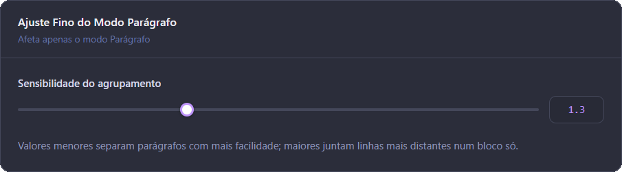

<i>O ajuste fica na aba <b>Overlay › Captura</b>, no card <b>Ajuste Fino do Modo Parágrafo</b>.</i>

### Trocando o motor de OCR — e por que o OneOCR é o recomendado

O OCR é o leitor de texto: ele transforma em texto o que aparece na área marcada, para ser
traduzido. Ele é usado na captura de tela e no Modo Legenda, e quanto melhor ele lê, melhor a
tradução. Em **Geral › OCR** você escolhe entre dois:

- **WinOCR** (nativo do Windows) — já vem pronto, não precisa instalar nada, e é o padrão. Lê bem
  texto sobre fundo liso, mas se perde fácil quando o fundo atrás do texto tem detalhes, cores ou
  movimento, e só lê os idiomas cujo pacote está instalado no Windows.
- **OneOCR** (recomendado) — o leitor de texto da Ferramenta de Captura (Snipping Tool) do
  Windows 11. É o que você deve usar.

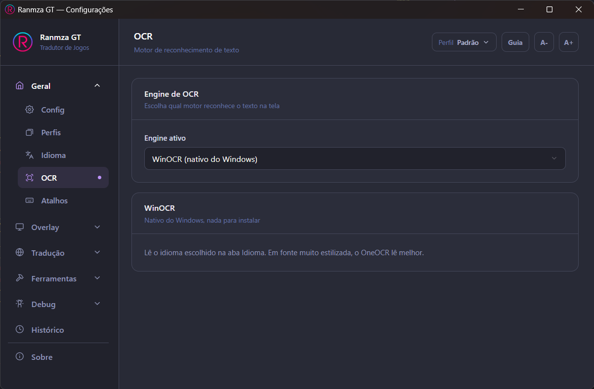

**Por que o OneOCR é bem superior:**

- **Lê com muito mais precisão.** Fontes estilizadas, texto com contorno, sombra ou efeito por
  cima, texto pequeno, texto sobre fundo cheio de detalhes — situações em que o WinOCR entrega
  letra trocada ou palavra faltando e o OneOCR lê certo.
- **Todos os idiomas de uma vez, sem configurar nada.** É um modelo único multilíngue (latim,
  japonês, chinês, coreano, cirílico…) com detecção automática: não existe "idioma do texto"
  para escolher, nem pacote de idioma do Windows para instalar. Um jogo que mistura inglês e
  japonês na mesma tela é lido do mesmo jeito.
- **Menos coisa para dar errado no dia a dia.** Sem pacote de idioma faltando e sem ter que
  trocar de idioma a cada jogo.

**Vale a pena o trabalho de pegar os arquivos?** Vale, e com folga. São três arquivos copiados
uma única vez — depois disso a qualidade da tradução inteira sobe junto, porque tudo o que vem
depois (agrupamento, tradução, legenda) depende do texto ter sido lido corretamente.

**O que ele exige:** os arquivos `oneocr.dll`, `oneocr.onemodel` e `onnxruntime.dll`. O programa
**não vai atrás deles sozinho**: quem copia é você, com um clique.

**No Windows 11 é um clique.** Escolha *OneOCR* em **Geral › OCR** (ou no passo OCR do guia) e use
o botão **Detectar e copiar**: o programa acha a Ferramenta de Captura instalada, copia os 3
arquivos para a pasta dele e já deixa tudo configurado. Se a Ferramenta de Captura não estiver
instalada, ou for uma versão sem os arquivos, ele avisa em vez de falhar em silêncio. Enquanto os
arquivos não forem copiados, o card mostra *"Não carregou"* e o OCR fica parado.

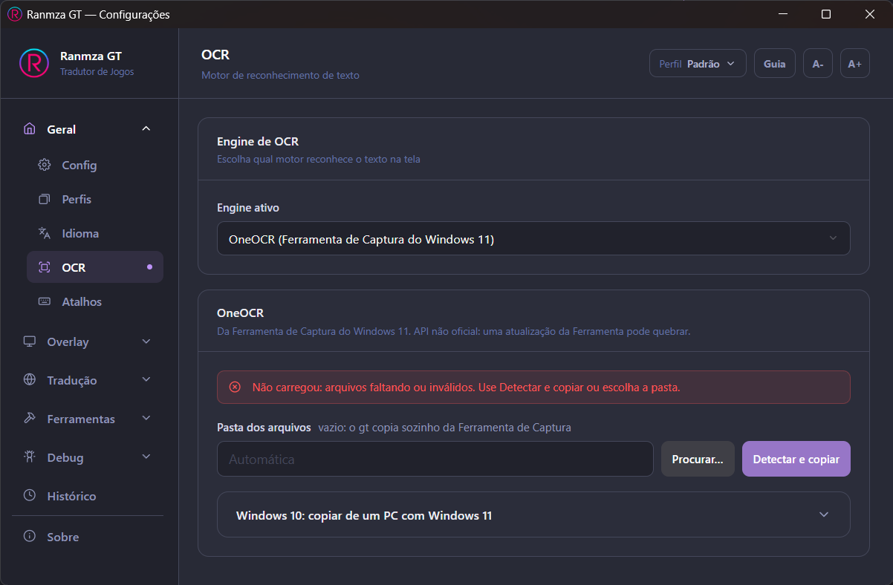

<i>Com o <b>OneOCR</b> selecionado, o card traz o botão <b>Detectar e copiar</b>,
o campo da pasta e, abaixo, o passo a passo para o Windows 10.</i>

**No Windows 10 é manual**, porque **os arquivos só vêm na Ferramenta de Captura do Windows 11**
(o OneOCR em si roda nos dois). Copie os três de uma máquina com Windows 11 e aponte a pasta com
**Procurar...** — o passo a passo dentro do card traz o comando do PowerShell que mostra onde eles
estão.

Por usar uma API não oficial da Microsoft, uma atualização da Ferramenta de Captura pode quebrar a
integração; nesse caso, clique em **Detectar e copiar** de novo.

### Filtro de alfabeto da legenda

No Modo Legenda, o programa pode considerar só as letras de um alfabeto e ignorar o resto:
latino, japonês/chinês, coreano ou cirílico. Útil quando aparecem nomes, placas ou símbolos em
outro alfabeto perto da legenda. Fica em **Overlay › Legenda**, no card **Alfabeto da legenda
original**:

- Com o **OneOCR**, você escolhe o alfabeto na lista (padrão: *Qualquer alfabeto*).
- Com o **WinOCR**, o filtro segue sozinho o idioma escolhido em **Geral › Idioma**.

Exemplo: na cena abaixo, a legenda em inglês fica por cima de uma manchete de jornal em japonês.
Com *Qualquer alfabeto*, o programa lê as duas juntas e manda o japonês para a tradução no meio da
fala. Com *Latino*, ele ignora os caracteres japoneses e traduz só a legenda.

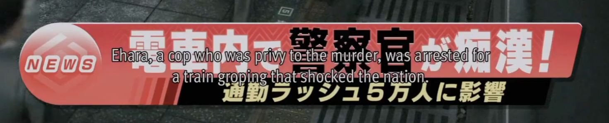

Vale só para o Modo Legenda; a captura de tela lê todo o texto da área.

### Fila rápida da OpenAI

Com a OpenAI escolhida, o card do modelo tem a opção **Fila rápida da OpenAI**. Ligada, a OpenAI
atende os seus pedidos antes, pelo dobro do preço por token. Ajuda quando a OpenAI está lenta. Vem
**desligada**: a chave é sua, então a conta dobrada só acontece se você ligar.

### IA no seu PC ou outro serviço

Muitos programas e serviços de IA aceitam o mesmo formato de pedido da OpenAI: LM Studio, Ollama,
llama.cpp, OpenRouter e outros. O tradutor **Compatível com OpenAI** conversa com qualquer um
deles. Você informa o endereço e o nome do modelo, e o programa manda o texto do jogo para lá.

**Configurando.** Em **Tradução › Tradutores**, escolha *Compatível com OpenAI* e preencha:

- **URL base** — o endereço do servidor, do jeito que o programa de IA mostra. Pode ser com ou
  sem `/chat/completions` no fim. Servidor no seu próprio PC costuma ser algo como
  `http://localhost:1234/v1` (LM Studio) ou `http://localhost:11434/v1` (Ollama).
- **Modelo** — o nome exato do modelo, como o servidor mostra. Não existe lista para escolher:
  cada servidor tem os seus.
- **O modelo aceita imagem** — ligue só se o modelo lê imagens. É o que libera o
  [Modo Vision](/Manual/modo-vision-quando-o-ocr-erra.md) nesse tradutor.
- **Chaves de API** — só se o serviço pedir. Servidor no seu PC geralmente não pede, e aí o
  campo fica vazio.

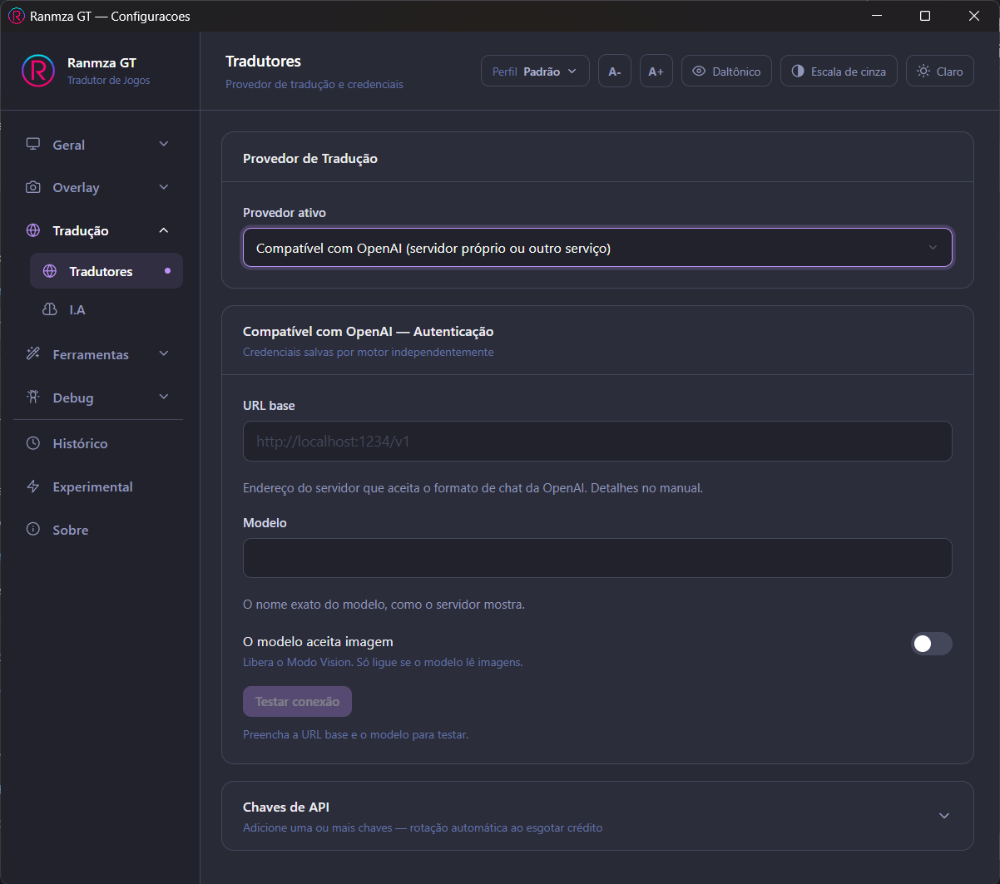

Depois clique em **Testar conexão**. Ele traduz uma palavra pelo servidor e mostra se deu certo
ou qual erro voltou. O botão só libera com a URL e o modelo preenchidos.

**Boas práticas**

- **Use um modelo que siga instruções.** Modelos muito pequenos às vezes respondem com
  comentários em vez da tradução, e essa resposta é descartada.
- **Servidor no mesmo PC divide a placa de vídeo com o jogo.** O jogo e a tradução podem ficar
  mais lentos. A legenda espera a resposta, então um modelo lento atrasa a legenda.
- **A primeira tradução pode demorar.** Muitos servidores só carregam o modelo na primeira
  chamada. O programa espera até 90 segundos por resposta neste tradutor.
- **Modelo de raciocínio:** o bloco `<think>` que alguns modelos escrevem antes da resposta é
  descartado.
- Com o servidor desligado aparece o alerta *"API compatível: servidor não responde"*. Sem URL
  ou sem modelo, *"API compatível: preencha URL e modelo"*.

---

## 7. Deixando a tradução com a "cara" do jogo

Em **Overlay › Captura**, no card **Texto**:

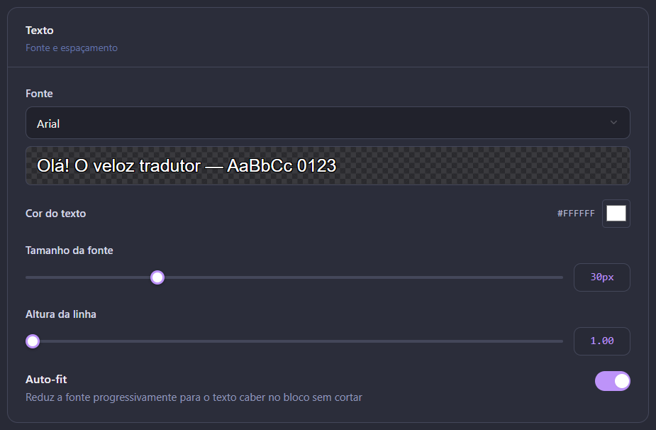

- **Fonte**: escolha entre as fontes da pasta `fonts/`, ao lado do programa, **todas as fontes
  instaladas no Windows** ou a padrão do sistema (Arial). A prévia logo abaixo mostra como fica.
  Para usar uma fonte nova, instale no Windows ou coloque o arquivo na pasta `fonts/` e abra o
  programa de novo.
- **Cor do texto**: branco por padrão; troque para combinar com a paleta do jogo.
- **Tamanho da fonte** e **Altura da linha**: ajuste para o texto ficar legível e bem
  espaçado.
- **Auto-fit** (vem ligado): diminui a fonte até a tradução caber no lugar do texto original. Desligado, a
  tradução mais longa que o original passa desse lugar e pode cobrir o texto vizinho. Dica: com
  o Auto-fit ligado, deixe o **Tamanho da fonte** alto — o programa encontra sozinho o maior
  tamanho que cabe.

No card **Fundo e Contorno**:

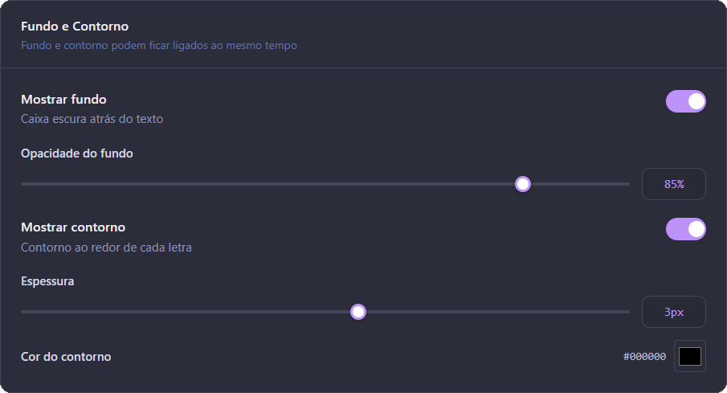

- **Fundo**: desenha uma caixa escura atrás do texto (com opacidade ajustável), para garantir
  legibilidade sobre qualquer cenário.
- **Contorno**: desenha uma borda nas letras, com espessura e cor ajustáveis — pode ser usado
  sozinho ou junto com o fundo.

### Quanto tempo a tradução fica na tela

Em **Exibição**, escolha por quanto tempo a tradução da captura de tela fica visível depois de
aparecer: 1 minuto (padrão), 2, 5, 10 minutos ou *Nunca*, que deixa a tradução na tela até você
limpar ou traduzir de novo. Para tirá-la antes, aperte o atalho de limpar ou
traduza de novo.

No mesmo card fica **"Esconder a tradução de gravações e transmissões"**: ligada, a tradução
continua na sua tela normalmente, mas não aparece para programas de captura. Útil para gravar o
jogo sem a tradução por cima. Vale só para a captura de tela.

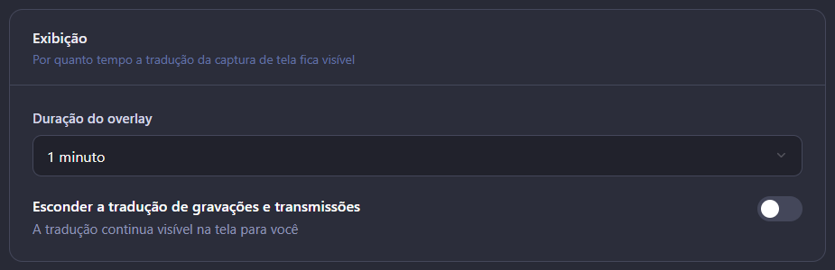

> Funciona só com programas rodando **NESTE PC** (OBS, Game Bar, NVIDIA ShadowPlay, etc).
> Gravando por placa de captura, a tradução aparece assim mesmo — quem esconde a janela é o
> Windows, e o que sai pelo cabo de vídeo é a tela inteira.

---

## 8. Modo Vision — quando o OCR erra

Às vezes o reconhecimento de texto comum (OCR) erra letras, perde pedaços do texto ou se perde
totalmente em fontes muito estilizadas, com símbolos ou ícones no meio do texto.

Para esses casos, use o **Traduzir com I.A Vision**. Junto com o texto reconhecido, o programa
**envia a imagem da área para a IA**, que "olha" a imagem, corrige o que o OCR leu errado e
traduz. Símbolo ou ícone no meio da frase vira `[...]` na tradução.

Assim como no Traduzir normal, o Vision tem os dois modos, e você escolhe pelo atalho:

- **`Numpad5`** — Vision no **modo parágrafo** (diálogos).
- **`Numpad6`** — Vision no **modo linha** (menus e listas).

**Importante:**
- Só funciona com **OpenAI, Anthropic (Claude), Gemini** ou **Compatível com OpenAI** com *O modelo
  aceita imagem* ligado. Com Google Translate, Google Cloud, DeepL, Azure ou Groq, o atalho traduz
  só o texto do OCR e mostra o alerta *"Vision só com IA"*.
- Usa o mesmo modelo escolhido em **Tradução › Tradutores**.
- É um pouco mais lento e **sempre faz uma chamada nova** à IA: não usa as traduções guardadas,
  porque a resposta depende da imagem.
- A posição da tradução na tela ainda depende de onde o reconhecimento de texto encontrou algo.

**Quando usar**: fontes desenhadas à mão, créditos estilizados, textos com ícones/símbolos
misturados (ex: "pressione [ícone de botão] para continuar"), ou sempre que o atalho normal
("Traduzir") devolver um texto sem sentido.

---

## 9. Modo Legenda — tradução automática contínua

Para cenas com diálogo contínuo (cutscenes, modo automático de visual novels, vídeos com
legenda), o Modo Legenda traduz **sozinho**, sem você precisar apertar nada a cada fala.

### Como configurar

1. Aperte **Selecionar área da legenda** (padrão `Numpad1`) e desenhe um retângulo sobre onde a
   legenda aparece no jogo. Essa área é separada da área da captura de tela.
2. Aperte **Ligar/desligar legenda** (padrão `Numpad0`) para ligar. Um alerta na tela confirma.

O programa sempre abre com a legenda desligada. As opções ficam em **Overlay › Legenda**, e os
padrões já funcionam bem para a maioria dos casos.

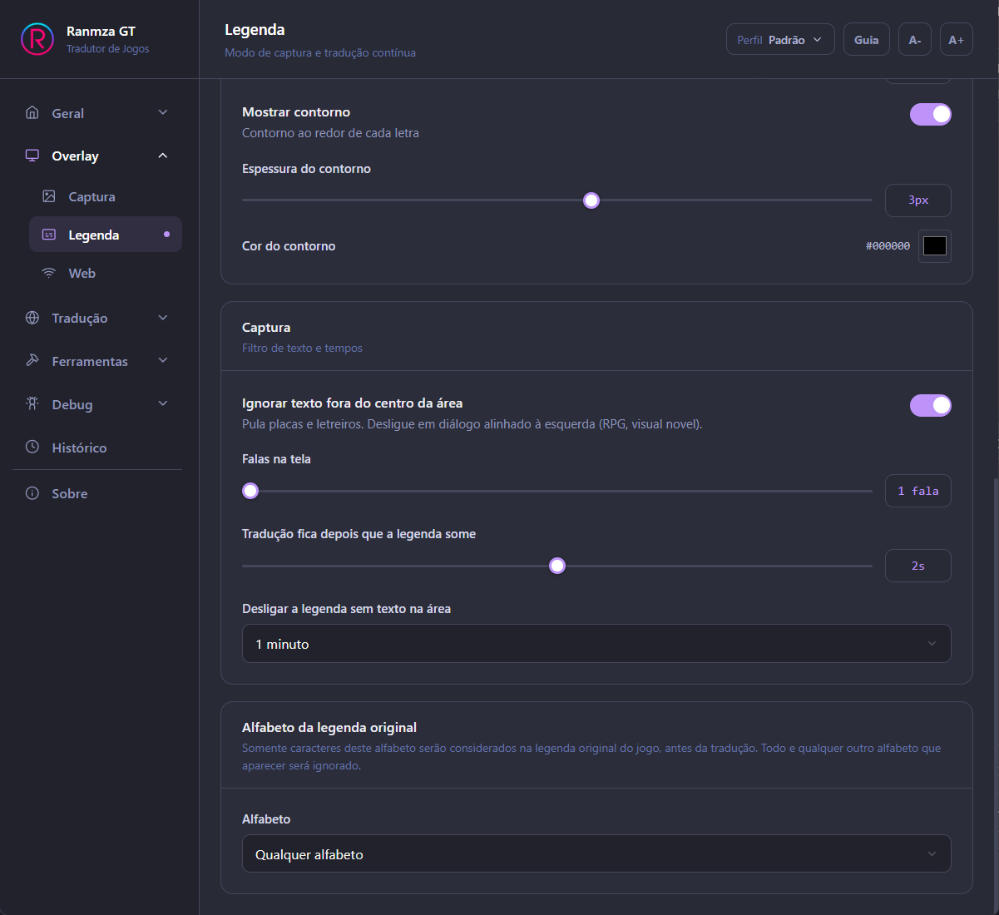

A partir daí, o programa fica de olho naquela área várias vezes por segundo e traduz cada texto
novo assim que ele aparece e se repete numa segunda leitura. Isso evita traduzir uma fala ainda
sendo escrita na tela. Se a área ficar igual, o programa nem relê o texto.

Por padrão, a tradução aparece **acima** da área selecionada e some sozinha alguns segundos
depois de a legenda sumir do jogo. Dá para trocar isso pela tradução em cima da legenda original
— é o tópico a seguir.

  <iframe src="https://player.vimeo.com/video/1217784520"
          style="position:absolute;top:0;left:0;width:100%;height:100%;border:0"
          allow="fullscreen; picture-in-picture" allowfullscreen
          title="Modo Legenda traduzindo sozinho"></iframe>

<i>Modo Legenda traduzindo sozinho, com a tradução acima da área selecionada.</i>

### Ignorar texto fora do centro da área

A opção **Ignorar texto fora do centro da área**, no card **Captura**, vem ligada. Com ela, o
programa ignora o texto perto das bordas da área, como placas, letreiros e textos do jogo que
aparecem ao lado da legenda.

- Quanto mais justa a área estiver em volta da legenda, melhor funciona. Marque só a faixa onde
  a legenda aparece.
- Em jogos com diálogo alinhado à esquerda, como alguns RPGs e visual novels, deixe essa opção
  desligada.

### Colar no texto detectado

Em **Overlay › Legenda**, o primeiro card (*Posição da tradução*) tem a opção **Colar no texto
detectado**. Ligada, a tradução deixa de aparecer acima da área e passa a ser desenhada **em
cima da fala original**, com as mesmas quebras de linha, cobrindo a legenda do jogo — como se o
jogo estivesse legendado no seu idioma.

- Nesse modo o programa mostra **uma fala por vez**, e *Falas na tela* fica em 1.
- A tradução **não é encolhida para caber**: fonte maior transborda a área, de propósito. É assim
  que dá para deixar a legenda maior que a do jogo.
- A área selecionada continua sendo o que o programa lê. Ela precisa caber a legenda inteira do
  jogo.

> Nesse modo a legenda fica **escondida das capturas de tela**. É isso que impede o OCR de reler
> a própria tradução no ciclo seguinte. Funciona só com programas rodando **NESTE PC** (OBS, Game
> Bar, NVIDIA ShadowPlay, etc). Gravando por placa de captura, a tradução aparece assim mesmo.

  <iframe src="https://player.vimeo.com/video/1218094053"
          style="position:absolute;top:0;left:0;width:100%;height:100%;border:0"
          allow="fullscreen; picture-in-picture" allowfullscreen
          title="Tradução cobrindo a legenda original"></iframe>

<i>A tradução desenhada por cima da legenda original. O vídeo foi gravado com
celular porque, nesse modo, a legenda fica escondida das capturas de tela — uma gravação normal
não mostraria a função funcionando.</i>

### Mais de uma fala na tela

Com *Colar no texto detectado* desligado, **Falas na tela** (1 a 8, padrão 1) define quantas
falas ficam visíveis ao mesmo tempo. Com mais de uma, cada fala fica numa linha, começando com um
traço, no meio do monitor. Fala comprida demais para a largura diminui a fonte do bloco, em vez de
quebrar a linha.

### Deixando a IA "lembrar" das falas anteriores

Com uma IA (OpenAI, Anthropic, Gemini, Groq ou Compatível com OpenAI), **Tradução › I.A** tem o controle **Falas
anteriores** (5 a 10, padrão 5). A IA recebe as últimas falas já traduzidas como referência antes
de traduzir a próxima — isso ajuda a manter os mesmos nomes, termos e tom ao longo de uma
conversa. Cada fala a mais custa tokens em toda tradução.

> O **DeepL** recebe só o texto original dessas falas, como contexto, e não cobra por ele. Os
> outros tradutores dedicados (Google Translate, Google Cloud e Azure) traduzem cada fala sozinha.

### Aparência separada

Overlay › Legenda tem suas próprias opções de fonte, cor, fundo e contorno — independentes da
captura de tela — então você pode deixar a legenda contínua menor e mais discreta e a tradução da
captura de tela maior, por exemplo.

### Desligando

Aperte **`Numpad0`** novamente, ou o botão de ligar/desligar a legenda na barra flutuante. A
legenda na tela é limpa imediatamente.

O modo também **se desliga sozinho** depois de um tempo sem texto na área, para não ficar rodando
à toa quando você sai da cutscene e esquece de desligar. O tempo é escolhido em
*Overlay › Legenda → Desligar a legenda sem texto na área*: Nunca, 1, 2, 5 ou 10 minutos (padrão
1 minuto). Legenda parada na tela conta como texto. Repare que isso **desliga o modo**, não só
esconde a legenda — para religar, aperte `Numpad0`.

---

## 10. Usando no OBS / transmissões

Se você transmite ou grava o jogo e quer que **a tradução da captura de tela apareça também no
vídeo/stream** (ou só no vídeo, sem aparecer no jogo em si), use **Overlay › Web**:

1. Ative o **Servidor ativo**.
2. Copie o endereço **Captura — OBS** (`/captura/obs`) mostrado na aba, no botão *Copiar*.
3. No OBS, adicione uma fonte do tipo **"Navegador" (Browser Source)** e cole esse endereço.
   Essa versão da página tem fundo transparente, pronta para sobrepor à captura do jogo.
4. (Opcional) **Desative** a chave **"Mostrar tradução na tela"** para tirar o overlay do jogo e
   deixar a tradução aparecer **só** na página do navegador/OBS — útil se a captura do OBS já
   inclui a janela do overlay e você não quer ver a tradução duplicada. Deixe **ligada** se
   quiser a tradução nos dois lugares.

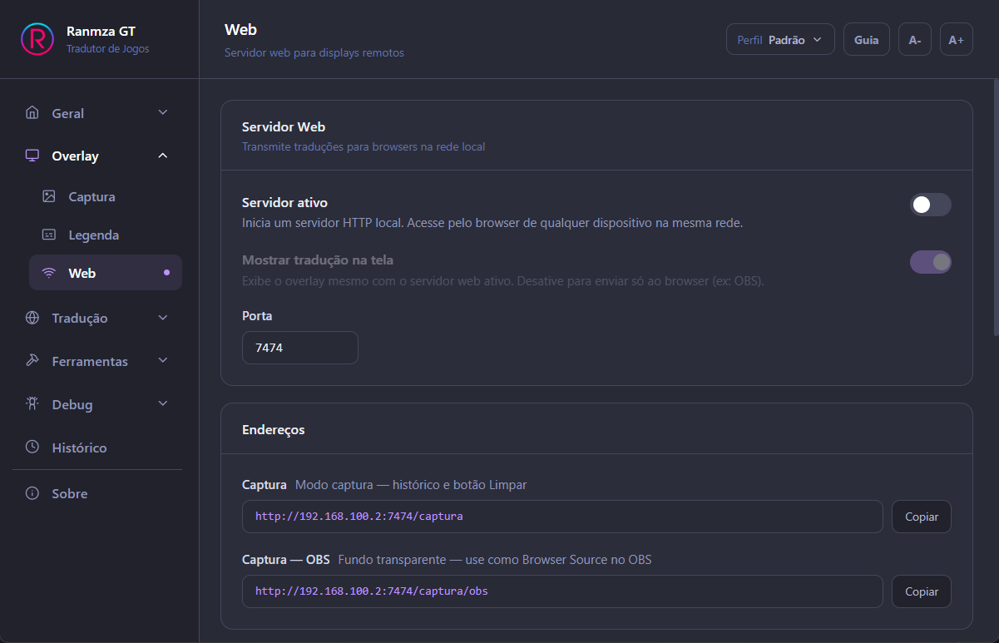

Você também pode personalizar tema (claro/escuro/dracula), cores, tamanho da fonte, e se quer
mostrar o texto original junto com a tradução, horário e qual serviço foi usado. As páginas
abertas mudam na hora.

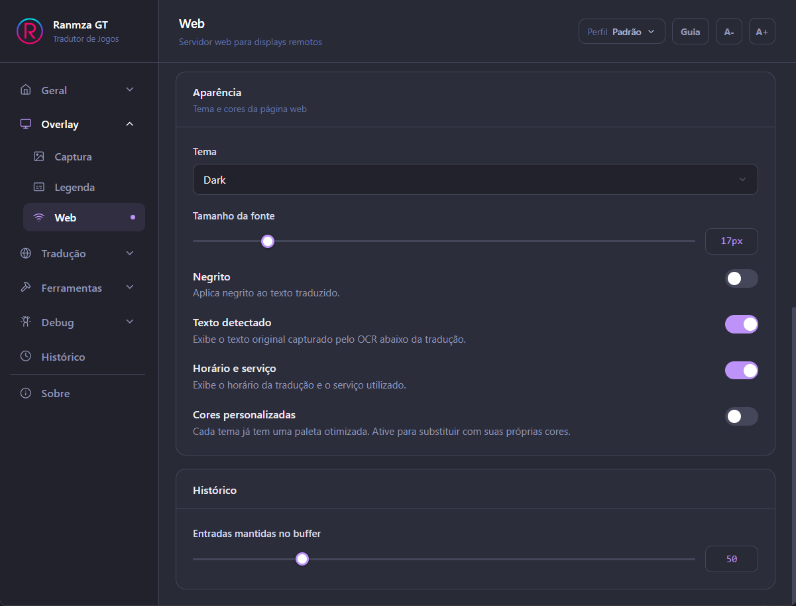

A página também pode ser aberta em qualquer navegador da rede local (celular, segundo monitor,
etc.) usando o endereço **Captura** (`/captura`) mostrado na aba — essa versão vem com histórico
e botão de limpar.

> Se a tradução some das suas gravações e transmissões, há duas causas possíveis. Uma é
> automática: o Modo Legenda com *Colar no texto detectado* ligado desenha **por cima** do texto
> original, e aí o overlay precisa ficar invisível para capturas, senão o OCR releria a própria
> tradução. A outra é uma escolha sua: *"Esconder a tradução de gravações e transmissões"*, no
> card **Exibição** de Overlay › Captura. Para a captura de tela, é justamente nesses casos que o
> servidor Web resolve.

---

## 11. Histórico e desempenho

- **Aba Histórico**: mostra as traduções da captura de tela feitas na sessão atual (texto
  original, tradução, horário e serviço usado). Clique numa entrada para copiar a tradução; há
  também um botão para limpar tudo. Fechar o programa limpa o histórico.
- **Debug › Monitor**: liga um registro das últimas 10 capturas de tela com o tempo que cada
  etapa levou (captura, reconhecimento, tradução, total) — útil para perceber o que está
  deixando a tradução lenta. A coluna **Cache** mostra quantos blocos foram resolvidos sem chamar
  a API, e a **API**, quantas chamadas foram feitas de fato.

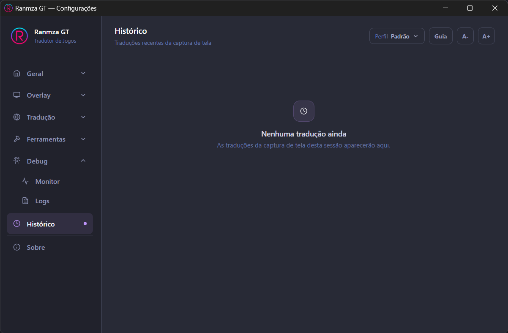

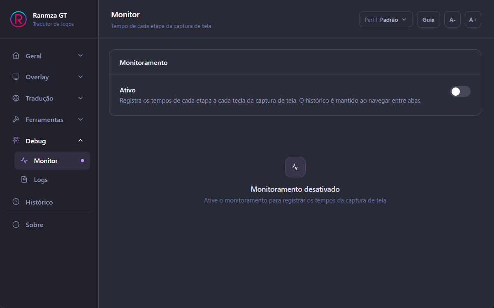

---

## 12. Problemas comuns e soluções

##### "Erro ao abrir o programa: VCRUNTIME140.dll não foi encontrado" (ou MSVCP140.dll)
→ Falta o **Microsoft Visual C++ Redistributable** no seu Windows — um componente gratuito da
Microsoft que alguns PCs recém-formatados ainda não têm. Baixe e instale o pacote **x64** por este
link oficial: <https://aka.ms/vs/17/release/vc_redist.x64.exe> — depois reabra o Ranmza GT, que ele
abre normalmente.

##### "O Ranmza GT já está aberto."
→ O programa abre uma vez só, para os atalhos não brigarem. Feche a outra janela do Ranmza GT —
inclusive uma versão antiga, se estiver aberta — e abra de novo.

##### "O reconhecimento não detecta nada" / aviso sobre idioma
→ Com o **WinOCR**, vá em **Geral › Idioma** e confira se um idioma está escolhido e se o pacote
dele está instalado no Windows. O **OneOCR** não usa pacotes de idioma do Windows e lê qualquer
idioma sem instalar nada — outro motivo para trocar de motor em **Geral › OCR**.

##### "Escolhi o OneOCR e o card diz *Não carregou*"
→ Também aparece o alerta *"OCR não carregou"*. Os arquivos do OneOCR ainda não foram copiados. Clique em **Detectar e copiar**, no card do
OneOCR em **Geral › OCR**. No Windows 10, siga o passo a passo do mesmo card. Enquanto o OneOCR
não carrega, o OCR fica parado.

##### "O guia não me deixa passar do passo Idiomas"
→ Com o WinOCR, o idioma do texto é obrigatório: escolha um na lista. Se a lista estiver vazia, o
Windows não tem nenhum pacote de idioma com leitura de texto; instale o pacote do idioma do jogo,
ou volte ao passo OCR e escolha o OneOCR.

##### "Apertei o atalho e nada acontece"
→ Confira se a janela de configuração não está em primeiro plano (os atalhos só funcionam com
o jogo em foco). Se aparecer o alerta *"Captura sem área"* ou *"Legenda sem área"*, marque a área
primeiro (`Numpad7` ou `Numpad1`). Se mesmo assim não funcionar, ative a **barra flutuante**
(**Geral › Atalhos**) e use os botões dela.

##### "Os atalhos não funcionam em alguns jogos (mesmo com o jogo em foco)"
→ Alguns jogos rodam com privilégios elevados (Administrador) e, por isso, **bloqueiam o registro
dos atalhos globais** do Ranmza GT. Nesse caso, **execute o Ranmza GT como Administrador** (clique
com o botão direito no `.exe` → *Executar como administrador*) — assim ele consegue ativar os
atalhos por cima do jogo. Para não precisar repetir toda vez, marque *Executar este programa como
administrador* em **Propriedades → Compatibilidade** do executável. (Alternativa: use a **barra
flutuante**, que dispara as ações por clique do mouse e não depende dos atalhos do teclado.)

##### "A tradução não aparece, ou demora muito"
→ Confira as abas **Histórico** e **Debug › Monitor** para ver se a tradução está sendo feita.
Falhas passageiras (servidor fora do ar por um instante, queda de conexão) são **tentadas de novo
automaticamente** antes de recorrer ao Google Translate. Se você tiver **mais de uma chave**
cadastrada para o serviço e o problema for da chave (recusada, sem crédito ou no limite de
requisições), ele passa na hora para a próxima chave da lista. Se aparecer o alerta
*"<serviço> falhou, usando Google"* — e no Histórico a tradução vier marcada como
*Google (fallback)* —, quer dizer que o serviço configurado falhou em **todas** as chaves;
confira suas chaves de API e créditos em Tradução › Tradutores. O serviço da configuração não
muda: a próxima tradução tenta ele de novo.

##### "Google: limite de uso (429)"
→ O Google Translate aqui é o **serviço gratuito, sem chave de API** — e serviço gratuito tem
limite de quantas traduções aceita num intervalo curto. Quando você bate nesse limite, aparece o
alerta e a tradução daquela captura não sai.

O que faz você bater no limite mais rápido do que parece: o **Modo Legenda** manda uma tradução a
cada fala nova, e uma captura de tela com muitos blocos separados vira muitos textos de uma vez.

E aqui vale saber de uma diferença: quando um serviço com chave falha, o programa cai no Google
Translate. **O Google não tem para onde cair** — ele já é o último recurso.

###### Por que o seu limite parece menor que o do vizinho: CGNAT

O limite não é por programa nem por conta: ele é contado **por endereço de IP** — o número que
identifica a sua conexão na internet. Tudo o que sai da sua casa chega ao Google com esse mesmo
número, e é ele que o Google usa para contar quantas traduções você pediu.

O problema é que muita gente hoje **divide o mesmo IP com estranhos**. Não existe IP público
sobrando para todo mundo, então boa parte dos provedores (fibra popular, rádio e principalmente
internet móvel 4G/5G) usa uma técnica chamada **CGNAT**: centenas de clientes saem para a internet
por um único IP público. É como um prédio grande que tem só um número na rua — as cartas chegam
todas na portaria e alguém distribui lá dentro. Visto de fora, você e os vizinhos parecem uma
pessoa só.

Para o Google, então, o limite daquele IP é gasto por todos juntos. Se alguém que divide o IP com
você já andou usando serviços do Google, parte da cota foi embora antes de você abrir o jogo — e o
aviso aparece bem mais cedo do que apareceria para quem tem um **IP público só seu**. Não é defeito
do programa nem do seu computador, e não existe ajuste interno que resolva.

**Como saber se você está atrás de CGNAT:** compare o IP que aparece na tela de status do seu
roteador (o IP da WAN) com o que um site de "qual é o meu IP" mostra. Se os dois forem diferentes,
é CGNAT — e o do roteador normalmente começa com algo entre **100.64** e **100.127**, faixa
reservada justamente para isso. Alguns provedores fornecem IP público a pedido, às vezes cobrando
à parte.

O que resolve, do mais simples ao mais definitivo:

- **Espere alguns minutos.** O limite é temporário e se solta sozinho.
- **Use o modo Parágrafo** (`Numpad8`) em vez do modo Linha (`Numpad9`). O Parágrafo junta as
  linhas de uma mesma fala num bloco só — menos blocos, mesma tela traduzida.
- **Troque de serviço** em **Tradução › Tradutores**. **Google Cloud**, **DeepL**, **Azure**,
  **Gemini** e **Groq** têm plano gratuito: exigem criar uma chave de API, mas em troca você ganha
  um limite próprio, muito mais folgado. Se você está atrás de CGNAT, é a solução que realmente
  funciona: o limite passa a ser contado pela **sua chave**, e não pelo IP.

##### "Apareceu um alerta vermelho de erro"
→ Geralmente indica chave de API inválida, créditos esgotados, ou o serviço fora do ar
temporariamente. Confira **Tradução › Tradutores** e a aba **Debug › Logs**.

##### "No Azure, a chave parece inválida — mas a chave está certa"
→ Confira a **Região do recurso** em **Tradução › Tradutores**. O Azure responde o **mesmo erro**
para chave inválida e para região errada ou ausente, então uma região trocada parece problema de
chave. Copie a região da página *Keys and Endpoint* do seu recurso, no portal do Azure — pode colar
como aparece lá ("Brazil South"), que o programa ajusta o espaço e as maiúsculas sozinho.

##### "A IA traduziu errado, e a mesma tradução errada volta sempre"
→ O programa guarda cada tradução e reaproveita quando o mesmo texto aparece de novo. Com o texto
na tela, aperte **`Numpad4` (Retraduzir sem cache)**: ele traduz de novo sem olhar o que está
guardado e troca a tradução antiga pela nova. Se a tradução nova também sair ruim, tente o
**Vision** (`Numpad5` ou `Numpad6`), que manda a imagem para a IA.

##### "O texto reconhecido está errado/incompleto"
→ A solução que mais resolve é trocar o motor de OCR para o **OneOCR** em **Geral › OCR** — ele
lê fontes de jogo muito melhor que o WinOCR (o passo a passo e o porquê estão na
[seção 6](/Manual/configurando-a-traducao.md), em *Trocando o motor de OCR*). No Modo Legenda,
confira também se a área está justa em volta da legenda e o **filtro de alfabeto**. Na captura de
tela, use o **Traduzir com I.A Vision** (`Numpad5` parágrafo, `Numpad6` linha) para deixar a IA
"ver" a imagem e corrigir.

##### "A tradução não cabe no lugar do texto original"
→ Na captura de tela, confira se o **Auto-fit** está ligado em **Overlay › Captura** — o programa diminui a fonte
até caber.
→ No **Modo Legenda** com *Colar no texto detectado* ligado, a tradução transborda a área de
propósito. Diminua o *Tamanho da fonte* em **Overlay › Legenda** se ela cobrir o que não deve.

##### "As traduções de falas diferentes estão se misturando num bloco só" (ou o contrário)
→ Primeiro confira se você apertou o atalho certo: `Numpad8` junta as linhas (parágrafo) e
`Numpad9` separa (linha). Se o modo está certo e ainda erra, ajuste a **Sensibilidade do
agrupamento** em **Overlay › Captura** — ela só afeta o modo Parágrafo.

##### "Troquei de monitor e as áreas sumiram"
→ Cada monitor guarda as próprias áreas. Na primeira vez que você usa um monitor, ele não tem área
nenhuma: marque de novo (`Numpad7` e `Numpad1`). Ao voltar para o monitor anterior, as áreas dele
voltam sozinhas.

##### "Quero compartilhar meus logs para suporte, mas não quero mostrar o conteúdo do jogo"
→ Confira em **Debug › Logs** se a opção "Logar textos capturados e traduções" está
**desativada** (é o padrão) — assim os logs não mostram o conteúdo dos textos e traduções, e as
chaves de API nunca aparecem neles.

---

## 13. Referência completa — todas as abas

Esta seção descreve **cada aba e cada opção** da janela de configuração, na ordem em que
aparecem no menu da esquerda. É material de consulta — para o dia a dia, as seções anteriores
já bastam.

O menu tem cinco grupos com sub-itens (**Geral**, **Overlay**, **Tradução**, **Ferramentas**,
**Debug**) e dois itens soltos embaixo (**Histórico** e **Sobre**).

### Geral › Config

- **Idioma do programa → Idioma da interface** — troca o idioma da própria janela de
  configuração (Português / Inglês) e dos alertas. Não afeta os idiomas de OCR e tradução. Na
  primeira execução ele segue o idioma do Windows (cai para Inglês se não for Português).
- **Aparência** — cores desta tela e da barra flutuante:
  - *Tema* — Escuro ou Claro.
  - *Daltônico* — paleta de cores acessível para daltonismo.
  - *Escala de cinza* — para acromatopsia.
- **Atualizações → Avisar sobre novas versões** — liga o aviso que aparece ao abrir o programa
  quando existe versão mais nova publicada (veja a seção 14).
- **Atualizações → Verificar agora** — consulta na hora se existe versão nova, mesmo com o
  aviso desligado.

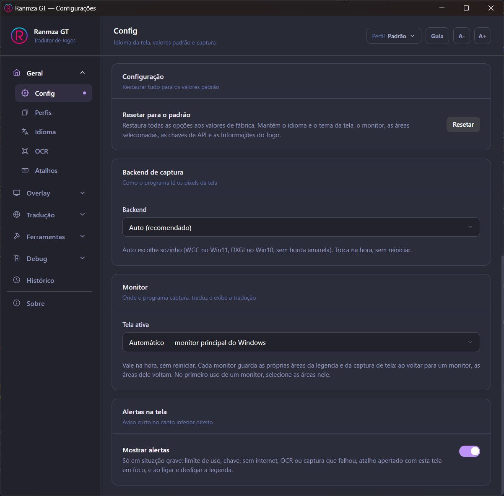

<i>Rolando a mesma aba: <b>Configuração</b>, <b>Backend de captura</b>,
<b>Monitor</b> e <b>Alertas na tela</b>.</i>

- **Configuração → Resetar para o padrão** — restaura todas as opções aos valores de fábrica.
  **Mantém** o idioma e o tema da tela, o monitor, as áreas selecionadas, as chaves de API, as
  Informações do Jogo e a preferência de aviso de atualização.
- **Backend de captura → Backend** — como o programa lê os pixels da tela:
  - *Auto (recomendado)* — escolhe sozinho: WGC no Windows 11, DXGI no Windows 10, sem a borda
    amarela. A troca vale na hora, sem reiniciar.
  - *WGC (Windows 11)* — Windows Graphics Capture.
  - *DXGI (Windows 10)* — Desktop Duplication; existe para o Windows 10 não desenhar a borda
    amarela ao redor do monitor capturado.
- **Monitor → Tela ativa** — em qual monitor abrem a seleção das áreas, os alertas, a prévia das
  áreas e a barra flutuante. *Automático* usa o monitor principal do Windows. Vale na hora, sem
  reiniciar; cada monitor guarda as próprias áreas, e cada perfil guarda o próprio monitor.
- **Alertas na tela → Mostrar alertas** — avisos curtos no canto inferior direito, só em situação
  grave (limite de uso, chave, sem internet, OCR ou captura que falhou, atalho apertado com esta
  tela em foco) e ao ligar e desligar a legenda.

### Geral › Perfis

Um conjunto de configurações por jogo. O conceito e o passo a passo estão na
[seção 4](/Manual/perfis-um-conjunto-de-ajustes-por-jogo.md); aqui ficam só os controles.

- **Novo perfil → Nome do jogo** — o nome do perfil que vai ser criado.
  - **Duplicar o atual** — cria a partir de tudo que está valendo agora, **inclusive as áreas
    selecionadas**.
  - **Começar do zero** — cria com os valores de fábrica, no monitor atual, e abre o Guia de
    configuração.
  - Em ambos os casos o perfil criado **já fica ativo**, e daí em diante tudo que você mexer
    nas outras abas é gravado nele sozinho.
- **Seus perfis** — a lista, num card retrátil. O perfil ativo aparece destacado e marcado como
  *ativo*; clique em qualquer outro para ativá-lo na hora.
  - **Renomear** — troca o nome. O **Padrão** não tem este botão.
  - **Apagar** — pede confirmação (*Apagar mesmo*). O **Padrão** não pode ser apagado. Se o
    perfil apagado era o que estava em uso, o Padrão assume na hora.
- **O que muda ao trocar de perfil** — o resumo de quais opções acompanham o perfil e quais
  valem para todos.

### Geral › Idioma

O campo do idioma de origem **se adapta ao motor de OCR** escolhido em Geral › OCR.

- **Idioma do texto original**
  - Com *WinOCR* — lista dos idiomas com pacote de leitura de texto instalado no Windows, sem
    opção padrão: escolha o idioma do jogo. Sem escolha, aparece um aviso. Se o idioma salvo não
    estiver mais instalado, aparece o botão **Instalar pacote de idioma**, que abre a tela de
    idiomas do Windows.
  - Com *OneOCR* — **detecção automática**; não há idioma de origem para configurar.
- **Idioma destino** — para qual idioma traduzir: Português (Brasil), Português (Portugal),
  Español, English, Français, Deutsch, Italiano, 日本語, 한국어, 中文（简体）e Русский.

### Geral › OCR

Qual motor reconhece o texto na tela.

- **Engine de OCR → Engine ativo**
  - *WinOCR (nativo do Windows)* — o padrão. Embutido no Windows, sem nada para instalar. Lê o
    idioma escolhido em Geral › Idioma; se perde em fundo com detalhes e em fonte muito
    estilizada.
  - *OneOCR (Ferramenta de Captura do Windows 11 — recomendado)* — modelo multilíngue com
    detecção automática de idioma, bem superior ao WinOCR em fontes de jogo (o porquê está na
    [seção 6](/Manual/configurando-a-traducao.md), em *Trocando o motor de OCR*). **Roda no
    Windows 10 e no 11**; o que é exclusivo do Windows 11 são os arquivos `oneocr.dll`,
    `oneocr.onemodel` e `onnxruntime.dll`. Usa uma API não oficial da Microsoft — uma
    atualização da Ferramenta de Captura pode quebrar a integração.
- **OneOCR** (aparece com o OneOCR selecionado)
  - *Estado* — mostra a pasta de onde o OneOCR carregou, ou *"Não carregou"* quando faltam os
    arquivos.
  - *Pasta dos arquivos* — vazia, usa a pasta onde o **Detectar e copiar** coloca os arquivos.
    **Procurar...** escolhe outra pasta e confere se os 3 arquivos estão nela.
  - *Detectar e copiar* — acha a Ferramenta de Captura instalada, copia os 3 arquivos e configura
    a pasta. Avisa quando o app não está instalado ou quando é uma versão sem os arquivos (o caso
    do Windows 10). **É o único jeito de o programa copiar os arquivos**: ele nunca vai atrás
    deles sozinho.
  - *Windows 10: copiar de um PC com Windows 11* — bloco recolhível com o passo a passo da cópia à
    mão.

### Geral › Atalhos

- **Barra flutuante → Mostrar barra flutuante** — liga a janelinha de botões sempre visível
  (veja o passo 2.8). Também abre e fecha pelo atalho `NumpadSubtract`, e ela **lembra a última
  posição** e o tamanho em que você a deixou.

Onze atalhos globais — funcionam com o jogo em foco e ficam pausados enquanto a janela de
configuração está em primeiro plano. Cada um tem os modificadores **Ctrl / Alt / Shift** e uma
tecla principal, escolhida entre os grupos **Numpad**, **Função** (F1–F12), **Navegação**
(setas, Insert, Delete, Home, End, PageUp, PageDown), **Números** e **Letras**.

| Ação | Padrão |
|---|---|
| Selecionar área | `Numpad7` |
| Traduzir (modo linha) | `Numpad9` |
| Traduzir (modo parágrafo) | `Numpad8` |
| Traduzir com I.A Vision (modo parágrafo) | `Numpad5` |
| Traduzir com I.A Vision (modo linha) | `Numpad6` |
| Retraduzir sem cache | `Numpad4` |
| Limpar overlay | `NumpadDecimal` |
| Ligar/desligar legenda | `Numpad0` |
| Selecionar área da legenda | `Numpad1` |
| Mostrar/ocultar áreas | `Numpad2` |
| Mostrar/esconder barra flutuante | `NumpadSubtract` |

> **Letras e números** como tecla principal **exigem** um modificador (Ctrl, Alt ou Shift) para
> não conflitar com o jogo, que usa WASD e os slots 0–9 o tempo todo. Numpad, F-keys e teclas de
> navegação funcionam sem modificador. Os grupos Números e Navegação salvam quem está em
> notebook sem teclado numérico.

O programa avisa se você repetir a mesma combinação em dois atalhos — um dos dois não seria
registrado. A troca de tecla vale na hora, sem reiniciar.

### Overlay › Captura

Aparência da tradução da captura de tela.

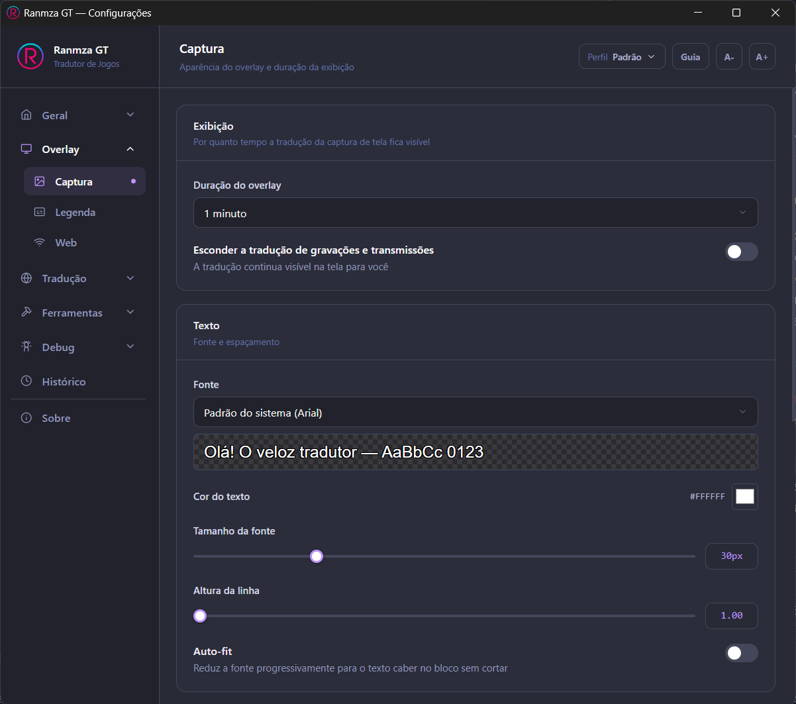

- **Exibição**
  - *Duração do overlay* — **1 minuto (padrão)**, 2, 5, 10 minutos ou *Nunca* (fica até o atalho
    de limpar ou a próxima captura).
  - *Esconder a tradução de gravações e transmissões* — a tradução continua visível na sua tela,
    mas some das capturas. Funciona só com programas rodando neste PC (OBS, Game Bar, NVIDIA
    ShadowPlay, etc); gravando por placa de captura, ela aparece assim mesmo.
- **Texto**
  - *Fonte* — "Padrão do sistema (Arial)", as fontes da pasta `fonts/` ou todas as instaladas no
    Windows, com prévia logo abaixo. Fonte instalada com o programa aberto aparece depois de
    abri-lo de novo.
  - *Cor do texto* — seletor de cor (padrão branco).
  - *Tamanho da fonte* — 8 a 100 px.
  - *Altura da linha* — 1,00 a 2,00 vezes o tamanho da fonte.
  - *Auto-fit* — reduz a fonte até o texto caber no lugar do original. **Vem ligado.**
- **Fundo e Contorno** — podem ser ligados juntos ou separados.
  - *Mostrar fundo* + *Opacidade do fundo* (10–100%) — caixa escura atrás do texto.
  - *Mostrar contorno* + *Espessura* (0,5–5 px) + *Cor do contorno* — contorno ao redor de cada
    letra.
- **Ajuste Fino do Modo Parágrafo → Sensibilidade do agrupamento** (0,5–3,0) — valores menores
  separam parágrafos com mais facilidade; maiores juntam linhas mais distantes num bloco só. O
  modo em si (parágrafo ou linha) **não se escolhe aqui**: é decidido na hora de capturar, pelo
  atalho — `Numpad8` (parágrafo) ou `Numpad9` (linha).

### Overlay › Legenda

O Modo Legenda tem aparência **própria**, independente de Overlay › Captura.

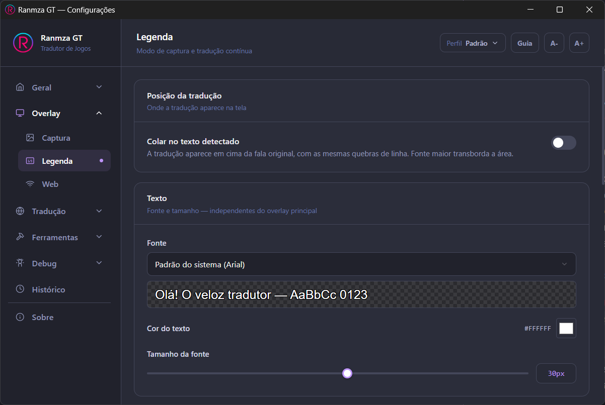

- **Posição da tradução → Colar no texto detectado** — desenha a tradução em cima da fala
  original, com as mesmas quebras de linha, em vez de acima da área. Mostra uma fala por vez, e
  fonte maior transborda a área. Nesse modo a legenda some das capturas feitas neste PC — é o que
  impede o OCR de reler a própria tradução. Ver a seção 9.
- **Texto** — *Fonte*, *Cor do texto* e *Tamanho da fonte* (10–48 px).
- **Fundo e Contorno** — *Mostrar fundo* + *Opacidade* (10–100%) e *Mostrar contorno* +
  *Espessura do contorno* (0,5–5 px) + *Cor do contorno*.

- **Captura**
  - *Ignorar texto fora do centro da área* — ligada por padrão. Pula placas e letreiros perto das
    bordas da área; desligue em diálogo alinhado à esquerda.
  - *Falas na tela* — quantas falas ficam visíveis (1 a 8). Fica em 1 com *Colar no texto
    detectado* ligado.
  - *Tradução fica depois que a legenda some* — 1 a 3 s (padrão 2 s).
  - *Desligar a legenda sem texto na área* — **desliga o modo** depois desse tempo sem texto:
    Nunca / 1 / 2 / 5 / 10 minutos (padrão 1 minuto).
- **Alfabeto da legenda original** — só caracteres desse alfabeto são considerados na legenda;
  o resto é ignorado. Com o OneOCR, escolha *Qualquer alfabeto*, latino, japonês/chinês, coreano
  ou cirílico. Com o WinOCR, segue o idioma de Geral › Idioma, com o botão **Mudar idioma**.

### Overlay › Web

Transmite as traduções da captura de tela para navegadores na rede local — e para o OBS.

- **Servidor Web**
  - *Servidor ativo* — sobe um servidor HTTP local, acessível por qualquer aparelho na mesma
    rede.
  - *Mostrar tradução na tela* — mantém o overlay mesmo com o servidor ligado; desligue para
    mandar **só** para o navegador/OBS.
  - *Porta* — padrão 7474. Mostra também quantos clientes estão conectados.
- **Endereços** — `/captura` (com histórico e botão Limpar) e `/captura/obs` (fundo
  transparente, para usar como Browser Source no OBS), cada um com botão **Copiar**.

<i>Rolando a mesma aba: <b>Aparência</b> da página web e o buffer do <b>Histórico</b>.</i>

- **Aparência** — *Tema* (Dark, Light ou Dracula) · *Tamanho da fonte* · *Negrito* · *Texto
  detectado* (mostra o original abaixo da tradução) · *Horário e serviço* · *Cores
  personalizadas*, que libera os seletores de cor da página.
- **Histórico → Entradas mantidas no buffer** — quantas traduções a página guarda para quem
  abre depois.

### Tradução › Tradutores

Qual serviço traduz e com quais chaves.

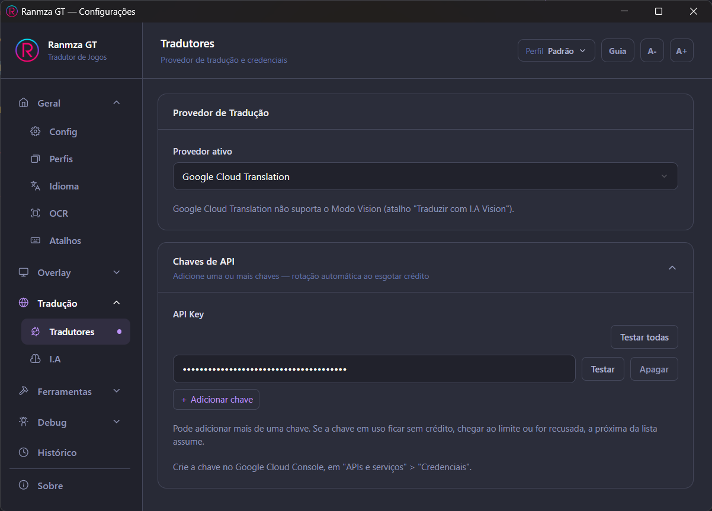

- **Provedor de Tradução → Provedor ativo**
  - *Google Translate — gratuito* — API não oficial, nada para configurar. É o mesmo endereço que
    a página do Google Tradutor usa internamente; como não é publicada nem documentada, o Google
    pode alterá-la ou desativá-la a qualquer momento. **Não suporta o Modo Vision.** Por ser
    gratuito, tem **limite de requisições**, contado por endereço de IP — o que fazer está na
    [seção 12](/Manual/problemas-comuns-e-solucoes.md).
  - *Google Cloud Translation* — a API oficial do Google, com chave criada no Google Cloud
    Console (*APIs e serviços › Credenciais*). **Não suporta o Modo Vision.**
  - *DeepL* — tradutor dedicado. A chave do plano gratuito termina em `:fx`, e o programa escolhe
    o servidor certo sozinho. Recebe as Informações do Jogo e as falas anteriores como contexto,
    sem custo. **Não suporta o Modo Vision.**
    - *Formalidade* — aparece abaixo do provedor, só com o DeepL: *Padrão*, *Mais formal* ou
      *Mais informal*. Muda o tratamento (você/o senhor). Nos idiomas em que o DeepL não tem
      formalidade, é ignorada. Fica salva no perfil.
  - *Azure Translator* — o tradutor da Microsoft; exige chave e **região** do recurso. **Não
    suporta o Modo Vision.**
  - *OpenAI*, *Anthropic (Claude)*, *Gemini* — IAs, com chave de API e Modo Vision.
  - *Groq* — IA com plano gratuito, com chave de API. **Não suporta o Modo Vision.**
  - *Compatível com OpenAI* — IA no seu PC (LM Studio, Ollama) ou outro serviço no formato da
    OpenAI. Chave opcional. Detalhes em [IA no seu PC ou outro serviço](/Manual/configurando-a-traducao.md).
- **Autenticação** — aparece nas IAs, no Azure e no Compatível com OpenAI.
  - *Modelo* (IAs) — cada uma traz uma lista curta. A primeira é o padrão.
    - OpenAI: GPT-5.4 mini (mais rápido, recomendado) · GPT-4.1 mini · GPT-4.1
    - Anthropic: Haiku 4.5 · Sonnet 5 · Opus 5
    - Gemini: 3.5 Flash-Lite · 3.6 Flash · 3.7 Flash
    - Groq: gpt-oss-20b · gpt-oss-120b
    - *Personalizado…* — última opção da lista: abre um campo livre onde você digita **qualquer
      ID de modelo** aceito pelo serviço, para usar um modelo mais novo sem esperar uma
      atualização do programa.
    - *Ver a lista completa de modelos do provedor* — abre no navegador a página oficial do
      serviço, com todos os modelos e os IDs exatos, para copiar para o *Personalizado…*.
  - *URL base*, *Modelo*, *O modelo aceita imagem* e *Testar conexão* (só no Compatível com
    OpenAI) — ficam no lugar da lista de modelos. URL, modelo e a opção de imagem ficam salvos no
    perfil. O *Testar conexão* só libera com URL e modelo preenchidos e funciona sem chave.
  - *Fila rápida da OpenAI* — aparece abaixo do modelo, só com a OpenAI. **Vem desligada.**
    Ligada, a OpenAI atende antes, pelo dobro do preço por token.
  - *Região do recurso* (só no Azure) — **obrigatória**. Aceita a grafia do portal ("Brazil
    South"): maiúsculas e espaços são ajustados sozinhos. O link *Ver a lista oficial de regiões
    do Azure* abre a tabela da Microsoft no navegador. Chave e região saem da mesma página:
    <https://portal.azure.com> → o seu recurso de Translator → *Keys and Endpoint*.
- **Chaves de API** — card recolhível onde entra a chave do serviço selecionado. Ele **abre
  sozinho** enquanto nenhuma chave estiver preenchida; no Compatível com OpenAI a chave é opcional
  e o card fica fechado. As chaves ficam guardadas criptografadas e
  só abrem neste PC, na sua conta do Windows.
  - *+ Adicionar chave* / *Apagar* — dá para cadastrar **quantas chaves quiser** no mesmo serviço.
    Quando a chave em uso é recusada, fica sem crédito ou bate no limite de requisições, a
    próxima da lista assume na hora; esgotadas todas, cai no Google Translate.
  - *Testar* — traduz uma palavra só com aquela chave, usando o modelo e a região escolhidos. O
    botão fica **verde** quando a chave funciona e **vermelho** quando falha. Passe o mouse em cima
    para ver o motivo, como "chave inválida", "sem crédito" ou "Sem internet". Editar a chave
    apaga o resultado.
  - *Testar todas* — testa as chaves da lista uma por vez e pinta o botão de cada uma.
  - No **DeepL**, a chave que funciona mostra abaixo dela quanto da cota do mês já foi usado
    (*"Cota do mês: 4.359 de 500.000 caracteres"*).

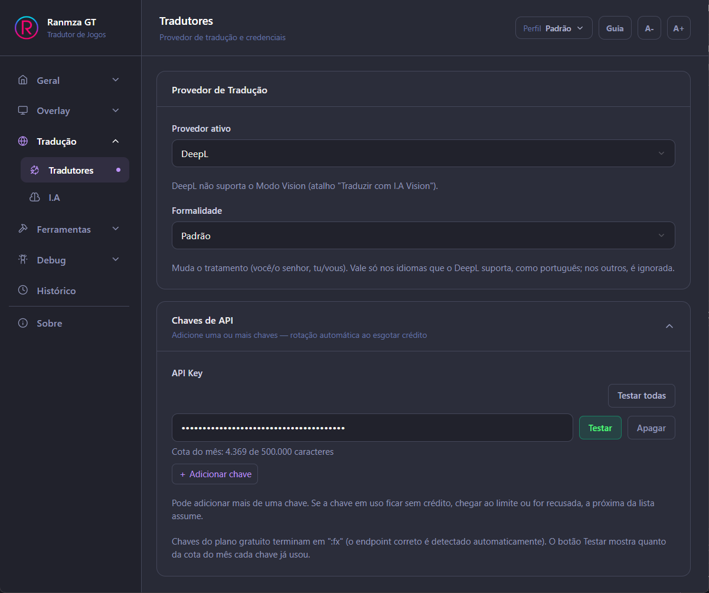

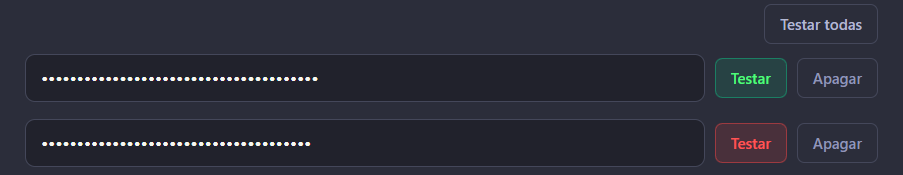

### Tradução › I.A

Contexto enviado às IAs.

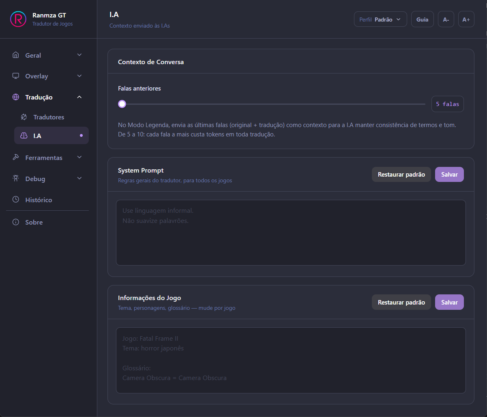

- **Contexto de Conversa → Falas anteriores** (5–10, padrão 5) — no Modo Legenda, envia as
  últimas falas (original + tradução) como contexto, para a IA manter consistência de termos e
  tom. Cada fala a mais custa tokens em toda tradução. No DeepL, vão só os originais, sem custo.
- **System Prompt** — regras gerais do tradutor, para todos os jogos. Vem **em branco**, com um
  exemplo em cinza dentro do campo; nada é enviado à IA enquanto você não escrever o seu. Botões
  **Salvar** e **Restaurar padrão** (que esvazia o campo de novo). O idioma de destino não precisa
  estar aqui: o programa já manda para a IA o idioma escolhido na aba **Idioma**, e um pedido de
  outro idioma neste campo é ignorado. Regras concretas (glossário, manter nomes, não suavizar
  palavrões) funcionam em todos os modelos.
- **Informações do Jogo** — tema, personagens e glossário; mude a cada jogo. Também vem em
  branco, com exemplo em cinza. Mesmos botões. No DeepL, o texto vai como contexto: ajuda no tom
  e nos termos, mas pedidos escritos aqui não são seguidos.

> Com Google Translate, Google Cloud ou Azure ativo, os cards ficam marcados em vermelho, porque
> não valem para eles. Com o DeepL, só o System Prompt fica marcado.

O reset geral (Geral › Config) **não** apaga as Informações do Jogo.

### Ferramentas › Inpaint

Reconstrução de fundo por IA (MI-GAN).

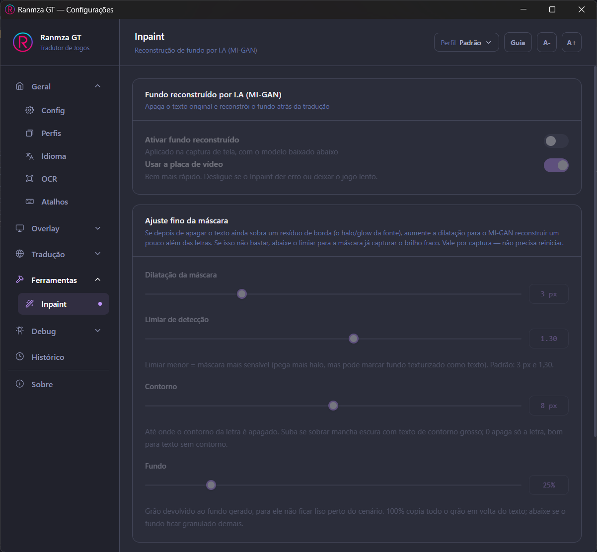

Em vez da caixa escura atrás da tradução, apaga o texto original da captura de tela e reconstrói o
fundo com um modelo de inpainting rodando dentro do programa — a tradução fica parecendo nativa do
jogo. Vale para a **captura de tela** (Traduzir e Vision); o Modo Legenda não usa.

  <iframe src="https://player.vimeo.com/video/1217778049"
          style="position:absolute;top:0;left:0;width:100%;height:100%;border:0"
          allow="fullscreen; picture-in-picture" allowfullscreen
          title="Fundo reconstruído por IA"></iframe>

<i>O fundo reconstruído no lugar da caixa escura atrás da tradução.</i>

- **Ativar fundo reconstruído** — só pode ser ligado depois de baixar o modelo, no card abaixo.
- **Usar a placa de vídeo** — vem ligado. Com a placa de vídeo, apagar o texto leva cerca de
  0,03 s por captura; no processador, cerca de 0,3 s. Desligue se o Inpaint der erro ou deixar o
  jogo lento. Se a placa de vídeo falhar, o programa usa o processador sozinho. A troca vale na
  hora.
- **Ajuste fino da máscara** — valem **por captura**, sem reiniciar.
  - *Dilatação da máscara* (0–12 px; padrão 3) — se depois de apagar o texto ainda sobra um
    resíduo de borda (o halo da fonte), aumente para o MI-GAN reconstruir um pouco além das
    letras.
  - *Limiar de detecção* (1,05–1,50; padrão 1,30) — limiar menor deixa a máscara mais sensível
    (pega mais halo, mas pode confundir fundo texturizado com texto).
  - *Contorno* (0–16 px; padrão 8) — até onde o contorno da letra é apagado. Suba se sobrar
    mancha escura com texto de contorno grosso; 0 apaga só a letra, bom para texto sem contorno.
  - *Fundo* (0–150%; padrão 25%) — grão devolvido ao fundo gerado, para ele não ficar liso perto
    do cenário. Abaixe se o fundo ficar granulado demais.

#### Baixar automaticamente

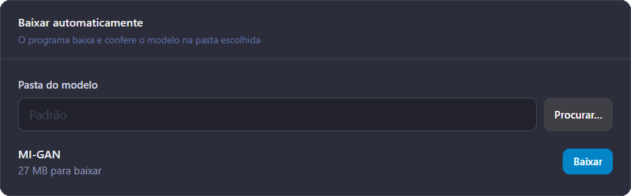

O recurso precisa do modelo do MI-GAN (27 MB), que não vem no `.zip` do programa. O card
**Baixar automaticamente** baixa e confere o modelo:

- *Pasta do modelo* — vazia, usa a pasta `models\inpaint`, ao lado do executável. **Procurar...**
  escolhe outra.
- *Baixar* — a barra mostra o andamento e o botão vira **Cancelar**. Cancelado ou interrompido, o
  download recomeça do zero na próxima vez.

O programa confere o **sha256** do arquivo antes de aceitá-lo. Arquivo que chega corrompido ou
diferente do esperado é apagado e o download falha com aviso — nunca fica um arquivo pela metade
se passando por bom.

> Dica: ative o **Contorno** na aba Overlay › Captura, porque o fundo reconstruído pode ficar
> claro demais para texto branco.

### Debug › Monitor

Tempo de cada etapa da captura de tela.

- **Monitoramento → Ativo** — registra os tempos de cada etapa a cada tecla da captura de tela.
  O histórico é mantido ao navegar entre abas.
- **Histórico de Execuções** — tabela das últimas 10 capturas: Hora, Captura, OCR, Tradução,
  Total, Blocos, Cache (acertos sem chamar a API) e API (chamadas feitas).
- **Estatísticas** — mínimo, média e máximo de cada etapa.

### Debug › Logs

Log desta execução, em tempo real.

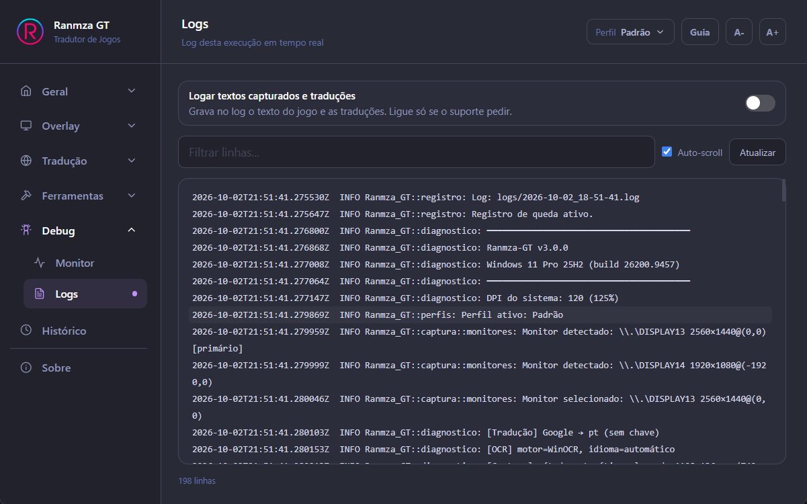

- **Logar textos capturados e traduções** — chave de privacidade, **desligada por padrão**.
  Deixe desligada ao mandar log para suporte, para não expor o conteúdo do jogo. As chaves de API
  nunca vão para o log.
- **Filtrar linhas** · **Auto-scroll** · **Atualizar** — controles da visualização; erros saem
  em vermelho, avisos em amarelo.

Cada execução grava um arquivo em `logs\`, ao lado do executável, e o programa guarda os 20 mais
recentes. É esse arquivo que o suporte vai pedir.

### Histórico

Lista as traduções da captura de tela na **sessão atual** — horário, serviço, tradução e, abaixo,
o texto original. Clique numa entrada para copiar a tradução. Botão **Limpar histórico**.

### Sobre

Informações do programa: ícone, nome e **versão** instalada, o autor, os links do projeto e de
apoio, e a **Licença de Uso** completa — o que é permitido (uso pessoal gratuito, distribuir
cópias não modificadas, criar conteúdo como vídeos e streams) e o que é proibido (modificar ou
fazer engenharia reversa, vender, redistribuir versões modificadas, uso comercial sem
autorização, remover créditos), além do aviso de garantia.

---

## 14. Atualizando o programa

Ao abrir o programa, se existir uma versão mais nova publicada, aparece um aviso com a versão
que você tem e a que saiu. O botão **Baixar** abre a página da versão nova no seu navegador —
é lá que estão as novidades daquela versão e o arquivo `.zip`.

**O programa não baixa e não instala nada sozinho.** Ele só avisa; o download e a troca dos
arquivos são feitos por você, do mesmo jeito que na primeira instalação. Isso é de propósito:
um programa que substitui o próprio executável é exatamente o comportamento que o Windows
Defender bloqueia, e não vale o risco de o programa inteiro parar de abrir.

**Como atualizar**, depois de baixar o `.zip`: feche o Ranmza GT, extraia o conteúdo por cima
da pasta atual e confirme a substituição dos arquivos. Suas configurações (`config.json`), os
perfis (`profiles\`), as chaves de API, as fontes que você colocou em `fonts/` e os arquivos de
`models/` (OneOCR e MI-GAN) **não estão no `.zip`** e continuam onde estão.

> **O `DirectML.dll` vai junto.** Desde a versão 3.0, o `.zip` traz o `DirectML.dll`, da
> Microsoft, além do `Ranmza-GT.exe`. Deixe os dois na mesma pasta. O programa carrega esse
> arquivo ao abrir, e o Inpaint o usa para apagar o texto pela placa de vídeo. O que vem no
> Windows 10 é mais antigo que o exigido; sem a cópia do `.zip`, o programa pode não abrir no
> Windows 10.

> As chaves de API ficam criptografadas para este PC e esta conta do Windows. Se você copiar a
> configuração para outro PC, digite as chaves de novo lá.

Para desligar o aviso, marque **Não avisar sobre novas versões** no próprio aviso, ou desligue
em **Geral › Config → Atualizações**. É por esse toggle que ele volta a aparecer.

Mesmo com o aviso desligado, o botão **Verificar agora**, no mesmo card, consulta na hora se
saiu versão nova — é o jeito de olhar de vez em quando sem ficar sendo avisado toda vez.

> O programa consulta a página de versões no máximo uma vez a cada 6 horas, mesmo que você
> abra e feche várias vezes no dia — o aviso continua aparecendo em toda abertura, porque ele
> usa a última resposta guardada. O botão *Verificar agora* ignora esse intervalo. Se você
> estiver sem internet, nada acontece: nenhum erro aparece e o programa abre normalmente.
