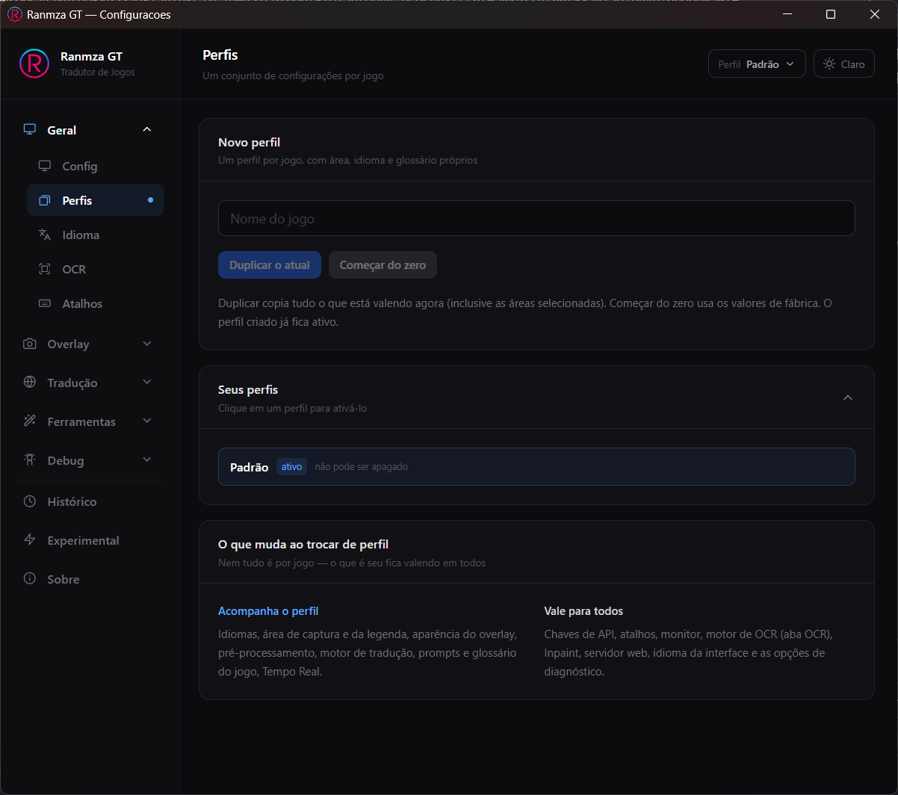
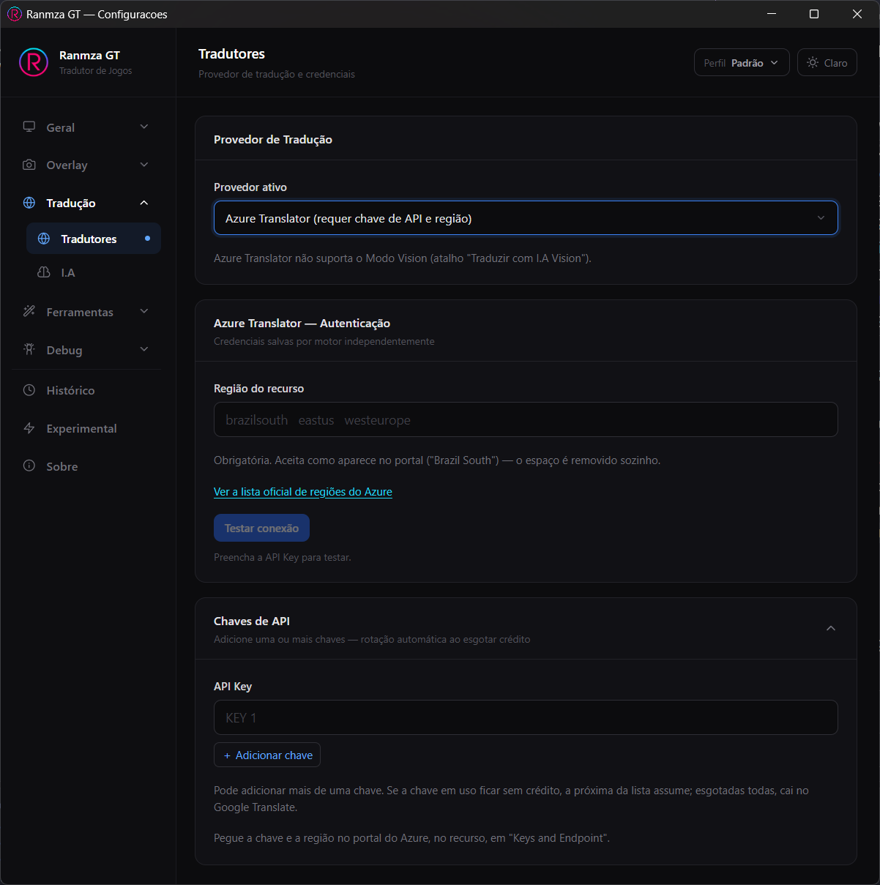
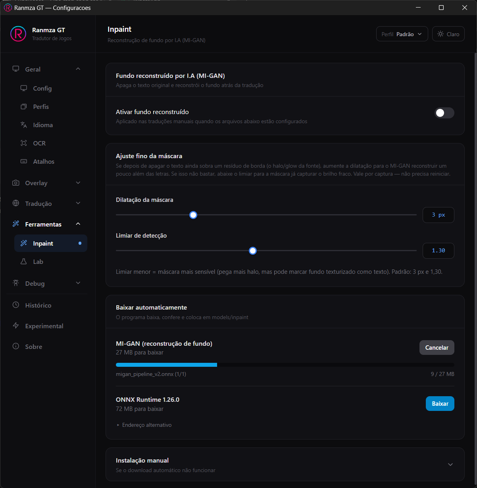
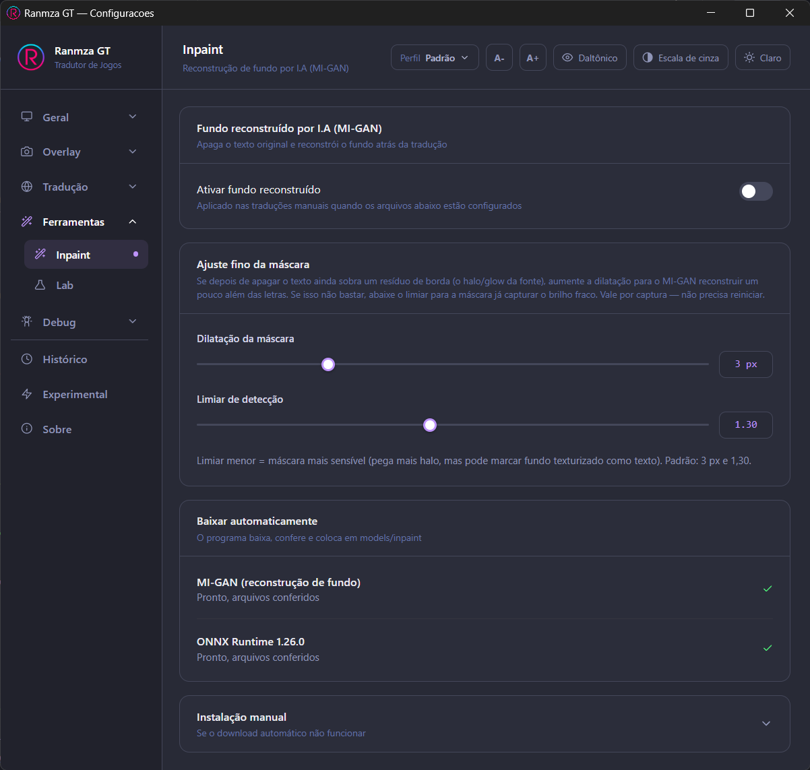
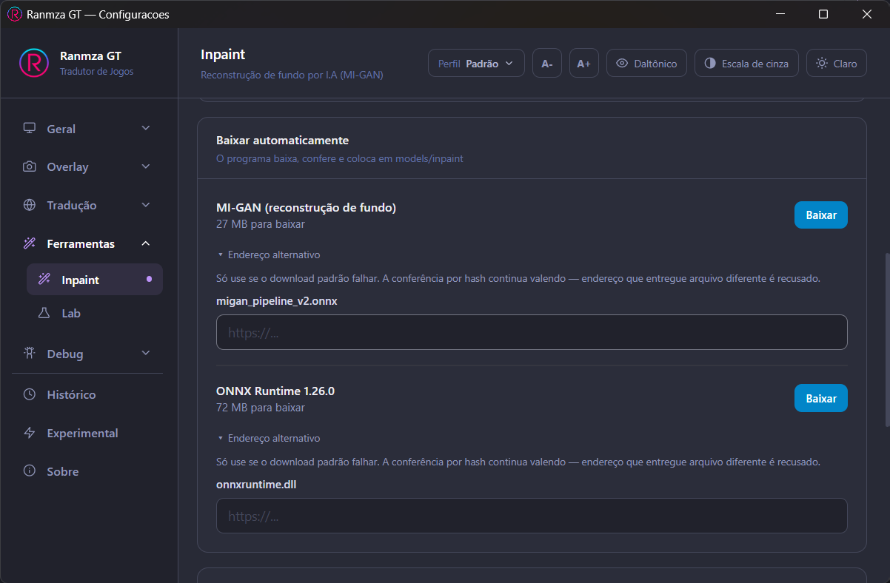
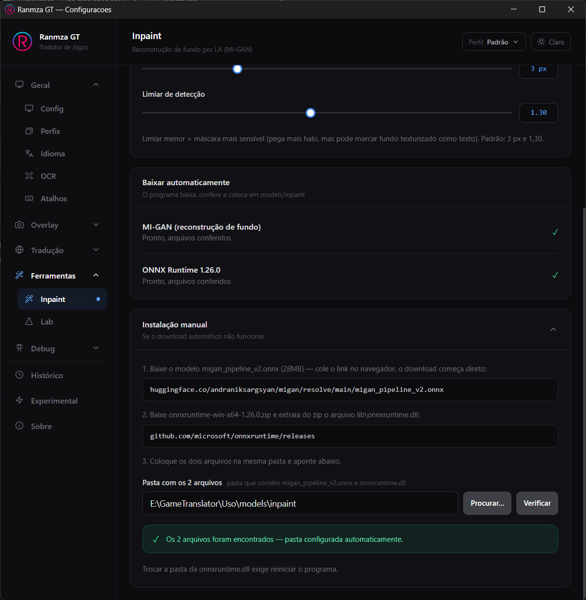

# User Manual — Ranmza GT

Practical guide to using **Ranmza GT**, the translator for games, visual novels, videos, and any on-screen content. This manual explains **how to use** each part of the program, without going into technical details.

---

## Table of Contents

1. [What the program does](#1-what-the-program-does)
2. [Quick setup](#2-quick-setup)
3. [Basic day-to-day usage](#3-basic-day-to-day-usage)
4. [Profiles — one set of settings per game](#4-profiles--one-set-of-settings-per-game)
5. [Keyboard shortcuts](#5-keyboard-shortcuts)
6. [Configuring translation](#6-configuring-translation)
7. [Making translation look like the game](#7-making-translation-look-like-the-game)
8. [Vision Mode — when OCR fails](#8-vision-mode--when-ocr-fails)
9. [Subtitle Mode — continuous automatic translation](#9-subtitle-mode--continuous-automatic-translation)
10. [Real-time Mode — continuous translation in place (experimental)](#10-real-time-mode--continuous-translation-in-place-experimental)
11. [Using with OBS / streaming](#11-using-with-obs--streaming)
12. [History and performance](#12-history-and-performance)
13. [Common problems and solutions](#13-common-problems-and-solutions)
14. [Complete reference — all tabs](#14-complete-reference--all-tabs)
15. [Updating the program](#15-updating-the-program)

---

## 1. What the program does

Ranmza GT takes a screenshot of an area on your screen, recognizes the text in it, translates it, and displays the translation **on top of the game**, in the same position as the original text — like a floating subtitle.

Works with any game, visual novel, video, or program that shows text on screen.

> **⚠️ Essential requirement: the game must be running in Windowed or Borderless Fullscreen mode.** Ranmza GT draws the translation **on top** of the game window — so run your game in **Windowed mode** (*Windowed*) or, preferably, **Borderless Fullscreen** (*Borderless* / *Fullscreen borderless*), which takes up the full screen and still lets the translation appear on top. In **Exclusive Fullscreen**, Windows gives the screen only to the game and no program can draw over it — the translation won't appear. Typical symptom: you press Translate, the translation even shows up in the **History** tab, but nothing appears over the game. Solution: change the game to **Borderless Fullscreen** in its video options.

The basic workflow is always:

1. You choose **where** the text is (an area of the screen).
2. Press a hotkey to **translate**.
3. The translation appears overlaid on the game.
4. Press another hotkey to **clear** it when you want, or it disappears on its own after a while.

---

## 2. Quick setup

**Five settings.** After them you're already translating; everything else in this manual is fine-tuning, to be read when (and if) you need it.

| Step | What to do | Where |
|---|---|---|
| 1 | Pick your monitor | **General › Config** tab |
| 2 | Pick your languages | **General › Language** tab |
| 3 | Pick your translator | **Translation › Translators** tab |
| 4 | Mark the text area | `Numpad7` hotkey, with the game open |
| 5 | Translate | `Numpad9` (line) or `Numpad8` (paragraph) hotkey |

> **Before anything else: run the game in Windowed mode.** In *Exclusive Fullscreen* no program can draw on top — the translation simply won't appear. Switch the game to **Borderless Fullscreen** in its video options. Full explanation in [section 1](/en/Manual/what-the-program-does.md).

> **Program won't even open, with the error *"VCRUNTIME140.dll not found"*?** The **Microsoft Visual C++ Redistributable (x64)** is missing — a free component from Microsoft that most PCs already have (it ships with many games). Install it from this official link and open the program again: <https://aka.ms/vs/17/release/vc_redist.x64.exe>

### 2.1 First look: how the window is organized

The left-hand menu groups options by subject. For this quick setup you only touch **General** and **Translation** — the rest is there for when you want to fine-tune something.

| Menu | What's inside |
|---|---|
| **General** | Config (monitor, theme, floating toolbar), Profiles, Language, OCR and Shortcuts |
| **Overlay** | How the translation looks on screen: Capture, Subtitles and Web |
| **Translation** | Translators (engine and API keys) and AI (prompts and parameters) |
| **Tools** | Inpaint (erase the original text) and Lab (test preprocessing) |
| **Debug** | Performance monitor, diagnostic images and Logs |
| **History** | Translations from the current session |
| **Experimental** | Features under development, such as Real-time Mode |
| **About** | Program version and links |

> **Interface language** (in *General › Config*) only changes the language **of the program** — the menus and labels you're looking at. It has nothing to do with the language being translated; that's step 2.3.

### 2.2 Pick your monitor

Still in **General › Config**, in the **Monitor** card, choose in **Active display** which screen the program should work on. With a single monitor, leave it on *Automatic* and move on.

Switching monitors **requires restarting the program** — a notice with a **Restart now** button appears at the bottom of the tab. Only after the restart do capture, the area selector and the on-screen translation move to the other screen. Any area you had already selected is cleared by the switch.

The **Capture backend** just above can stay on *Auto (recommended)*: it picks the right method for your Windows version by itself, and switches on the fly with no restart.

### 2.3 Pick your languages

Open **General › Language**.

- **Text language** — the language written in the game. Type the language code (`en` for English, `ja` for Japanese, `ko` for Korean, `zh` for Chinese…).
- **Target language** — the language you want to read in. `en` for English.

> **Yellow warning about a language pack?** Windows OCR only recognizes languages whose pack is installed in Windows. Install it under *Settings → Time & Language → Language & region*. Without the pack, the program can't read text in that language.

> **Using OneOCR?** Then there's no source language to pick: it's a single multilingual model (Latin, CJK, Cyrillic…) that detects the language on its own, and the **Text language** field doesn't even show while it's selected — nor does the Windows pack warning, which doesn't apply. **Target language** works normally. The OCR engine is switched in *General › OCR*, but leave it on the default to get started.

### 2.4 Pick your translator

Open **Translation › Translators**.

The default is **Google Translate — free, no key**: nothing to configure, it's ready to use. Do your first test with it.

> **Free, but capped.** Google Translate with no key only accepts a handful of translations in a short window. Go past that and a *"Rate limit reached"* warning appears, leaving that capture untranslated. For the odd line here and there it's fine; in a long session or in the continuous modes (Subtitle and Real-time) you reach the cap quickly. And the cap is counted **per IP address** — if you're on mobile internet or an ISP that uses **CGNAT**, you share that cap with other customers and hit it much sooner. The explanation and what to do about it are in [section 13](/en/Manual/common-problems-and-solutions.md).

?> **Careful: the Google API used here is not official.** It's the same address the Google Translate web page uses under the hood, with no key and no account. It is neither published nor documented, so Google can change it or take it down whenever it likes, without notice — and on that day only the engines with a key keep translating. If you depend on the program to play, it's worth having a free **DeepL** or **Azure Translator** key already set up.

When you want better quality, switch in **Active provider**:

- **DeepL** — a dedicated translator, very natural, with a formality option. Requires an API key, but has a **free plan** (those keys end in `:fx`, and the program figures out which server to use by itself).
- **Azure Translator** — Microsoft's translator, dedicated as well. On top of the API key it requires the resource **region** (both live on the same page of the Azure portal). It detects the source language **block by block**, which helps when a capture mixes languages.
- **OpenAI**, **Anthropic (Claude)** or **Gemini** — AI engines. They need an API key with credits, and in return deliver far more natural and consistent translations, especially in long dialogue. Pick the model under *Authentication* and paste the key under *API Keys*.

Each engine stores its own credentials, so switching away and back doesn't erase anything. Use the **Test connection** button to confirm the key is valid before jumping into the game.

> **Multiple keys with automatic rotation.** Every engine with a key accepts **more than one**: click *+ Add key*. If the key in use runs out of credit or hits the request limit, the program moves to the next one in the list by itself; once all are exhausted, it falls back to Google Translate. Very handy in long Subtitle Mode sessions.

> Only the AI engines (OpenAI, Claude, Gemini) support **Vision Mode** — Google Translate, DeepL and Azure Translator don't. See [section 8](/en/Manual/vision-mode-when-ocr-fails.md).

### 2.5 Mark the text area

With the game open and focused, press **`Numpad7`**. The screen dims and you drag the mouse to draw a rectangle over the region where the text appears — usually the dialogue box. Release the button to confirm, or press `ESC` to cancel.

The area is saved. You only need to mark it again if the game moves its text box or if you change resolution.

> Didn't mark any area? The program captures the **whole screen** — it works, but it's slower and less accurate. Marking is worth it.

  <iframe src="https://player.vimeo.com/video/1218016540"
          style="position:absolute;top:0;left:0;width:100%;height:100%;border:0"
          allow="fullscreen; picture-in-picture" allowfullscreen
          title="Marking the text area"></iframe>

<i>Marking the text area with `Numpad7`.</i>

### 2.6 Translate

With text on screen, press one of the two translation hotkeys — the only difference is **how lines are grouped** before translating:

| Hotkey | Mode | Use it for |
|---|---|---|
| **`Numpad9`** | **Line** | Menus, lists, items, buttons — each line is its own thing |
| **`Numpad8`** | **Paragraph** | Dialogue and running text — merges nearby lines into a single block |

When in doubt, start with `Numpad8` in story games and `Numpad9` in menus.

The translation appears over the game, in the position of the original text, and disappears on its own after a while. To clear it right away, press **`NumpadDecimal`** (the numpad's decimal point).

  <iframe src="https://player.vimeo.com/video/1217778050"
          style="position:absolute;top:0;left:0;width:100%;height:100%;border:0"
          allow="fullscreen; picture-in-picture" allowfullscreen
          title="Selecting the area and translating"></iframe>

<i>Selecting the area and translating — in line and paragraph modes.</i>

> **Hotkeys only work with the game focused.** With the Ranmza GT settings window in the foreground they're disabled on purpose — that way you can type into fields without firing off commands. Click back into the game before testing.

### 2.7 Plan B: the floating bar

Some games swallow the numpad keys, and NumLock sometimes gets in the way. For those cases, turn on **Show floating toolbar** in *General › Config*: a small window with the same commands as buttons, fired with the mouse.

It stays **on top of everything** — including a game in borderless fullscreen — and you drag it by the dotted handle on the left to any corner of any monitor. The `NumpadSubtract` hotkey (the numpad's minus) shows and hides the bar.

The buttons, left to right (hover over one to see its name):

| Icon | What it does |
|---|---|
| Brackets (cyan) | Select capture area |
| Three lines (purple) | Translate (Paragraph) |
| Dash (purple) | Translate (Line) |
| Three lines (pink) | Translate with AI Vision (Paragraph) |
| Dash (pink) | Translate with AI Vision (Line) |
| X (red) | Clear overlay |
| Bubble (green) | Subtitle Mode — on/off |
| Rectangle (green) | Select subtitle area |
| Four dots (orange) | Show/hide areas |

### 2.8 Changing the hotkeys

If the default keys don't suit you — a keyboard with no numpad, a clash with the game's controls — change them in **General › Shortcuts**.

Each action has a main key, picked from the list on the right, plus three modifier buttons (Ctrl, Alt and Shift) you toggle if you want a combination.

> **A letter or number as the main key requires a modifier** (Ctrl, Alt or Shift) — otherwise you'd fire the program every time you typed in the game. Numpad keys, F1–F12 and the navigation keys work on their own.

The **Real-time Mode** keys aren't here: being experimental, they live in the **Experimental** tab, and come with no key assigned. See [section 10](/en/Manual/real-time-mode-continuous-translation-in-place-experimental.md).

### Did it work? And if it didn't

If the translation showed up over the game, you're all set — move on to [section 3](/en/Manual/basic-day-to-day-usage.md).

- **Nothing happened when you pressed the hotkey** → the settings window was focused, or the game is swallowing the numpad keys. Use the **floating bar** (step 2.7) or change the key (step 2.8).
- **The translation shows in the History tab, but not over the game** → the game is in *Exclusive Fullscreen*. Switch it to *Borderless Fullscreen*.
- **The translation came out wrong or scrambled** → the OCR misread it. Start by switching the grouping mode (`Numpad9` ↔ `Numpad8`) and see [section 6](/en/Manual/configuring-translation.md).

Other problems are covered in [section 13](/en/Manual/common-problems-and-solutions.md).

---

## 3. Basic day-to-day usage

> **Important**: keyboard shortcuts only work with the **game window in focus**. If Ranmza GT's settings window is open and selected (in the foreground), the shortcuts are disabled — click back on the game (or minimize the settings) before using `Numpad9`, `Numpad7`, etc.

1. Play normally.
2. When text you want to translate appears, press **Translate**: `Numpad8` for dialogue (paragraph mode) or `Numpad9` for menus (line mode).
3. The translation appears on screen, in the position of the original text.
4. It disappears on its own after a while (configurable), or press **Clear overlay** (default `NumpadDecimal`) to remove it right away.
5. If game text changes before the translation disappears, just press **Translate** again — the old translation is automatically cleared before the new capture.

### Paragraph or line: get the hang of it

Choosing between `Numpad8` and `Numpad9` is the adjustment that changes your results the most day to day, and you make it on the spot, without opening any settings:

- **`Numpad8` (paragraph)** merges nearby lines into a single block. That's what you want in a dialogue box, where the line carries over to the next.
- **`Numpad9` (line)** translates each line on its own. That's what you want in an inventory or menu, where "Potion" and "Long sword" have nothing to do with each other.

Picked the wrong mode? Just press the other hotkey right after — the previous translation is cleared automatically.

### Don't trust keyboard shortcuts?

Enable the **floating toolbar** in **General › Config**. It's a compact window that stays **always on top of any window** — even fullscreen games (borderless) — with the main commands at hand: select area, translate, translate with Vision, clear, toggle Subtitle Mode, select subtitle area, and show/hide areas (hover over a button to see its name).

Three advantages:

- **Always visible, on top of everything** — doesn't disappear behind the game or need Alt+Tab.
- **Moves freely between monitors** — drag it to any corner of the screen, on any monitor.
- **Works when the keyboard doesn't** — some games swallow or block Numpad keys (or NumLock interferes). Since the toolbar fires actions by mouse click, it completely works around this: it's a guaranteed plan B for when hotkeys don't respond.

### Checking if your areas are correct

Press **Show/hide areas** (default `Numpad2`) to draw colored rectangles showing where the program will capture (and, if Subtitle Mode is configured, where the subtitle appears). Press again to hide them. It doesn't translate anything, just a visual guide.

---

## 4. Profiles — one set of settings per game

Every game asks for different settings: the dialogue box sits in a different corner of the screen, the language is another one, the font that reads well in one doesn't in the other, and the glossary of names is useless anywhere else. A **profile** keeps all of that together, and you switch games in one click.

The selector lives in the **top-right corner of the window**, next to the theme button, and shows up on every tab — because the active profile is the context for everything they display.

### The Default profile

It always exists, comes active and **cannot be deleted or renamed**. If you never create another profile, the program works exactly as before: everything you adjust stays in it.

Nobody already using Ranmza GT loses anything on the update — your current configuration becomes the Default profile automatically.

### Creating a profile

Go to **General › Profiles**, type the game's name and choose:

- **Duplicate current** — copies everything in effect right now, selected areas included. This is the usual path: you got the program right for a game and want to save that under a name.
- **Start from scratch** — uses the factory values. Good for a game that has nothing to do with the previous one.

The new profile becomes active right away. From there you just set the program up as usual, in the same tabs: **everything you change is saved into it by itself**, with no save button.

### Switching profiles

Click the selector in the header and pick another one (or click its row in *General › Profiles*). The switch takes effect immediately — areas, languages, appearance and glossary all change together, with no restart. An on-screen notification confirms which profile took over, handy when you switch with the game in the foreground.

If **Subtitle Mode** or **Real-time Mode** are running, they stay running and start capturing the new profile's area.

### Renaming and deleting

In **General › Profiles**, every profile (except Default) has **Rename** and **Delete**. Deleting asks for confirmation; if you delete the profile in use, Default takes over immediately.

### What does NOT change when you switch profiles

Not everything is "per game" — what is yours keeps applying across all profiles:

| Follows the profile | Applies to every profile |
|---|---|
| Source and translation languages | API keys |
| Capture area and subtitle area | Keyboard shortcuts |
| Translation appearance (font, color, background, duration) | Monitor and floating toolbar |
| Image preprocessing | OCR engine and OneOCR folder (*General › OCR* tab) |
| | Grouping sensitivity (*Overlay › Capture* tab) |
| Translation engine, model and Azure region | Inpaint |
| System Prompt and Game Information | Web server |
| Subtitle Mode and Real-time Mode | Interface language and the diagnostic options |

The API key is the one that matters most: you type it **once** and it applies to every profile, including the ones you create later.

---

## 5. Keyboard shortcuts

| Shortcut | Default | What it does |
|---|---|---|
| Select area | `Numpad7` | Opens the selector to choose where text is |
| Translate (paragraph mode) | `Numpad8` | Captures and translates merging nearby lines into a block — dialogue |
| Translate (line mode) | `Numpad9` | Captures and translates each line on its own — menus and lists |
| Translate with AI Vision (paragraph mode) | `Numpad5` | Same as `Numpad8`, but sending the image to the AI (see section 8) |
| Translate with AI Vision (line mode) | `Numpad6` | Same as `Numpad9`, but sending the image to the AI (see section 8) |
| Clear overlay | `NumpadDecimal` (Numpad period) | Hides the displayed translation |
| Toggle subtitles | `Numpad0` | Activates continuous automatic translation (see section 9) |
| Select subtitle area | `Numpad1` | Choose where the game's subtitle appears |
| Show/hide areas (preview) | `Numpad2` | Shows rectangles of configured areas |
| Show/hide floating toolbar | `NumpadSubtract` (Numpad minus) | Opens or closes the floating toolbar of buttons (see section 3) |

> **What about Real-time Mode?** Its shortcuts — toggle and select area — aren't in this list nor in General › Shortcuts: being experimental, they live in the **Experimental** tab and come with **no key assigned**. You pick your own there. See [section 10](/en/Manual/real-time-mode-continuous-translation-in-place-experimental.md).

All can be changed in **General › Shortcuts** — choose another key and, if you want, combine with Ctrl/Alt/Shift. If you choose a **letter or a number** from the top row, it's **mandatory** to use at least one modifier (Ctrl, Alt, or Shift) to not interfere with normal game controls (which use WASD and slots 0–9 constantly). Numpad, F1–F12 and the navigation keys work on their own — the **Numbers** and **Navigation** groups are what save you on a laptop with no numpad.

> Shortcuts only work when the game window is in focus (i.e., when Ranmza GT's settings window isn't in the foreground). This way you can type normally in settings fields without triggering commands accidentally.

---

## 6. Configuring translation

### Text type: dialog or menu?

The grouping mode **isn't picked in a tab** — it's decided at capture time, by which hotkey you press:

- **`Numpad8` — Paragraph Mode** — groups nearby lines into a single translation block. Use for **dialogs, character speech, flowing text** (visual novels, JRPGs).
- **`Numpad9` — Line Mode** — each line becomes a separate translation. Use for **menus, inventory, status, HUD** — where each line is independent info and shouldn't be mixed with the one above or below.

The same goes for Vision: `Numpad5` is paragraph and `Numpad6` is line.

If Paragraph Mode is grouping lines that should be separate (or separating a speech that should stay together), adjust the **Grouping sensitivity**, in **Overlay › Capture**:
- Text being **separated too much**? Increase the value (up to 3.0).
- Text being **grouped too much**? Decrease the value (down to 0).

This adjustment only affects Paragraph Mode — in Line Mode it is ignored.

<i>The setting sits in the <b>Overlay › Capture</b> tab, in the <b>Paragraph Mode Fine-Tuning</b> card.</i>

### Improving difficult text recognition

If the program isn't detecting text correctly (small fonts, stylized, with effects), go to **Overlay › Capture** and enable **Preprocessing**. A few quick tips:

- **Small text**: increase **Upscale** (2x or 3x usually fixes it).
- **Font with thick outline**: increase **Sharpen** a bit.
- **Text with low contrast against background**: increase **Contrast**.
- **Light text on dark background** (or vice versa, if it's giving wrong results): try **Invert colors**.

<i>The <b>OCR Preprocessing</b> card, in <b>Overlay › Capture</b>. The extra filters (Threshold, Blur, Dilation, Erosion) only kick in with <b>Advanced</b> turned on.</i>

Don't know where to start? Use **Tools › Lab** — you can test all these options on sample images, see the result in real time, and then apply the best-working configuration directly to Capture or Subtitles.

### Switching OCR engine (advanced)

If preprocessing still doesn't fix recognition, **General › OCR** lets you switch the text recognition "engine":

- **WinOCR** (default) — fast (~30 ms), comes ready, but can fail on very stylized fonts.
- **OneOCR** (experimental) — the OCR engine from the Snipping Tool, much better than WinOCR on stylized fonts and auto-detects language (no need to configure source language). You copy 3 files from Windows itself to a folder of yours — the OCR tab shows step-by-step. Because it uses an unofficial Microsoft API, a Snipping Tool update might break it; if so, just re-extract the files.

---

## 7. Making translation look like the game

In **Overlay › Capture**, in the **Text** card:

- **Font**: choose from fonts in the `fonts/` folder or use the system default (Arial). The preview right below shows how it looks.
- **Text color**: white by default; change it to match the game's palette.
- **Font size** and **Line height**: adjust so text is readable and well-spaced.
- **Auto-fit**: leave enabled so the program **automatically shrinks the font** until the whole translation fits the original text's space — this way text is never cut off. Tip: with Auto-fit on, set **Font size** to the maximum — the program finds the largest size that shows the complete translation filling the area nicely, and raising the control further changes nothing.
- **Background**: draws a dark box behind the text (with adjustable opacity) to guarantee readability over any scenery.
- **Outline**: alternative to background — draws a black border around letters, no visible box, for a more discrete/integrated look.

> Background and outline are alternatives — enabling one disables the other automatically.

<i>The <b>Text</b> and <b>Background &amp; Outline</b> cards, in <b>Overlay › Capture</b>. The preview under the font shows the result before you try it in the game.</i>

### How long translation stays on screen

Under "Display", choose how long the translation stays visible after appearing: 15s, 30s, 1 minute (default), 2, 5, or 10 minutes — or "Never" (translation only disappears when you press clear or translate again).

The same card holds **"Hide the translation from recordings and streams"**: when on, the translation stays on your screen as usual but doesn't show up for capture programs. Handy for recording the game without the translation on top. It only affects manual translation; Subtitle Mode has the equivalent option in its own tab.

<i>The <b>Display</b> card, in <b>Overlay › Capture</b>.</i>

> Only works with programs running **ON THIS PC** (OBS, Game Bar, NVIDIA ShadowPlay, etc). If you record with a capture card, the translation still shows up — it's Windows that hides the window, and what goes out the video cable is the whole screen.

---

## 8. Vision Mode — when OCR fails

Sometimes normal text recognition (OCR) misses letters, loses parts of text, or gets completely lost on very stylized/artistic fonts, with symbols or icons mixed in the text.

For those cases, use **Translate with AI Vision**. Instead of relying only on recognized text, the program **sends the screen image to Artificial Intelligence**, which "looks" at the image and understands better what's written, even if text recognition got it wrong.

Just like normal Translate, Vision has both modes, and you pick with the hotkey:

- **`Numpad5`** — Vision in **paragraph mode** (dialogue).
- **`Numpad6`** — Vision in **line mode** (menus and lists).

**Important:**
- Only works with **OpenAI, Claude, or Gemini** (Google Translate, DeepL and Azure Translator don't support this mode).
- It's a bit slower and **always makes a new call** to the AI (doesn't use translation history).
- The translation's position on screen still depends on where text recognition found something — so in rare cases, the translation might be larger than the detected area.

**When to use**: hand-drawn fonts, stylized credits, text with icons/symbols mixed in (ex: "press [button icon] to continue"), or whenever the normal hotkey ("Translate") returns nonsensical text.

---

## 9. Subtitle Mode — continuous automatic translation

For scenes with ongoing dialog (cutscenes, visual novel auto mode, videos with subtitles), Subtitle Mode translates **on its own, repeatedly**, without you needing to press anything.

### How to set up

1. In **Overlay › Subtitles**, adjust capture options (interval, how many lines to show, etc.) — defaults work well for most cases.
2. Press **Select subtitle area** (default `Numpad1`) and draw a rectangle over where the game's subtitle/dialogue appears.
3. Press **Toggle subtitles** (default `Numpad0`) to activate.

From then on, the program watches that area, automatically translating whenever new text appears and stays "still" for a moment (this avoids translating letters appearing one by one in "typewriter" effects).

By default, translations appear **above** the selected area, in order (most recent at bottom), and disappear on their own if no new text appears for a few seconds. You can swap that for drawing over the original subtitle instead — that's the next topic.

  <iframe src="https://player.vimeo.com/video/1217784520"
          style="position:absolute;top:0;left:0;width:100%;height:100%;border:0"
          allow="fullscreen; picture-in-picture" allowfullscreen
          title="Subtitle Mode translating on its own"></iframe>

<i>Subtitle Mode translating on its own, with the translations above the selected area.</i>

### Replacing the original subtitle in place

In **Overlay › Subtitles**, the first card (*Translation position*) has the **"Replace the original subtitle in place"** option. When on, the translation stops appearing above the area and is drawn **over** it, covering the game's original subtitle — as if the game were subtitled in your language.

In this mode the program shows **one line at a time**, and the *Visible lines* control is locked at 1. The reason is simple: the area you selected is the size of **one** game subtitle, so stacking two or three translated lines in there wouldn't fit — the text would end up cut off at the edge. Your line choice is kept and comes back as soon as you turn the option off.

> If the translation doesn't fit even with a single line (English or Japanese is often shorter than other languages), lower the *Font size* in the **Text** card, or redo the area selection a bit taller than the game's subtitle.

> In this mode the subtitle is **hidden from screen capture**. It's not a defect: that's exactly what keeps the OCR from re-reading its own translation on the next cycle and feeding back on itself. Only works with programs running **ON THIS PC** (OBS, Game Bar, NVIDIA ShadowPlay, etc). If you record with a capture card, the translation still shows up.

The option applies to Subtitle Mode only — manual translation (`Numpad8`/`Numpad9`) and Real-time Mode are not affected.

  <iframe src="https://player.vimeo.com/video/1218094053"
          style="position:absolute;top:0;left:0;width:100%;height:100%;border:0"
          allow="fullscreen; picture-in-picture" allowfullscreen
          title="Translation covering the original subtitle"></iframe>

<i>The translation drawn over the game's original subtitle. The video was recorded with a phone because, in this mode, the subtitle is hidden from screen capture — a normal screen recording wouldn't show the feature working.</i>

### Letting the AI "remember" previous lines

If you're using OpenAI, Claude, or Gemini, **Translation › AI** has a **"Previous lines"** control (0 to 20, default 5). When enabled, the AI gets the last already-translated lines as reference before translating the next one — this helps keep the same character names, terms, and tone throughout a conversation. If you notice the AI is changing a character's name or translation tone from one line to another, increase this value; if you prefer each line translated without depending on previous ones, leave it at 0.

> **DeepL** also benefits from previous lines as context, **at no extra cost** — it gets the last lines as reference (following the same **"Previous lines"** control) to keep character names and terms consistent. Even though it's not a conversational AI, this makes continuous translation more cohesive. **Google Translate** and **Azure Translator** don't use this context — the Azure translation API has no context parameter.

### Separate appearance

Overlay › Subtitles has its own font, color, background and outline options — separate from manual translation — so you can keep the continuous subtitle smaller/more discreet and the manual translation (`Numpad8`/`Numpad9`) bigger, for example. The image preprocessing is independent too.

### Turning it off

Press **`Numpad0`** again, or the green bubble button on the floating toolbar. The subtitle on screen clears immediately.

The mode also **turns itself off** after a while with no text detected in the region, so it doesn't keep running for nothing when you leave the cutscene and forget to switch it off. The timeout is set in *Overlay › Subtitles → Turn off Subtitle Mode after inactivity*: Never, 1, 2, 3, 5 or 10 minutes (default 1 minute). Note this **turns the mode off**, not just hides the subtitle — press `Numpad0` to switch it back on.

---

## 10. Real-time Mode — continuous translation in place (experimental)

> **Experimental feature** — configured via the **Experimental** tab. Behavior may still change and bugs are expected.

Real-time Mode combines the best of the other two modes: it's **continuous and automatic** like Subtitle Mode (no need to press anything for each line), but draws the translation **in the original text's place**, over each detected line, like Translate mode — instead of stacking everything in a box outside the area. It works over its **own area**, usually bigger than the subtitle area (covers the entire dialog box, character name, multiple lines at once).

It's ideal for conversations with NPCs where **name + multiple lines of speech** appear at the same time, and you want everything translated live, in the original position, without clicking.

### How to use

Everything about Real-time Mode lives in the **Experimental** tab, inside the *Real-time Mode (live overlay)* card — including the shortcuts, which come with **no key assigned**. That's deliberate: while the feature is experimental, it doesn't claim a key on your keyboard without you asking.

1. Open the **Experimental** tab and expand the **Real-time Mode** card.
2. Turn on **Allow Real-time Mode**. That switch only **unlocks** the hotkey — it doesn't start translating anything by itself. With it off, the hotkey does absolutely nothing.
3. Set the two keys right there: **Toggle Real-time** and **Select Real-time area**. Pick free Numpad keys (`Numpad3` and `Numpad4` are unused in the factory defaults) or any other combination.
4. Adjust the options if you like (interval, font, background, outline, auto-clear) — the defaults work fine.
5. Press your **select area** key and draw the rectangle over the region where text appears.
6. Press your **toggle** key. Translation starts appearing overlaid, updating automatically as text changes. Press it again to turn it off.

> The Real-time overlay is **always** hidden from screen capture — there's nothing to turn on. Without that, the translation the program draws on top would be recaptured by its own OCR on the next cycle, feeding back on itself until it turns to mush. Only works with programs running **ON THIS PC** (OBS, Game Bar, NVIDIA ShadowPlay, etc). If you record with a capture card, the translation still shows up.

> Because it's continuous and draws multiple areas live, Real-time Mode is heavier than other modes. If you notice stuttering, increase the **interval** in the card.

### Stability with animated backgrounds

In scenes with moving backgrounds (RPG game animations, videos), text recognition may vary from frame to frame, making the translation **shake** or **flicker**. Two adjustments in the Real-time card control this:

- **Position stability** — how many pixels text must move for the translation to reposition. Higher = translation more "still" (ignores shaking); lower = follows text more closely. (Default: 12px.)
- **Hold on OCR failure** — how many cycles a translation stays on screen when recognition fails for a moment, avoiding flicker. Higher = holds longer; lower = disappears faster. (Default: 6.)

Quick rule: still **shaking**? Increase *Position stability*; still **flickering**? Increase *Hold on OCR failure*.

### Typewriter effect (typewriter)

Many games reveal text **letter by letter**. To avoid translating incomplete sentences, turn on **Wait for the text to settle**, in the *Wait for complete text (typewriter effect)* card of the Experimental tab: the program waits for the line to stop changing before translating. Works for both Real-time Mode and Subtitle Mode.

Three controls fine-tune it: how many consecutive reads must match (*Required stable captures*), how alike they must be to count as identical (*'Same text' threshold*), and the longest it will wait before translating whatever it has (*Wait cap*).

---

## 11. Using with OBS / streaming

If you stream or record the game and want **the translation to also appear in the video/stream** (or only in the video, without appearing in the game itself), use the **Web** tab:

1. Turn on **Server active**.
2. Copy the **Capture — OBS** address (`/captura/obs`) shown in the tab, with the *Copy* button.
3. In OBS, add a source of type **"Browser Source"** and paste that address. This version of the page has a transparent background, ready to overlay the game capture.
4. (Optional) **Turn off** the **"Show translation on screen"** switch to drop the overlay from the game and let the translation appear **only** on the browser page/OBS — useful if OBS's capture already includes the overlay window and you don't want to see the translation twice. Leave it **on** if you want the translation in both places.

You can also customize theme (light/dark/dracula), colors, font size, and whether you want to show the original text together with the translation, time, and which service was used.

The page can also be opened in any browser on the local network (phone, second monitor, etc.) using the **Capture** address (`/captura`) shown in the tab — that version comes with history and a clear button.

> If the translation disappears from your recordings and streams, there are three possible causes. Two are automatic, in the modes that draw **over** the original text: Real-time Mode (always) and Subtitle Mode with *"Replace the original subtitle in place"* on — in both the overlay has to be invisible to captures, otherwise the OCR would re-read its own translation. The third is your own choice: *"Hide the translation from recordings and streams"*, in the **Display** card of Overlay › Capture. That is exactly the case the Web server solves.

---

## 12. History and performance

- **History tab**: shows translations made during the current session (original text, translation, time and service used), most recent first. Click an entry to copy the translation; there's also a button to clear everything.
- **Debug › Monitor**: turns on a log of the last 10 translations with the time each step took (capture, preprocessing, recognition, translation, total) — useful to notice if any configuration is slowing the program down (for example, heavy preprocessing).
- **DeepL usage** (**Translation › Translators**, with DeepL selected): shows how many **characters** DeepL translated in this session and your **account quota** (characters used/billing period limit) — click "Update" to check. Exclusive to DeepL: the AI engines don't expose spend through the key, and Azure has no equivalent quota endpoint (you track it in the Azure portal).

---

## 13. Common problems and solutions

##### "Error opening program: VCRUNTIME140.dll not found" (or MSVCP140.dll)
→ Your Windows is missing **Microsoft Visual C++ Redistributable** — a free Microsoft component some freshly-formatted PCs don't have. Download and install the **x64** package from this official link: <https://aka.ms/vs/17/release/vc_redist.x64.exe> — then reopen Ranmza GT, it should open normally.

##### "Recognition detects nothing" / red warning about language
→ Go to **General › Language** and click the warning to install the necessary Windows language package.

##### "I pressed the hotkey and nothing happened"
→ Check if the settings window isn't in the foreground (hotkeys only work with the game in focus). If still nothing, enable the **floating toolbar** (**General › Config**) and use its buttons.

##### "Hotkeys don't work in some games (even with game in focus)"
→ Some games run with elevated privileges (Administrator) and therefore **block Ranmza GT's global hotkey registration**. In that case, **run Ranmza GT as Administrator** (right-click the `.exe` → *Run as administrator*) — then it can activate hotkeys over the game. To avoid repeating every time, check *Run this program as an administrator* in **Properties → Compatibility** of the executable. (Alternative: use the **floating toolbar**, which fires actions by mouse click and doesn't depend on keyboard hotkeys.)

##### "Translation doesn't appear, or it's slow"
→ Check the **History** and **Debug › Monitor** tabs to see if translation is being done. Transient failures (rate limit, server briefly down, connection drop) are **automatically retried** once before falling back to Google Translate. If you have **more than one key** registered for the engine, it still tries the other keys in the list before the fallback. If a yellow "fallback to Google Translate" warning appears — and in History the translation is marked "Google Translate (fallback)" —, the configured service (DeepL, Azure or an AI engine) failed on **every** key; check your API keys and credits in Translation › Translators.

##### "Rate limit reached" using Google Translate
→ Google Translate here is the **free service, with no API key** — and a free service limits how many translations it accepts in a short window. When you hit that limit, the yellow warning appears and that capture isn't translated.

What makes you hit the limit sooner than you'd expect: the program sends **one request per text block** in the capture, all at the same time. A screen with many separate lines of dialogue becomes many requests at once. And the continuous modes (**Subtitle** and **Real-time**) repeat that on every cycle.

The program already retries once on its own, after a moment — the warning only appears when the second attempt fails too. And there's a difference worth knowing: when an engine with a key (DeepL, Azure, AI) fails, the program falls back to Google Translate. **Google has nothing to fall back to** — it is already the last resort.

###### Why your limit looks smaller than your neighbour's: CGNAT

The limit isn't per program or per account: it's counted **per IP address** — the number that identifies your connection on the internet. Everything that leaves your house reaches Google with that same number, and that's what Google uses to count how many translations you asked for.

The catch is that a lot of people today **share the same IP with strangers**. There aren't enough public IPs to go around, so many ISPs (budget fibre, fixed wireless and above all mobile 4G/5G) use a technique called **CGNAT**: hundreds of customers reach the internet through a single public IP. It's like a large building with only one street number — every letter arrives at the front desk and someone hands them out inside. Seen from outside, you and your neighbours look like one person.

So as far as Google is concerned, that IP's quota is spent by everyone together. If someone sharing your IP has been using Google services, part of the quota is gone before you even open the game — and the warning shows up far sooner than it would for someone with a **public IP of their own**. It isn't a fault in the program or in your computer, and no setting inside it can fix that.

**How to tell whether you're behind CGNAT:** compare the IP shown on your router's status page (the WAN IP) with the one a "what is my IP" site reports. If the two differ, it's CGNAT — and the router's one usually starts somewhere between **100.64** and **100.127**, a range reserved for exactly this. Some ISPs will give you a public IP on request, sometimes for an extra fee.

What fixes it, from simplest to most permanent:

- **Wait a few minutes.** The limit is temporary and clears on its own.
- **Use paragraph mode** (`Numpad8`) instead of line mode (`Numpad9`). Paragraph joins the lines of the same speech into a single block — fewer blocks, fewer requests, same screen translated.
- **In the continuous modes, raise the capture interval** in **Overlay › Subtitles**. Translating every half second costs far more than translating every two.
- **Switch engines** in **Translation › Translators**. **DeepL** and **Azure Translator** have free tiers: they require creating an API key, but in exchange you get your own, far more generous limit, and better translation quality. If you're behind CGNAT, this is the fix that actually works: the limit is then counted against **your key**, not against the IP, so what your ISP's other customers do stops affecting you.

##### "A red error warning appeared"
→ Usually means invalid API key, exhausted credits, or the service temporarily down. Check **Translation › Translators**. If the warning says the response was **cut off at the token limit**, increase **Max tokens** in **Translation › AI** (happens only with very large text blocks).

##### "On Azure the test says the key is invalid — but the key is right"
→ Check the **Resource region** in **Translation › Translators**. Azure returns the **same error** for an invalid key and for a wrong or missing region, so a mistyped region looks like a key problem. Copy the region from your resource's *Keys and Endpoint* page in the Azure portal — you can paste it exactly as shown there ("Brazil South"), the program strips the space and the capitals by itself. While the field is empty, the *Test connection* button stays disabled.

##### "Recognized text is wrong/incomplete"
→ Try enabling preprocessing (**Overlay › Capture**) with upscale and contrast adjustments, or use **Translate with AI Vision** (`Numpad5` paragraph, `Numpad6` line) to let the AI "see" the image and correct it.

##### "Translation is cut off or doesn't fit in the box"
→ For manual translation (`Numpad8`/`Numpad9`), enable **Auto-fit** in **Overlay › Capture** — the program will automatically shrink the font until it fits.
→ In **Subtitle Mode** with *Replace the original subtitle in place* on there is no auto-fit: the translation has to fit the area you marked. Lower the *Font size* in **Overlay › Subtitles**, or redo the area selection a bit taller than the game's subtitle.

##### "Translations of different lines are mixing into one block (or the opposite)"
→ First check you pressed the right hotkey: `Numpad8` merges lines (paragraph) and `Numpad9` keeps them apart (line). If the mode is right and it still gets it wrong, adjust **Grouping sensitivity** in **Overlay › Capture** — it only affects Paragraph Mode.

##### "I switched monitors and capture isn't working right anymore"
→ Restart the program via the button in **General › Config** — it's necessary after switching monitors.

##### "I want to share my logs for support, but don't want to show game content"
→ Check **Debug › Logs** if the option "Log captured texts and translations" is **disabled** (it's the default) — this way logs don't show text/translation content.

---

## 14. Complete reference — all tabs

This section describes **every tab and every option** in the settings window, in the order they appear in the left-hand menu. It's reference material — for day-to-day use, the earlier sections are enough.

The menu has five groups with sub-items (**General**, **Overlay**, **Translation**, **Tools**, **Debug**) and three standalone items below them (**History**, **Experimental**, **About**).

> The screenshots show the interface in Portuguese; the labels quoted in the text are the English ones you'll see with **Interface language** set to English.

### General › Config

Where the program runs.

- **App language → Interface language** — switches the language of the settings window itself (Portuguese / English). It does not affect the OCR and translation languages. On first run it detects the Windows language (falling back to English if it isn't Portuguese).
- **Updates → Notify me about new versions** — turns on the notice that shows up when you open the program and a newer version has been published (see section 15). Turn it off here, or from the notice itself, and turn it back on with this toggle.
- **Updates → Check now** — checks right away whether a new version is out, even with the notice turned off. The answer appears next to the button: *"You are on the latest version"*, the version found (with a **Download** button that opens the page in your browser), or a warning that the check failed.
- **Configuration → Reset to default** — restores every option to factory values. It **keeps** the monitor, the selected areas, the API keys, the prompts (System Prompt and Game Info) and the update-notice preference.
- **Capture backend → Backend** — how the program reads screen pixels:
  - *Auto (recommended)* — decides on its own: WGC on Windows 11, DXGI on Windows 10, with no yellow border. Switches instantly, no restart.
  - *WGC (Windows 11)* — Windows Graphics Capture.
  - *DXGI (Windows 10)* — Desktop Duplication; it exists so Windows 10 doesn't draw the yellow border around the captured monitor.
- **Monitor → Active display** — which monitor the program captures, translates and displays on. *Automatic* uses the Windows primary monitor. Switching monitors **clears the saved capture area** and **requires a restart** (a "Restart now" button appears at the bottom of the tab).
- **Floating toolbar → Show floating toolbar** — turns on the always-visible button window (see step 2.7). It also opens and closes with the `NumpadSubtract` hotkey, and it **remembers the last position** you left it in.

### General › Profiles

One set of settings per game. The concept and the walkthrough are in [section 4](/en/Manual/profiles-one-set-of-settings-per-game.md); this is just the controls.

- **New profile → Game name** — the name of the profile to be created.
  - **Duplicate current** — creates it from everything in effect right now, **selected areas included**.
  - **Start from scratch** — creates it with the factory values.
  - Either way the new profile **becomes active**, and from then on everything you change in the other tabs is saved into it by itself.
- **Your profiles** — the list, in a collapsible card: click the header to fold it away once it grows. The active profile is highlighted and marked *active*; click any other one to activate it right away.
  - **Rename** — changes the name. **Default** doesn't have this button: its name follows the interface language.
  - **Delete** — asks for confirmation (*Delete it*). **Default** cannot be deleted. If the deleted profile was the one in use, Default takes over immediately.
- **What changes when you switch profiles** — the summary of which options follow the profile and which apply to all of them (API keys, shortcuts, monitor, OCR tab, Inpaint and web server).

### General › Language

The source-language field **adapts to the OCR engine** picked in General › OCR.

- **Source text language**
  - With *WinOCR* — the **Text language** field takes a BCP-47 tag (`en`, `ja`, `ko`, `zh-Hans`, `pt`…). If the language pack isn't installed in Windows, a warning appears with an **Install language pack** button that opens the Windows language screen directly.
  - With *OneOCR* — **automatic detection**; there's no source language to configure and the field doesn't show.
- **Target language** — what to translate into (`pt`, `es`, `fr`, `de`, `it`, `zh`…).

### General › OCR

Which engine recognizes the text, and how it groups lines.

- **OCR Engine → Active engine**
  - *WinOCR (default — native, ~30 ms)* — the engine built into Windows: fast, offline, no external dependency. Recognition depends on the language packs installed on the system. It's the fastest, but can trip on heavily stylized game fonts.
  - *OneOCR (Snipping Tool — experimental, ~50–150 ms)* — a multilingual model with automatic language detection. It **runs on Windows 10 and 11**; what's exclusive to Windows 11 are the files: `oneocr.dll`, `oneocr.onemodel` and `onnxruntime.dll` only ship with the Windows 11 Snipping Tool. You copy them from a Win11 machine and point to the folder (the card walks you through it, including the PowerShell command to find the Snipping Tool folder). It uses an unofficial Microsoft API — a Snipping Tool update can break the integration, in which case you just re-extract the files.
  - The engine's configuration card is **collapsible**: it stays open while the folder isn't configured, and you can fold it away afterwards.

> **Grouping isn't adjusted here.** Paragraph mode's *Grouping sensitivity* lives in **Overlay › Capture**, next to preprocessing.

### General › Shortcuts

Ten global shortcuts — they work with the game focused, and are disabled while the settings window is in the foreground. Each has the **Ctrl / Alt / Shift** modifiers plus a main key, picked from the **Numpad**, **Function** (F1–F12), **Navigation** (arrows, Insert, Delete, Home, End, PageUp, PageDown), **Numbers** and **Letters** groups.

| Action | Default |
|---|---|
| Select area | `Numpad7` |
| Translate (line mode) | `Numpad9` |
| Translate (paragraph mode) | `Numpad8` |
| Translate with AI Vision (paragraph mode) | `Numpad5` |
| Translate with AI Vision (line mode) | `Numpad6` |
| Clear overlay | `NumpadDecimal` |
| Toggle subtitles | `Numpad0` |
| Select subtitle area | `Numpad1` |
| Show/hide areas (preview) | `Numpad2` |
| Show/hide floating toolbar | `NumpadSubtract` |

> **Letters and numbers** as the main key **require** a modifier (Ctrl, Alt or Shift) so they don't clash with the game, which uses WASD and slots 0–9 constantly. Numpad, F-keys and navigation keys work without one. The Numbers and Navigation groups are what save you on a laptop with no numpad.

The program warns you if you assign the same combination to two shortcuts — one of them wouldn't be registered.

The **Real-time Mode** shortcuts aren't here: being experimental, they live in the Experimental tab and come with **no key assigned**.

### Overlay › Capture

Appearance of manual translations, and image preprocessing.

- **Text**
  - *Font* — "System default (Arial)" or any font in the `fonts/` folder, with a preview beside it.
  - *Text color* — color picker (white by default).
  - *Font size* — 8 to 72 pt.
  - *Line height* — 0.80 to 2.00.
  - *Auto-fit* — gradually shrinks the font so the text fits the block without clipping.
- **Background and Outline** — mutually exclusive; turning one on turns the other off.
  - *Show background* + *Background opacity* (10–100%) — a dark box behind the text.
  - *Show outline* + *Thickness* (2–5 px) — a black outline around each letter.

- **Display**
  - *Overlay duration* — Never clear automatically / 15 s / 30 s / **1 minute (default)** / 2 / 5 / 10 minutes.
  - *Hide the translation from recordings and streams* — the translation stays visible on your own
    screen but disappears from captures. Only works with programs running on this PC (OBS, Game Bar,
    NVIDIA ShadowPlay, etc); with a capture card it still shows up. Affects manual translation only.
- **Paragraph Mode Fine-Tuning → Grouping sensitivity** (0–3.0; default 1) — a multiplier over
  the typical vertical spacing between lines, used to decide whether two lines belong to the same
  paragraph. Lower values split paragraphs more readily; higher ones merge more distant lines into
  a single block. The mode itself (paragraph or line) **isn't chosen here**: it's decided at
  capture time, by the hotkey — `Numpad8` (paragraph) or `Numpad9` (line).
- **OCR Preprocessing** — filters applied to the image before recognition:
  - *Enable preprocessing* turns the block on.
  - *Grayscale* · *Invert colors*
  - *Contrast* (1.0–3.0×) · *Upscale* (1.0–4.0×) · *Sharpen* (0–2.0×)
  - *Advanced* — only applied when enabled: *Threshold* (0–255), *Blur* (0–5.0×), *Dilation* (0–10 px), *Erosion* (0–10 px).

### Overlay › Subtitles

Subtitle Mode has its **own** appearance and preprocessing, independent of Overlay › Capture.

- **Translation position** — *Replace the original subtitle in place*: draws the translation over the
  captured area, covering the original subtitle, instead of showing it above the area. Shows one line
  at a time (see *Visible lines* below). In this mode the subtitle disappears from captures made on
  this PC — that's what keeps the OCR from re-reading its own translation. See section 9.
- **Text** — *Font*, *Text color* and *Font size* (10–48 pt). No line height and no auto-fit.
- **Background and Outline** — *Show background* + *opacity* (10–100%), or *Show outline* + *Outline thickness* (1–5 px).

- **Capture**
  - *Interval* — how often the area is re-read (25 ms to 5 s).
  - *Visible lines* — how many subtitle lines to keep on screen (1 to 8). **Locked at 1** when
    *Replace the original subtitle in place* is on; the value you picked is kept for when the option
    is turned off.
  - *Clear after silence* — wipes the subtitle if no new text shows up for X seconds (1 to 5 s).
  - *Turn off Subtitle Mode after inactivity* — **turns the mode off**, not just hides it, after that long without detecting text in the region: Never / 1 / 2 / 3 / 5 / 10 minutes.
- **OCR Preprocessing** — the same controls as Overlay › Capture, but independent of it.

### Overlay › Web

Streams translations to browsers on the local network — and to OBS.

- **Web Server**
  - *Server active* — starts a local HTTP server, reachable from any device on the same network.
  - *Show translation on screen* — keeps the overlay even with the server running; turn it off to send **only** to the browser/OBS.
  - *Port* (1024–65535) — also shows how many clients are connected.
- **Addresses** — `/captura` (with history and a Clear button) and `/captura/obs` (transparent background, for use as a Browser Source in OBS), each with a **Copy** button.
- **Appearance** — *Theme* · *Font size* (12–48 px) · *Bold* · *Detected text* (shows the original below the translation) · *Time and service* · *Custom colors*, which unlocks six pickers: translated text, original text, time, service (badge), card background and card border.
- **History → Entries kept in the buffer** (10–200).

### Translation › Translators

Which service translates, and with which credentials.

- **Translation Provider → Active provider**
  - *Google Translate — free, no key* — unofficial API, nothing to configure. It's the same address the Google Translate web page uses internally; since it is neither published nor documented, Google can change it or shut it down at any time — if it ever stops responding, the way out is switching to an engine with a key. **Doesn't support Vision Mode.** Being free, it has a **request limit**, counted per IP address: on captures with many blocks, in continuous use or on CGNAT connections (an IP shared with your ISP's other customers), a *"Rate limit reached"* warning may appear — what to do about it is in [section 13](/en/Manual/common-problems-and-solutions.md).
  - *DeepL (requires API key)* — a high-quality dedicated translator; **doesn't support Vision Mode**. It has no model selection, but it does have **Formality** (Default / More formal / More informal), which only affects target languages that support it — PT-BR included — and is ignored on the rest. It makes use of the **Game Info** field (Translation › AI) and, in Subtitle Mode, the previous lines as context, at no extra cost.
  - *Azure Translator (requires API key and region)* — Microsoft's translator; **doesn't support Vision Mode**. It has no model selection and no formality, and it **doesn't use** Conversation Context or Game Info — its translation API takes no context. In exchange, it detects the source language **block by block**: in a capture where part of the text is in another language, each block is translated from the right one.
  - *OpenAI*, *Anthropic (Claude)*, *Gemini* — AI engines, requiring an API key.
- **Authentication** — shown for providers with a key. Credentials are **saved per engine**, so switching services and back erases nothing.
  - *Model* (AI engines) — each engine offers three tiers: fast/cheap, best balance, and top quality.
    - OpenAI: GPT-4.1 nano · GPT-4.1 mini · GPT-4.1
    - Claude: Haiku 4.5 · Sonnet 5 · Opus 5
    - Gemini: 3.5 Flash-Lite · 3.6 Flash · 3.7 Flash
    - *Custom…* — the last option in the list: opens a free-text field where you type **any model ID** the provider accepts, so you can use a newer model without waiting for a program update.
    - *See the provider's full model list* — opens the selected engine's official page in your browser, with every model and its exact ID. Useful in two situations: when a model newer than the built-in list comes out, and when you have an older key that still reaches models the provider has closed off to new accounts — that's the case with the Gemini 2.0 and 2.5 families, which answer for older keys but return an error on freshly created ones. Either way, copy the ID from there into the *Custom…* field.
  - *Resource region* (Azure only) — **required**, and it sits where DeepL shows Formality. It accepts the portal spelling ("Brazil South"): capitals and spaces are normalized for you. The *See Azure's official region list* link opens Microsoft's table in your browser. Key and region come from the same page: <https://portal.azure.com> → your Translator resource → *Keys and Endpoint*.
  - *Test connection* — makes a test call with the current key and model and tells you right away whether everything is fine or which error came back, instead of you finding out mid-game. It also exists for Google, to check connectivity. On Azure it only unlocks once the region is filled in, because without it the error that comes back is indistinguishable from an invalid key.
- **API Keys** — a collapsible card where the selected engine's credential goes (`sk-…`, `sk-ant-…`, `AIza…`, or the free-plan DeepL `:fx` key). It **opens by itself** while no key is filled in.
  - *+ Add key* / *✕* — you can register **as many keys as you like** for the same engine. When the key in use runs out of credit or hits the request limit, the next one in the list takes over automatically; once all are exhausted, it falls back to Google Translate.
- **DeepL usage** — only with DeepL selected: calls and characters translated this session, plus the **account quota** (*Refresh* button); *Reset session* restarts the count. It's the only engine with this tracking — the AI ones don't expose spend through the key, and Azure has no equivalent quota endpoint.

### Translation › AI

Model parameters and prompts.

- **Model Parameters**
  - *Temperature* (0–2) — 0.0 literal · 0.3 recommended · 1.0+ creative.
  - *Max tokens* (256–4096) — response size; 1024 is plenty for translation.
- **Conversation Context → Previous lines** (0–20) — in Subtitle Mode, sends the last lines (original + translation) as context, so the AI keeps terminology and tone consistent. 0 disables it; 3–5 recommended.
- **System Prompt** — translator role and general rules, with **Save** and **Restore default** buttons (the latter recovers the factory text for this field only).
- **Game Info** — theme, characters and glossary; change it per game. Same buttons.

> With a non-AI engine active, the cards that don't apply are flagged in red ("Only applies to AI engines…" and "The current translation engine doesn't use this."). **Conversation Context** and **Game Info** also apply to **DeepL**; **Google Translate** and **Azure Translator** ignore both.

The global reset (General › Config) does **not** wipe the System Prompt or the Game Info.

### Tools › Inpaint

AI-reconstructed background (MI-GAN) — under development.

Instead of a black box behind the translation, it erases the original text from the capture and reconstructs the background with an inpainting model running inside the program — the translation ends up looking native to the game. It applies to **manual translations** (Translate and Vision); Subtitle Mode doesn't use it. It costs ~50–200 ms per translation and ~200 MB of RAM while active.

  <iframe src="https://player.vimeo.com/video/1217778049"
          style="position:absolute;top:0;left:0;width:100%;height:100%;border:0"
          allow="fullscreen; picture-in-picture" allowfullscreen
          title="AI-reconstructed background"></iframe>

<i>The reconstructed background in place of the black box behind the translation.</i>

- **Enable reconstructed background** — only takes effect with the files configured below.
- **Mask fine-tuning**
  - *Mask dilation* (0–12 px; default 3) — if an edge residue remains after erasing the text (the font halo), raise it so MI-GAN reconstructs a bit beyond the letters.
  - *Detection threshold* (1.05–1.60; default 1.30) — a lower threshold makes the mask more sensitive (catches more halo, but may mistake textured background for text).
  - Both apply **per capture**, with no restart.
#### Download automatically

The feature needs two files that don't ship inside the program's `.zip`: the MI-GAN model (27 MB) and `onnxruntime.dll` (72 MB). The **Download automatically** card fetches both for you.

Click **Download** on each one. The bar shows progress and the button turns into **Cancel** — cancelling doesn't throw away what already came down: resuming picks up where it stopped.

Once finished, both read **Ready, files verified** with a green check, and **the folder is configured on its own** — you don't have to copy any path.

The program checks each file's **sha256** before accepting it. A file that arrives corrupted or different from what was expected is deleted and the download fails with a message — a half-written file never gets to pass for a good one. Both land in `models\inpaint`, next to the executable.

##### Alternate address

If the default download doesn't work on your network (some corporate networks and some ISPs block HuggingFace and GitHub), open **Alternate address** and paste another link.

Hash verification **still applies** to the alternate address. It changes where the file comes from, never which file is accepted: a link that serves something else is rejected.

#### Manual installation

If you'd rather do it by hand — or if the gaming machine has no internet — open **Manual installation**. It has the links for both files and the folder field, with **Browse** and **Verify**.

Download `migan_pipeline_v2.onnx` and `onnxruntime.dll` (from inside `onnxruntime-win-x64-1.26.0.zip`), put both in the same folder and point here. Once it finds both, the folder is configured right away.

> Moving the `onnxruntime.dll` to another folder requires restarting the program.

> Tip: turn on **Outline** in Overlay › Capture, because the reconstructed background can come out too light for white text.

### Tools › Lab

A lab for testing preprocessing without touching the game.

- **Test Image** — pick a PNG/JPG from the `images/lab_images/` folder, next to the executable.
- **Preprocessing Parameters** — the same controls as Overlay › Capture, with a **live preview**: the original and processed images appear below, side by side.
- **Apply to Capture** / **Apply to Subtitles** — copy the setup you just tested into the matching tab.

Turning on *Advanced* reveals Threshold, Blur, Dilation and Erosion, for the hard cases:

### Debug › Monitor

Latency of each pipeline stage.

- **Monitoring → Active** — records the timing of each stage on every translation. The history survives navigating between tabs.
- **Run History** — a table of the last 10 captures: Time, Capture, Preproc, OCR, Translation, Total, Blocks, Cache (hits that skipped the API) and API (calls made).
- **Statistics** — min, average and max for each stage.

### Debug › Image

Diagnostic images.

- **Debug Mode → Enabled** — saves diagnostic images on every capture.
- **Images to save** — Original capture before preprocessing (`frame.png`), Capture after preprocessing (`frame_proc.png`), OCR lines (`ocr_lines.png`), Grouped paragraphs (`ocr_paragraphs.png`) and the inpainting mask preview (`mask.png`).
- **Output folder** — the path (default `images\ocr_debug_images`) and a button to open the folder.

### Debug › Logs

The current session's log, in real time.

- **Log captured text and translations** — a privacy switch, **off by default**. Leave it off when sending a log to support, so you don't expose the game's content.
- **Filter lines** · **Auto-scroll** · **Refresh** — view controls; errors come out in red, warnings in yellow.

### History

Lists the **current session's** translations — time, service, translation and, below it, the original text — most recent first, up to the limit set in Overlay › Web. Click an entry to copy the translation. **Clear history** button.

### Experimental

> Everything in this tab is **under development**: behavior can change, bugs are expected, and features can be removed.

Two collapsible cards.

**Real-time Mode (live overlay)** — continuous translation drawn in place of the original text, over its own area.

- *Allow Real-time Mode* — unlocks the hotkey below, which is what actually starts and stops the capture. With this off, the hotkey does nothing.
- Both shortcuts — *Toggle Real-time* and *Select Real-time area* — live here and come with **no key assigned**; pick your own.
- *Interval* (25 ms–2 s) · *Font size* (10–48 pt) · *Show background* + *opacity* (10–100%) · *Show outline* · *Clear after silence* (0–10 s).
- *Position stability* (0–60 px) and *Hold on OCR failure* (0–30 ticks) — against shaking and flicker when the background is animated.
- It also has its own dedicated image preprocessing. See **section 10**.

> The Real-time overlay is always hidden from screen capture (OBS included) — see section 10.

**Wait for complete text (typewriter effect)** — only translates once the line has finished appearing, so you don't translate sentences still "being typed" on screen. Applies to Subtitle Mode and Real-time Mode.

- *Required stable captures* (2–8 frames) — how many consecutive reads must match.
- *'Same text' threshold* (80–99%) — how alike two reads must be to count as identical.
- *Wait cap* (0–4 s) — the longest it will wait before translating whatever it has.

### About

Program information: icon, name and installed **version**, the feature list, the author, and the full **License** — what's allowed (free personal use, distributing unmodified copies, creating content such as videos and streams) and what's prohibited (modifying or reverse-engineering, selling, redistributing modified versions, commercial use without authorization, removing credits), plus the warranty disclaimer.

---

## 15. Updating the program

When you open the program, if a newer version has been published, a notice appears showing the version you have and the one that came out. The **Download** button opens the new version's page in your browser — that's where the release notes and the `.zip` file are.

**The program does not download and does not install anything by itself.** It only tells you; downloading and replacing the files is up to you, the same way you did the first install. This is on purpose: a program that replaces its own executable is exactly the behaviour Windows Defender blocks, and it isn't worth the risk of the whole program failing to start.

**How to update**, once you have the `.zip`: close Ranmza-GT, extract its contents over your current folder and confirm replacing the files. Your settings (`config.json`), the API keys, the fonts you dropped in `fonts/` and the files in `models/` (OneOCR and MI-GAN) are **not in the `.zip`** and stay where they are.

To turn the notice off, tick **Do not notify me about new versions** on the notice itself, or turn it off in **General › Config → Updates**. That toggle is how it comes back.

Even with the notice off, the **Check now** button in the same card checks right away whether a new version is out — that's how to look every once in a while without being told every time.

> The program queries the releases page at most once every 6 hours, no matter how many times you open and close it during the day — the notice still appears on every launch, because it uses the last stored answer. The *Check now* button ignores that interval. If you have no internet, nothing happens: no error shows up and the program opens normally.
